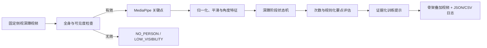

# 深蹲动作评估原型：Demo 预实施方案

> **定位**：开题答辩前的可解释、可复现功能 Demo。它在受控拍摄条件下，对预先选择的深蹲动作进行姿态时序分析与训练辅助提示；**不**宣称医疗诊断、损伤风险预测、通用动作识别或“自动矫正”。

## 1. 结论先行

推荐将首个可答辩 Demo 收束为：**固定侧视机位、单人、离线深蹲视频 → MediaPipe 关键点 → 时序阶段判定 → 次数与规则化动作要点评估 → 带证据的画面叠加、结果视频和日志**。

这条路线保留“健身动作矫正、体育动作分析”的原始应用方向，但把可验证目标定义为“训练辅助反馈”。YOLOv8 与 DeepSORT 是已有、可复用的人体定位/跟踪基础，首版不应作为必经链路；千问也只可在结构化规则结论之后充当可选的文字润色器。

---

## 2. 当前基础与 Demo 差距

### 已有且可如实陈述的基础

| 能力 | 仓库证据 | 能否直接支撑首版 Demo |
|---|---|---|
| 视频读取、YOLOv8 检测、DeepSORT 轨迹和结果视频输出 | `yolov8-deepsort/demo.py` | 可复用为后续多人扩展基础；首版不必依赖 |
| 区域入侵、越线计数 | `zone.py`、`count.py` | 与健身质量评估无直接关系，仅作既有工程能力 |
| MediaPipe 姿态可视化 | 独立的 `mediapipe-plot-pose-live-main/example.py` | 只能证明单图姿态示例，尚不能证明视频融合 |
| 运行环境依赖 | `pyproject.toml` 已声明 MediaPipe、Ultralytics、OpenCV 等 | 具备搭建条件，不等于功能已实现 |
| 检测框标注 | `humandetection/annotations.xml`：45 条 `person` 轨迹、41 帧、1,785 个框 | 只能用于检测/跟踪调试，不能做姿态或动作质量评测 |

### 核心差距：不是“差一点”，而是主闭环尚未形成

现有工作覆盖了“视频输入与人定位”的基础层；真正决定健身 Demo 是否成立的 **姿态时序 → 动作阶段 → 可解释规则 → 反馈与评估** 四段均未实现。因而不建议用未经定义的完成百分比描述进度，建议答辩时表述为：

> 已完成检测、跟踪及独立姿态可视化原型；下一阶段将完成深蹲姿态时序分析和规则化训练反馈的集成验证。

---

## 3. 首版范围与明确边界

### 首版必须完成（MVP）

| 项目 | 范围 |
|---|---|
| 人员与机位 | 单人、固定侧视、全身入镜、普通室内光照、离线视频 |
| 动作 | 仅深蹲；由用户在界面/配置中预先选择“深蹲模式”，不做开放集动作识别 |
| 姿态 | MediaPipe 33 个关键点；以 **2D 屏幕几何特征** 为主，不将 world landmarks 当作精确三维生物力学测量 |
| 时序 | 可见度门控、平滑、滞回阈值、有限状态机（站立→下蹲→最低点→起身→站立） |
| 结果 | 骨架、关键角度、阶段、次数、置信/异常状态、每次动作的原因码与训练提示 |
| 交付物 | 标注 MP4、逐帧/逐次 JSON 或 CSV 日志、测试记录、输入与配置元数据 |

### 首版刻意不承诺

- 多人同时评估、任意机位、任意动作和实时帧率；
- “动作矫正成功”“预防受伤”“医学诊断”或关节受力结论；
- YOLOv8/DeepSORT 已与姿态链路集成；
- 大模型提高评估精度；
- 没有标注和测试支撑的准确率、FPS、PCK、MPJPE、MOTA、IDF1 等数字。

---

## 4. 可答辩的技术闭环

### 4.1 每层的职责

| 层 | 输入与输出 | 关键设计 | 降级行为 |
|---|---|---|---|
| 有效性检查 | 视频帧 → 状态 | 全身是否入镜、单人、关键点可见度、最小人体尺寸 | `NO_PERSON`、`LOW_VISIBILITY`、`OUT_OF_FRAME` 时不计数、不评价 |
| 姿态提取 | 有效帧 → 关键点 | 记录坐标、可见度和时间戳 | 关键点缺失即保留缺失状态，不插值成结论 |
| 时序特征 | 关键点 → 角度/代理量 | 选定侧的膝关节屈曲角、躯干相对竖直角、髋部下降代理量；做身体尺度归一化 | 仅以屏幕空间特征解释，不作临床解释 |
| 阶段判定 | 特征序列 → 状态 | 最小持续帧、进入/退出双阈值与滞回，抑制单帧抖动 | 未走完完整周期不增加次数 |
| 规则评估 | 已完成一次深蹲 → 结果 | 输出 `acceptable / insufficient_depth / excessive_torso_lean / insufficient_confidence` 等原因码 | 低置信度只提示“本次不评估” |
| 呈现与留痕 | 结果 → 视频/日志 | 画面与日志都显示时间戳、阶段、原始/平滑特征、规则版本与原因 | 模板化提示始终可用 |

### 4.2 规则的可解释约束

每条规则必须事先写入“规则卡”，包括：适用机位、关键点、特征定义、阈值、持续帧数、文献/运动规范依据、输出语句和不适用条件。阈值是受控场景下的**工程参数**，须通过少量人工标注样本校准，而不是宣称适用于所有人。

建议首版只检验三类可观察结果：

1. 是否完成了一个完整的下蹲—最低点—起身周期；
2. 下蹲深度代理量是否达到预设规则；
3. 躯干前倾的屏幕空间角是否超过预设规则。

“膝盖是否超过脚尖”等对视角高度敏感的判断不列为首版强结论。

---

## 5. 数据、标注与验证设计

### 5.1 新建小型演示数据集

现有检测框数据不能替代动作数据。新数据集应在取得参与者同意后录制，并至少保存下列元数据：机位方向、距离、分辨率、光照、参与者匿名编号、动作次数、是否可用及剔除原因。

| 数据子集 | 建议内容 | 用途 |
|---|---|---|
| 正常样例 | 受控条件下的完整深蹲片段 | 验证次数、阶段和正常反馈流程 |
| 浅蹲样例 | 有意识地降低下蹲幅度 | 验证深度提示的可追溯性 |
| 前倾样例 | 有意识地增加躯干前倾 | 验证角度提示的可追溯性 |
| 异常样例 | 无人、半身出框、低可见度 | 验证系统克制地拒绝评价 |

功能演示至少准备一段可接受样例、两段受控问题样例和一段无效样例。若要给出性能数字，则应先固定标注手册和数据划分；建议由两名标注者独立复核一部分视频，记录分歧及处理规则。

### 5.2 可测、可答辩的指标

| 目的 | 指标 | 前提 |
|---|---|---|
| 次数功能 | 次数绝对误差（MAE） | 有人工次数真值 |
| 阶段功能 | 阶段识别准确率/一致率 | 有逐帧或逐段阶段标签 |
| 规则功能 | 与人工规则标签的一致率，或 Precision / Recall / F1 | 有预定义问题类别与标签 |
| 健壮性 | 有效帧比例、无效状态是否抑制结论 | 有异常样例测试表 |
| 工程可复现 | 输出视频可播放、日志与时间戳对齐 | 人工回放核验记录 |

首个答辩 Demo 可以先报告功能性测试表；任何数值指标均须在完成上述标注后实测填写。

---

## 6. 分阶段实施计划（不含代码）

| 阶段 | 目标 | 可验收产物 | 主要风险与处理 |
|---|---|---|---|
| P0：口径冻结 | 写清边界、机位、规则卡和数据授权 | 一页需求/规则卡、录制清单 | 范围膨胀：只保留深蹲 |
| P1：姿态视频链路 | 视频逐帧关键点、可见度与骨架叠加 | 一段带骨架的离线视频 | 关键点丢失：输出无效状态 |
| P2：时序闭环 | 平滑、状态机与可靠计数 | 阶段叠加和逐帧日志 | 抖动误计：最小持续帧+滞回 |
| P3：规则与反馈 | 完成三类规则结果和原因码 | 每次深蹲的结构化结论与模板提示 | 规则不可解释：规则卡与日志留痕 |
| P4：验证包 | 固定输入、回放、测试表和截图 | MP4、JSON/CSV、测试记录 | 现场不稳定：离线视频作为正式演示 |
| P5：扩展（非前置） | YOLO 人体选择、DeepSORT 多人关联、第二动作、千问改写 | 独立扩展报告 | 仅在 MVP 全部通过后进行 |

---

## 7. Demo 验收清单

- [ ] 固定的深蹲输入视频可一键复现，输出目录和文件命名明确。
- [ ] 输出画面同时显示骨架、选定角度、阶段、次数、有效性状态与最终提示。
- [ ] 至少一个正常样例及“下蹲不足”“躯干前倾过大”两类受控样例得到可追溯的不同原因码。
- [ ] 无人、低可见度和出框时明确显示无效状态，且不输出次数或质量结论。
- [ ] 每个完整周期才计一次；日志能对应到视频中的时间戳与状态切换。
- [ ] 标注 MP4 能播放，JSON/CSV 包含输入名、配置/规则版本、时间戳、特征、状态与结果。
- [ ] 人工回放检查表完成；若报告性能数值，附测量条件、样本量和计算方式。

---

## 8. 答辩口径与扩展路线

**可说**：在限定拍摄条件下，系统利用人体关键点时序、可解释规则和状态机完成深蹲训练辅助评估原型，并保留结构化证据以便回放核查。

**不可说**：系统能自动纠正姿势、预防损伤、诊断疾病、适配全部动作/视角，或已完成 YOLOv8—DeepSORT—MediaPipe—千问的端到端整合。

后续可扩展为“YOLOv8 选人/ROI + DeepSORT 身份保持 + 多动作规则配置 + 受 schema 约束的千问文本改写”。其中千问不参与对错判定；规则引擎应始终提供可运行的模板反馈兜底。

## 9. 方案审查记录

本方案经过两轮独立审查后定稿：第一轮核查选题与仓库事实，第二轮对单动作 MVP、视角歧义、数据真值、时序抖动、可复现产物和答辩表述进行了对抗性检验。审查后落实的关键收缩是：深蹲单动作、离线视频、MediaPipe 直连全帧、受控侧视、规则辅助评估，以及 YOLO/DeepSORT/千问全部后置为扩展项。
