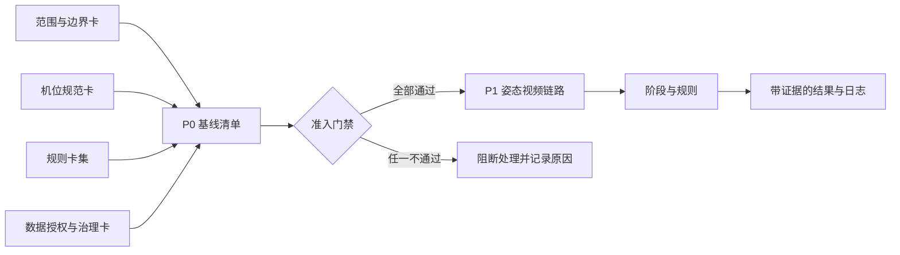
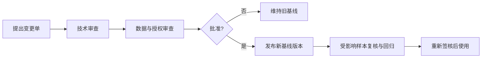

# P0｜口径冻结详细实施方案

> **基线名称**：`P0-SQUAT-SIDE-OFFLINE-v1.0`  
> **状态**：待签核；在 `G3`（学校流程决定、授权文本、分级存储与影响评估）通过前，不得采集、处理或展示参与者视频。`G3` 通过后，才可按待签核基线受控采集最小样张；P0 最终签核仅放行其后的 P1。  
> **适用目标**：为“受控条件下的单人深蹲训练辅助评估 Demo”冻结唯一、可审计、可复现的输入契约。  
> **核心原则**：宁可拒绝评价，也不输出没有证据支撑的结论。

---

## 0. 执行摘要

P0 不是一份普通计划，而是一套进入后续 P1–P4 的**强制准入基线包**。它将范围、机位、规则、数据授权绑定为同一个版本：一条视频只有同时满足四项条件，才允许进入姿态、时序、规则和展示流程。

本项目首版只交付：**固定侧视、单人、全身入镜、离线录制、预先声明的深蹲动作、基于 2D 屏幕空间关键点的规则化训练辅助反馈**。它不构成医疗诊断、损伤风险预测、动作矫正承诺或通用生物力学测量。

> [!IMPORTANT]
> 已有 `humandetection/annotations.xml` 是行人检测框数据；现有 `yolov8-deepsort/video/` 是测试视频；仓库内没有可核验的深蹲机位记录、参与者授权或动作质量真值。因此它们**不得**进入本 P0 深蹲数据基线。P0 必须新录受控视频，并先完成授权与元数据绑定。

### 0.1 冻结后的处理关系

### 0.2 成功定义

- 每一条纳入视频均可追溯到有效授权、机位记录、范围版本和规则版本；
- 每条规则都能被独立执行、解释、回放和变更；
- 无人、多人、出框、低可见度、错误机位、未授权等情形只输出无效状态，**不计数、不评价**；
- 任何范围、机位、规则、数据用途或授权变化都生成新版本，不静默覆盖旧实验结论。

---

## 1. 事实基线与口径边界

### 1.1 已确认事实

| 事实 | 本方案中的处理 |
|---|---|
| YOLOv8 + DeepSORT 是现有检测/跟踪主流程；MediaPipe 姿态示例尚为独立入口 | 不宣称已完成端到端动作评估集成；首版姿态链路直连受控视频，YOLO/DeepSORT 后置。现有检测器的多类输出不等于 P0 的单人准入，人体筛选/姿态处理仍未实现 |
| `humandetection` 含 41 帧、45 条 `person` 轨迹的检测框标注 | 仅可作检测/跟踪调试参考，不能充当深蹲姿态、阶段或质量真值 |
| 原有预实施方案已将 MVP 收束为固定侧视、单人、离线深蹲与 2D 特征 | 作为 P0 唯一业务边界；不扩展至多人、任意动作和任意机位 |
| 当前仓库内未发现深蹲视频授权、机位档案、标注手册或性能实测记录 | P0 不填写准确率、FPS、PCK、MPJPE、MOTA、IDF1 等数值 |

### 1.2 允许、禁止与强制拒绝

| 类别 | 冻结口径 |
|---|---|
| **允许** | 已单独授权的成年参与者；固定侧视；单人；离线深蹲视频；头至双脚完整可见；普通室内稳定光照；规则化训练提示 |
| **仅作后续扩展** | YOLO 选人、DeepSORT 身份保持、多人、第二动作、实时处理、受 schema 约束的文本润色 |
| **禁止声明** | 医疗诊断、康复建议、伤病/风险预测、自动矫正成功、适配所有人/所有镜头、已完成 YOLO–DeepSORT–MediaPipe–大模型集成 |
| **强制拒绝** | 未授权/已撤回、未成年人、多人或人员切换、非侧视、镜头移动、全身或足部出框、关键点低可见度、遮挡、动作周期不完整、基线版本不一致 |

**标准表述**：在已冻结机位、数据和规则的适用范围内，系统对完整深蹲周期输出可回放的训练辅助结果；它不能替代专业教练、医疗人员或三维运动捕捉系统。

---

## 2. P0 基线包：高内聚、低耦合的唯一入口

### 2.1 交付物与职责

| 构件 | 唯一职责 | 产物 | 责任人 |
|---|---|---|---|
| 范围与边界卡 | 冻结能做与不能做的事情 | `Scope Contract` | 技术负责人 |
| 机位规范卡 | 固定屏幕空间特征的采集条件 | `Camera Profile` + 现场记录 | 采集负责人 |
| 规则卡集 | 定义特征、阈值、无效条件与提示 | `Rule Set` + 校准记录 | 规则负责人 |
| 数据授权与治理卡 | 控制数据合法性、用途、访问和处置 | `Consent Register` + 数据台账 | 数据负责人 |
| 基线清单 | 将四卡及样本、标注、输出绑定 | `Baseline Manifest` | 配置管理员 |

每个样本、标注、输出视频和实验记录必须携带同一组“基线指纹”：

`baseline_id · scope_version · camera_profile_id · rule_set_version · consent_status · source_video_id · operator · recorded_at`

它们是跨模块唯一的**准入与可追溯元数据接口**；算法输入/输出仍按各模块最小数据契约独立定义。授权台账中的 `consent_id`、用途、期限与撤回状态不进入算法日志或展示层：准入层只发放可撤销的 `processing_permit_id` 和 `permit_snapshot_version`。这既避免规则散落和耦合失控，也贯彻最小权限。

### 2.2 P0 不包含代码实现

P0 输出的是签核版卡片、清单、样张、授权台账、校准/验证划分和演练记录；不在本阶段编写姿态处理、规则引擎或界面代码。后续每个实现阶段只消费已冻结的版本化合同。

---

## 3. 四张冻结卡的详细实施

### 卡 A｜范围与边界卡（Scope Contract）

| 字段 | 冻结内容 |
|---|---|
| `scope_id / version / effective_date` | `SQUAT-SIDE-SINGLE-OFFLINE / v1.0 / 签核日` |
| 业务目标 | 对完整深蹲的次数、阶段和有限规则命中给出训练辅助提示 |
| 输入 | 本 P0 合格的离线视频；不得输入网络抓取、来源不明或旧测试视频 |
| 输出 | 阶段、次数、有效/无效状态、原因码、模板化提示、可回放时间戳与日志 |
| 证据边界 | 后续 P1 若采用 MediaPipe，则仅消费其 33 个关键点中的 2D 屏幕空间特征；不把 world landmarks 解释为精确三维或临床测量 |
| 纳入条件 | 已授权成年单人；固定侧视；完整周期；全身可见；机位卡与授权卡均通过 |
| 排除条件 | 多人、任何身份识别/跨视频关联、实时指标、泛化结论、医疗化结论 |
| 终止条件 | 授权撤回、用途变化、版本失配或任何安全门禁失败 |

**签核检查**：需求、规则卡、演示脚本、论文表述和数据台账中不得再出现“通用”“诊断”“矫正成功”“预防受伤”“全链路已集成”等禁止承诺。出现任一处，`G0` 失败。

### 卡 B｜机位规范卡（Camera Profile）

固定侧视必须是一份可复拍的合同，而不是一句描述。首次采集前填写下表；变更任一受控项即产生新 `camera_profile_id`。

| 类别 | 必填项 | 通过标准 | 失败处置 |
|---|---|---|---|
| 视角 | 左/右侧视二选一；受试者矢状面近似平行画面 | 一段内不得混入正视、斜视或镜面反射视角 | `WRONG_VIEW`，不评价 |
| 相机稳定 | 设备、镜头、三脚架/固定支撑、方向 | 无变焦、平移、旋转、切镜 | `INVALID_CAMERA`，重录 |
| 几何记录 | 相机高度、相机—受试者距离、镜头方向、允许偏差、测量工具 | 均填写实测锁定值与容差；P0 不假称跨设备通用厘米阈值 | 新建或重新校准机位档案 |
| 构图 | 横/竖屏、分辨率、帧率、人体画面区域、最小人体像素尺度 | 起立和最低点均可见头、肩、髋、膝、踝与双脚 | `OUT_OF_FRAME`，不计数 |
| 环境 | 光照、背景对比、服装、遮挡/反光、关键点可见度门槛 | 锁定值已填写；关键部位可辨；无可识别旁人进入 | 停止录制、裁除后重录；不可保留旁人素材 |
| 现场留痕 | 样本编号、操作人、设备设置、异常、合格/剔除理由 | 每段源视频有一条一对一记录 | 未记录即不纳入 |

**双样张制度**：`G3` 通过前仅允许无人的设备/构图测试；之后每个机位版本至少保留一条已授权的合格样张和一条故意不合格样张（如足部出框或斜视）。两名执行人须独立记录判定、日期和依据，并得出相同的准入/拒绝结论。此项只验证可操作性，不宣称算法精度。

### 卡 C｜规则卡集（Rule Set）

规则卡的目标是让每一次“提示”都具有证据链。每条规则单独编号、独立版本化，禁止用“适当、明显、尽量”等不可判定用语。

#### C.1 通用字段（每条规则必填）

| 字段 | 要求 |
|---|---|
| 身份与责任 | `rule_id`、版本、责任人、生效日、变更原因 |
| 适用范围 | 仅限当前 `scope_id` 与 `camera_profile_id`，明确适用侧别 |
| 输入证据 | 关键点名称、取侧策略、可见度门槛、2D 特征、单位与归一化方式 |
| 时序判定 | 平滑策略、进入/退出双阈值、最小持续帧、边界相等时归类 |
| 前置门控 | 单人、全身入镜、正确机位、有效授权、完整周期 |
| 无效条件 | 无人、多人、遮挡、低可见度、出框、机位失配、周期不完整 |
| 输出 | 原因码、严重度、非医疗化模板提示、视频时间戳 |
| 组合与冲突 | `aggregation_policy_version`、规则并存/覆盖策略、总体提示模板 |
| 依据与校准 | 资料来源级别、人工样例、校准日期、适用样本群；阈值标注为工程参数 |
| 回归样本 | 正常、目标问题、无效样例各至少一条，绑定样本 ID 与预期结果 |

#### C.2 首版仅冻结三条规则

| 规则 | 可观察结论 | 关键约束 | 输出 |
|---|---|---|---|
| `R-CYCLE-001` 完整周期 | 是否经历站立→下蹲→最低点→起身→站立 | 完整状态序列和最小持续帧才加 1；中断不补计 | `COMPLETE_REP` / `INCOMPLETE_REP` |
| `R-DEPTH-001` 下蹲深度代理 | 是否达到当前机位校准的髋部下降或膝髋相对量 | 仅为 2D 代理量；阈值待用校准集确定 | `RULE_NOT_TRIGGERED` / `INSUFFICIENT_DEPTH` |
| `R-LEAN-001` 躯干前倾代理 | 躯干相对竖直的屏幕空间角是否越过校准阈值 | 只对固定侧视有效；不得外推为关节受力结论 | `RULE_NOT_TRIGGERED` / `EXCESSIVE_TORSO_LEAN` |

`膝盖是否超过脚尖` 等强依赖镜头高度和透视的判断，不进入 P0 强规则。低置信度时统一输出 `INSUFFICIENT_CONFIDENCE` / `NOT_EVALUATED`，绝不强制给出好坏评价。

**结果聚合冻结规则**：任一前置门控失败时，`NOT_EVALUATED` 覆盖全部质量结论；否则一次完整动作可以同时输出 `COMPLETE_REP`（计数事件）和 0..n 个质量原因码。`INSUFFICIENT_DEPTH` 与 `EXCESSIVE_TORSO_LEAN` 可并存，按严重度、再按 `rule_id` 稳定排序。`RULE_NOT_TRIGGERED` 仅表示该单条规则未命中，不等同于整次动作“合格”。总体状态与提示必须由已冻结的 `aggregation_policy_version` 唯一确定。

### 卡 D｜数据授权与治理卡（Consent & Data Governance）

人体视频通常可能构成个人信息；当处理涉及可用于识别个体的生物识别信息或依法属于敏感个人信息的字段时，适用更高保护要求。本项目无论法律分类如何，均以特定目的、最小必要、严格保护和**可核验的单独同意**作为 P0 内部准入门槛。该设计是项目合规控制，不代替学校伦理审查或法律意见。

#### D.1 采集前的授权书与记录

授权书应采用清晰、独立、可撤回的表达，并与每条源视频绑定 `consent_id`。至少说明：

1. 项目名称、处理者/指导教师联系人、仅限教学科研 Demo 的具体目的；
2. 数据类别：原始视频、关键点、动作标签、结构化日志、叠加视频；
3. 视频可能包含面部/体态等可识别信息及其影响；
4. 明确**不用于**人脸识别、身份验证、跨视频关联、商业用途、公开传播或医疗判断；
5. 保存位置、访问角色、**具体的 `retention_until` 日期**、删除责任人、到期删除验收方式及备份/同步副本清单；
6. “答辩展示/匿名化截帧使用”作为**独立可选项**，默认不勾选；
7. 自愿性、撤回渠道、撤回后的停止处理与仍可定位数据处置；
8. 本 `v1.0` 不纳入未成年人；未来如范围变更，必须完成监护人同意、专项学校流程并创建另一条基线，不得修改或混入当前数据集。

> [!CAUTION]
> 授权书、身份对应表、原始视频及可识别截图严禁提交到公开仓库或公共网盘。开源代码的 GPL/MIT 许可证不能替代肖像、视频或个人信息授权。

#### D.2 数据最小化与访问分级

| 等级 | 数据范围 | 存储和访问规则 |
|---|---|---|
| S1：原始敏感数据 | 原视频、带脸截图、身份映射表 | 加密存储；仅数据管理员和获授权研究成员；身份映射与样本数据分离保存 |
| S2：受控派生数据 | 带骨架视频、关键点、阶段/原因码日志 | 去标识化命名；仅项目成员按需访问；仍不可公开 |
| S3：展示证据 | 获独立展示授权的截图、汇总结果 | 展示前二次复核；只用于已授权范围。若拟以匿名化替代，必须完成书面不可识别性评估、去标识方案、学校流程责任人批准及禁止反向关联，否则仍按 S2 |
| S4：非个人资料 | 规则卡、机位卡、空白模板、统计方法 | 可版本管理、可公开 |

样本目录只使用 `subject_pseudonym` 和 `sample_id`。身份对应表与研究数据物理/权限分离。撤回、到期或项目结束时，先按 `consent_id`/`source_video_id` 生成全量影响清单并隔离访问，再按受控处置流程覆盖 S1 原始数据及所有 S2/S3 派生物、导出物和可恢复备份；受法定备份周期约束的副本标记为不可用并在到期删除。删除审计只保留不含个人信息的最小记录。

---

## 4. 数据、标注与校准：避免“伪真值”

### 4.1 新建受控数据集的最小结构

| 子集 | 内容 | 用途 | 不得用于 |
|---|---|---|---|
| 校准集 | 合格、浅蹲、前倾的受控样例 | 固定工程阈值与规则边界 | 对外宣称性能 |
| 验证集 | 与校准集隔离的同口径样例 | 检验次数、阶段和规则一致性 | 回调阈值 |
| 无效集 | 无人、多人、出框、低可见度、错误机位、未授权模拟 | 验证拒绝机制 | 性能分子/分母混入 |

每条记录至少含：`sample_id`、`consent_id`、机位版本、分辨率/帧率、光照、匿名参与者 ID、动作次数、采集日期、可用状态、剔除原因、操作者、基线指纹。

### 4.2 标注与评价纪律

- P0 先冻结标注手册：周期边界、阶段标签、规则标签、无效标签、剔除规则与边界样例；
- 先按 `subject_pseudonym` 与录制会话划分校准/验证集，再划分片段；同一人、同一会话或高度相邻片段不得跨集，禁止用验证结果回调阈值；
- 在样本规模确定**前**冻结双人独立复核的最小数量或比例、随机/分层抽样法、盲法与裁决规则；记录分歧、裁决人及裁决依据；
- 任何未来数值指标都必须能追溯到真值字段、计算公式、样本纳入/排除表和基线版本；
- 在这些条件具备前，只报告功能性测试和回放记录，不报告准确率或性能数字。

---

## 5. 准入门禁与安全降级

### 5.1 P0 → P1 硬门禁

| 门禁 | 必需证据 | 通过标准 | 未通过处置 |
|---|---|---|---|
| G0 范围一致性 | 签核边界卡、演示/论文口径核对表 | 0 个禁止承诺 | 停止，修订后复核 |
| G1 机位可执行 | 机位卡、合格/不合格样张、现场记录 | 不同执行人可一致判定 Pass/Fail | 重录或新建机位版本 |
| G2 规则可判定 | 完整规则卡、原因码、边界案例、组合策略 | 每条规则谓词确定；每次动作在明确组合/优先级下产生唯一总体状态和确定原因码集合 | 禁止实现为正式规则 |
| G3 授权可追溯 | 学校流程决定、影响评估、授权书版本、授权台账、数据清单 | 抽查任一 `source_video_id` / `sample_id` 均可追溯具体用途、展示范围、日期、撤回与处置状态 | 隔离并停止处理 |
| G4 标注可验证 | 标注手册、划分表、分歧台账 | 校准/验证隔离，未来指标有真值依据 | 不得报告指标 |
| G5 版本可审计 | 基线清单、版本/哈希、审批记录 | 输入、输出、标注均有基线指纹 | 不纳入正式实验集 |
| G6-P0 拒绝合同 | 无效状态定义、触发条件、强制行为、样例与桌面演练 | 全部场景被明确设计为“不计数、不评价、留原因” | 不得进入 P1 |

### 5.2 无效状态矩阵

| 状态码 | 触发条件 | 强制行为 |
|---|---|---|
| `NO_PERSON` | 帧中无人 | 不计数、不评价 |
| `MULTI_PERSON` / `AMBIGUOUS_SUBJECT` | 多人或人员切换 | 不选择“最像的人”，阻断 |
| `OUT_OF_FRAME` | 头部/双脚或关键肢段不完整 | 不计数、不评价 |
| `LOW_VISIBILITY` / `OCCLUSION` | 关键点置信不足或遮挡 | 不用插值制造结论 |
| `WRONG_VIEW` / `INVALID_CAMERA` | 非侧视、镜头移动或档案失配 | 不计算深度/前倾 |
| `INCOMPLETE_REP` | 未走完完整周期 | 不增加次数 |
| `CONSENT_BLOCKED` | 未授权、过期、撤回或用途不符 | 不解析、不导出、不展示 |
| `BASELINE_MISMATCH` | 四卡任一版本不一致 | 不并入实验/指标 |

P1 实现后另执行 `G6-P1`：使用固定无效集验证实际链路的“未计数、未评价、无结果导出”；P0 不将桌面演练误报为运行时验证。

---

## 6. 变更控制与运行治理

### 6.1 变更分级

以下均为**重大变更**：动作、评价目标、机位、特征/阈值、数据用途、保存期限、展示范围、处理者、第三方工具、授权文本。它们必须创建新 `baseline_id`，旧版本保持只读，不得静默覆盖；并重新进行个人信息保护影响评估，审查目的和必要性、数据流、保存位置、访问角色、展示路径、泄露/误展示/撤回/误删除风险、控制措施和剩余风险。

仅文字纠错且不改变目的、数据字段、阈值、输入或输出时可作补丁版本，但仍须留下审计记录。

### 6.2 四步变更流程

1. **提出**：说明原因、影响对象、受影响样本和既有结论；
2. **双审**：技术负责人审核可复现性与规则影响，数据负责人审核授权、最小化和删除影响；
3. **发布**：新建版本，绑定四卡版本、校准/验证划分和批准记录；
4. **复验**：受影响机位抽检、规则回归、授权状态和展示范围全部复核。新旧版本不得混算同一性能指标。

### 6.3 架构质量落实

| 原则 | P0 落地方式 |
|---|---|
| 低耦合 | 四卡通过版本化数据合同连接；后续模块不自行决定业务口径 |
| 高内聚 | 与“是否能处理一条视频”相关的范围、机位、规则、授权集中于基线包 |
| 高可用 | 输入异常不崩溃、不猜测，稳定输出可解释无效码与审计记录 |
| 高性能 | 规则/机位文档不在热路径动态解释；运行阶段读取已签核只读配置缓存。每个处理作业准入及每次导出/展示前仍须校验可撤销的授权许可快照或吊销清单，绝不以性能为由跳过授权校验 |
| 可维护 | 责任人、版本、样本映射、回归样本和变更单形成可追溯闭环；新增动作/机位只能新建配置 |

---

## 7. P0 实施排期与验收

| 工作包 | 关键动作 | 产物 | 完成判定 |
|---|---|---|---|
| W1：口径收敛 | 对齐题名、报告、Demo 和答辩话术 | 签核版范围与边界卡 | G0 通过 |
| W2：机位试录 | G3 前完成无人的设备/构图测试；G3 后制作已授权的正反样张 | 机位卡、现场记录、样张 | G1 通过 |
| W3：规则定义 | 写三条规则、无效条件和校准计划 | 规则卡集、标注手册草案 | G2 通过 |
| W4：授权治理 | 优先审核学校流程，完成影响评估、授权书/台账、分级存储及留存/备份处置方案 | 影响评估、授权书、台账、数据目录 | G3 通过 |
| W5：数据方案 | 建立校准/验证/无效集划分与复核机制 | 数据清单、划分表、分歧台账模板 | G4 通过 |
| W6：签核演练 | 绑定基线指纹，模拟变更与无效输入 | 基线清单、门禁记录、演练报告 | G5、G6 通过 |

**P0 退出条件**：G0–G6 全部通过，四卡和基线清单签核完成；任何一项缺失均为 `STOP`，不得进入 P1。

---

## 8. 附录：可直接使用的最小模板

### A. 基线清单字段

| 字段 | 示例/要求 |
|---|---|
| `baseline_id` | `P0-SQUAT-SIDE-OFFLINE-v1.0` |
| `scope_version` | 已签核范围卡版本 |
| `camera_profile_id` | 机位档案唯一编号 |
| `rule_set_version` | 三条规则的集合版本 |
| `consent_form_version` | 授权书版本；不保存签名内容 |
| `manifest_hash / supersedes` | 清单与签核版文件完整性校验；被替代的上一基线 |
| `dataset_manifest_version` | 数据清单版本与完整性校验值 |
| `label_guide_version` | 标注手册版本 |
| `approved_by / approved_at` | 技术、数据两方签核信息 |
| `change_log` | 变更编号、原因、影响、复验结论 |

### B. 单条视频准入记录

| 字段 | 记录要求 |
|---|---|
| `source_video_id / sample_id` | 不含姓名、学号等直接标识符 |
| `processing_permit_id / permit_snapshot_version` | 后续模块可用的最小许可凭据；不暴露授权台账 |
| `processing_purpose / display_scope` | 已授权的具体处理用途与展示范围 |
| `granted_at / retention_until / withdrawn_at` | 明确同意、留存截止与撤回时间 |
| `revocation_checked_at / processing_blocked_at` | 最近撤回核验与实际阻断时间 |
| `disposal_case_id / disposal_status` | 到期或撤回后的处置可审计 |
| `camera_profile_id` | 与现场记录、样张一致 |
| `operator / recorded_at` | 采集可追溯 |
| `full_body / single_person / correct_view` | 三项准入检查及证据 |
| `quality_status / exclusion_reason` | 合格或明确无效原因 |
| `baseline_id` | 必须与本次评估、标注和输出一致 |

### C. 签核页

| 角色 | 核对重点 | 签核 |
|---|---|---|
| 技术负责人 | 边界、机位、规则可执行性和拒绝机制 | 姓名 / 日期 |
| 数据负责人 | 授权、最小化、访问、撤回和处置 | 姓名 / 日期 |
| 指导教师或学校流程责任人 | 教学科研用途、展示范围与必要审批 | 姓名 / 日期 |

---

## 9. 依据与审查结论

- 仓库内的 [Demo 预实施方案](Demo预实施方案_深蹲动作评估原型.md) 已明确单人、固定侧视、离线深蹲、2D 特征、规则卡和新录授权的业务约束；本方案将其提升为可审计门禁。
- [项目 README](README.md) 与现有数据表明，MediaPipe 姿态尚未形成视频时序主链路，`humandetection` 仅为检测框数据；本方案没有把它们误写成已完成的动作评估能力。
- 数据治理以《个人信息保护法》的最小必要、敏感个人信息严格保护、告知同意、删除和影响评估原则为依据，并实施更严格的项目内部授权门槛：[个人信息保护法（网信办）](https://www.cac.gov.cn/2021-08/20/c_1631050028355286.htm)。本项目不进行人脸识别、身份验证或特定个人辨识；若未来将人脸信息用于身份验证或辨识特定个人，必须在变更前按届时适用法律及学校流程专项核查，不得仅以本 P0 授权替代该核查。

**最终口径**：P0 只冻结“可处理什么、在什么条件下处理、如何给出可解释反馈、凭什么有权处理”。未通过 P0 的视频或结论，不得进入后续系统、论文指标或答辩展示。
