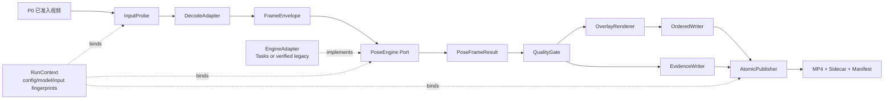
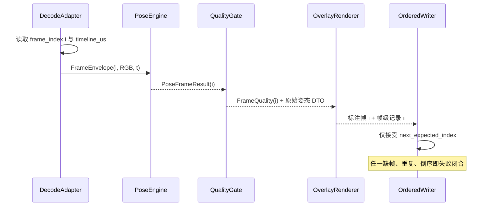

# P1｜姿态视频链路详细实施方案

> **方案编号**：`P1-POSE-VIDEO-OFFLINE-v1.0-draft`  
> **状态**：设计待签核；仅在 [P0｜口径冻结详细实施方案](P0_口径冻结_详细实施方案.md) 的 `G0–G6` 全部通过后执行。  
> **交付范围**：受控的离线视频逐帧关键点、可见度/在帧门控、二维骨架叠加、结构化帧级证据和可验证输出。  
> **不含范围**：深蹲阶段/计数、质量规则、训练提示、多人选择、YOLOv8/DeepSORT 集成、实时处理、临床或三维生物力学结论。

<p align="center">
  <b>单人 · 固定侧视 · 离线 · 全身入镜 · 逐帧不丢失 · 失败闭合</b>
</p>

---

## 导航

`01 结论` · `02 前置门禁` · `03 架构` · `04 数据合同` · `05 运行协议` · `06 质量与叠加` · `07 产物` · `08 可靠性` · `09 验证` · `10 里程碑`

---

## 01｜结论与边界

P1 只负责把一条 **P0 已准入** 的视频，按展示顺序完整地转换为：

1. 每帧至多一组姿态关键点及其原始可见度/存在性字段；
2. 每帧明确的处理与姿态状态、原因码和时间线；
3. 与帧序一一对应的二维骨架叠加视频；
4. 可回放、可校验、可归因的结构化 sidecar 与运行清单。

它不是动作评价器。P1 不得输出“合格/不合格”“完成次数”“下蹲不足”“前倾过大”等业务结论；这些属于 P2/P3。任何 P0 前置条件或 P1 技术完整性失败，均停止并留下诊断，**不得把失败伪装为无效动作或成品视频**。

> [!IMPORTANT]
> 当前仓库的 `mediapipe-plot-pose-live-main/example.py` 仅循环读取固定图片并调用旧式 `mp.solutions.pose`，`plot_pose_live.py` 只保存 3D PNG；它不是视频链路。当前锁文件固定 `mediapipe 0.10.21`，仓库未发现 `.task` / `.tflite` 姿态模型资产或 P1 自动化测试。因此，本方案不宣称 Tasks、视频推理或任何 FPS 已可用。

### 1.1 P1 的成功定义

| 维度 | 必须成立的事实 | 不得偷换成 |
|---|---|---|
| 完整性 | 输入 `N>0` 帧时，成功运行满足 `decoded = inferred = rendered = encoded = sidecar = N`，且序号连续 | “看起来能播放”的 MP4 |
| 可追溯 | 每条帧记录可定位 `run_id + frame_index + timeline_us`，并关联输入/配置/引擎/模型指纹 | 只保留骨架视频 |
| 克制性 | 未检出姿态、关键点不满足门控、侧别歧义等有机器可读原因码；不产生业务评价 | 以旧帧或零坐标补全 |
| 可复现 | 同输入、同配置、同模型和同环境得到相同帧序、状态和 sidecar 摘要 | 逐字节相同的编码文件 |
| 可用性 | 成品可重开、核对帧数/尺寸/首尾帧；失败无 `SUCCESS` 成品 | 只检查写入 API 未报错 |

### 1.2 事实边界与取舍

| 项目事实 / 一手资料 | 本方案的处理 |
|---|---|
| P0 已把业务收束为固定侧视、单人、离线、完整全身深蹲，并要求无效时不计数、不评价 | P1 仅消费 P0 已放行的 `processing_permit_id`；P1 也不替代 P0 的授权、机位和单人准入 |
| Google Tasks 文档规定 `VIDEO` 调用携带时间戳且相邻输入时间戳递增；`LIVE_STREAM` 为降延迟可丢输入帧 | P1 是批处理，默认全帧保留；禁止以实时异步模式做正式证据链 |
| Tasks 的 landmark 含归一化图像坐标；`visibility`/`presence` 可能未提供且并非精度指标 | 原样、可空保存两字段；不命名为“准确率/置信精度”，不把缺失静默写成 0 |
| 仓库已有 YOLOv8+DeepSORT 检测跟踪主流程，但 P0 明确其为后置扩展 | P1 不引用 `objtracker.py`、不共享其全局 tracker 状态、不声称端到端集成 |

---

## 02｜门禁：先锁定可运行引擎，再写功能

P1 的架构接口可以先冻结；任何姿态处理功能开始前，必须通过 `G1-P1`。此门禁避免将尚未核验的模型、许可证或 API 当作既成能力。

### 2.1 `G1-P1` 引擎与资产签核

| 检查项 | 必需证据 | 通过条件 | 失败处置 |
|---|---|---|---|
| 候选 ADR | 选型、替代项、版本、许可证、为何满足 P1 | 明确唯一实现候选与责任人 | `BLOCKED_ENGINE_UNRESOLVED`，不开始功能实现 |
| 依赖可复现 | `pyproject.toml`、`uv.lock`、Python/OS 指纹 | 在锁定环境安装并可导入 | 依赖变更须走 P0 变更控制并重新锁定 |
| 模型资产 | 合法来源、许可证、受控位置、SHA-256 | 资产可读且哈希匹配；不得把资产提交到公开仓库 | `MODEL_ASSET_MISSING` / `MODEL_HASH_MISMATCH` |
| 视频语义冒烟 | 一段已准入短视频的逐帧运行记录 | 连续帧、单调时间线、无姿态、关闭重开均真实运行 | 记录问题，候选不通过 |
| 字段映射 | 33 点索引、坐标约定、`visibility/presence` 映射表 | 引擎内部对象在适配层消除，DTO 完整可序列化 | 不允许进入流水线 |

**正式交付候选但未预设为可用**：若在锁定环境与合法模型资产下完成上述验证，MediaPipe Tasks `VIDEO` 是本 P1 的正式实现候选；它的接口原生支持视频帧和调用方提供的时间戳。若不满足任一条件，不能悄然下载模型、升级依赖或改成实时模式。现有 legacy Pose 可用于兼容性探索或 DTO 对比，但它不具备本合同要求的调用方视频时间戳接口，**不得**被表述为本 P1 的正式等价实现；若要采用，必须作为重大需求变更重新审查。两类引擎的配置/结果对象不得混用。

### 2.2 P1 输入准入复核

| 门禁 | 条件 | P1 行为 |
|---|---|---|
| `P0_PERMIT_VALID` | `processing_permit_id` 有效且版本匹配 | 允许打开输入 |
| `INPUT_MEDIA_VALID` | 可打开、至少一帧、尺寸与流元数据可读 | 进入预检 |
| `TIMELINE_VALID` | 可建立严格递增 `timeline_us` | 进入流水线 |
| `ENGINE_READY` | G1-P1 签核的引擎、模型和配置均匹配 | 创建本次 `RunContext` |
| `OUTPUT_READY` | 目标同卷临时目录、编码器、剩余空间、锁均可用 | 开始处理 |

`P0_PERMIT_VALID` 失败不得解析视频；时间线、模型、编码器或写出失败是**运行失败**，不是 `REJECT` 的业务判定。

---

## 03｜目标架构：单向、端口化、可替换



### 3.1 模块职责与禁止依赖

| 模块 | 唯一职责 | 输入 / 输出 | 禁止事项 |
|---|---|---|---|
| `InputProbe` | 校验 P0 permit、媒体、时间基准、输出可写性 | 路径 → `InputManifest` | 不解码整段、不做姿态 |
| `DecodeAdapter` | 顺序解码并构造帧信封 | 媒体 → `FrameEnvelope` | 不推理、不渲染、不缓存全视频 |
| `PoseEngine` | 在单帧上产生中立姿态 DTO | RGB + 时间 → `PoseFrameResult` | 不写文件、不画图、不暴露 SDK 对象 |
| `QualityGate` | 对原始关键点执行 P1 可用性与侧别策略 | 姿态 DTO → `FrameQuality` | 不算动作角度、次数或质量结论 |
| `OverlayRenderer` | 仅按 DTO 和渲染策略画点、线、状态 | 原图 + 结果 → 标注帧 | 不回调引擎、不修改原始数据 |
| `OrderedWriter` | 按权威帧序写视频与流式证据 | 标注帧/记录 → 临时文件 | 不重排、不丢帧、不发布最终文件 |
| `AtomicPublisher` | 完整性校验、原子发布或失败清理 | 临时产物 → 最终 Run 目录 | 不把 partial 标为成功 |

> [!TIP]
> 规则、阶段、计数和文本反馈只消费 P1 发布的稳定 sidecar；反过来 P1 不依赖 P2/P3。这是隔离算法更换、渲染变更与业务规则演进的关键。

### 3.2 并发与资源策略

- 单个 `run_id` 的帧序是绝对顺序：一个 `PoseEngine` 实例只能由一个推理 worker 顺序调用，避免跨帧跟踪/平滑状态被并发破坏。
- 解码→推理、推理→渲染各用有界队列（初始深度 2–4，后续由实测调优）；队满时**阻塞背压**，绝不 newest-wins、抽帧或替换旧帧。
- 帧离开阶段立即释放图像缓冲；关键点 JSONL/CSV 流式写入。不得在内存累积全部 BGR 帧、叠加帧或视频。
- 视频间并发默认 1；只有在显存/内存预算和无丢帧基准证明后提高。每个 `RunContext` 独立，禁止跨视频复用计数、侧别或平滑状态。

---

## 04｜稳定数据合同

所有字段以 schema 版本约束。引擎 SDK 对象只能存在于 `EngineAdapter` 内；后续模块只见下列中立 DTO。

### 4.1 `RunContext` 与时间契约

| 字段 | 约束 | 用途 |
|---|---|---|
| `run_id` | UUID，唯一 | 隔离并发、定位产物 |
| `input_sha256` | 源文件哈希 | 输入可复核 |
| `baseline_id / processing_permit_id` | 来自 P0，最小必要引用 | 准入追溯，不泄露身份台账 |
| `config_hash / overlay_policy_version` | 冻结配置哈希 | 判定与画面可复现 |
| `engine_id / package_version / model_sha256` | 已签核候选 | 运行可归因 |
| `time_basis` | `source_pts` 或 `derived_cfr` | 不混淆原始与推导时间 |

`frame_index` 是从 0 起连续的**权威顺序键**；`timeline_us` 是 `int64`、严格递增的标准化展示时间。正式 P1 解码适配器必须导出每帧可信容器 `source_pts` 与 `time_base`，并把换算后的时间传给视频推理引擎；不得用 OpenCV `CAP_PROP_POS_MSEC` 假称原始 PTS，也不得以 `frame_index / nominal_fps` 冒充容器时间戳。仅用于早期管线诊断的 CFR 推导时间线必须标记 `derived_cfr_nonrelease`，不得通过 `G2-P1`。重复、倒退、缺失、溢出或毫秒量化后碰撞均以 `TIMELINE_INVALID` 失败，不能静默去重或修正。

### 4.2 `FrameEnvelope`（解码层唯一输出）

| 字段 | 类型 / 不变量 |
|---|---|
| `run_id, frame_index, timeline_us` | 三元组唯一；相邻 `frame_index +1`、`timeline_us` 递增 |
| `source_pts, time_base` | 可空溯源字段；不参与顺序判定 |
| `decoded_bgr, decoded_rgb` | 本帧图像；色彩转换只发生一次、明确颜色空间 |
| `width, height, rotation_applied` | 叠加坐标系与成品尺寸证据 |
| `decode_status` | `OK` 或不可恢复错误；错误即 run 级停止 |

### 4.3 `PoseFrameResult`（引擎中立端口）

| 字段 | 约束 | 说明 |
|---|---|---|
| `processing_status` | `OK / INFERENCE_FAILED / INVALID_MODEL_OUTPUT` | 技术执行状态，不是业务评价 |
| `pose_status` | `POSE_DETECTED / NO_POSE / INVALID_MODEL_OUTPUT` | 姿态是否存在 |
| `landmarks_2d` | `POSE_DETECTED` 时固定 33 项，否则 `[]` | 不零填充、不复用前帧 |
| `x, y, z` | 浮点或空；保存模型原始坐标约定 | 不在该层裁剪越界点 |
| `visibility, presence` | `number[0,1] \| null` | `null` 表示模型未提供，绝不替换为 0 |
| `landmarks_world` | 可选原始派生字段 | P1 不使用它作尺度、医疗或 3D 精确结论 |
| `engine_diagnostic` | 稳定错误码与短诊断 | 不暴露个人信息或 SDK 原始对象 |

### 4.4 `FrameQuality`（只做 P1 门控）

| 字段 | 规则 |
|---|---|
| `overlay_status` | `DRAWABLE / POSE_ABSENT / REQUIRED_JOINT_INVALID / SIDE_AMBIGUOUS / SIDE_CHANGED / RENDER_SUPPRESSED` |
| `required_side` | 在首个校准窗依据可见度与连续性选 `LEFT` 或 `RIGHT`，整段固定 |
| `required_joints` | 同侧肩、髋、膝、踝；P0 规定的全身/足部信息另作为准入证据 |
| `joint_validity` | 每点独立记录 `finite / in_frame / visibility_state / presence_state / allowed_for_overlay` |
| `reason_codes` | 可排序、稳定、机器可读；文案与代码分离 |

**点有效性**：坐标有限、在图像范围内、且已知的 `visibility`/`presence` 满足 `OverlayEligibilityPolicy` 的版本化阈值，才可允许画该点。两个端点均允许时才画骨架边。未知字段是“未提供”而非低值；其默认策略（允许但标记、或抑制）必须写入配置和清单。该策略只影响渲染与 P1 门控，绝不篡改原始关键点。

---

## 05｜逐帧运行协议



### 5.1 处理步骤

1. **预检**：验证 permit、输入哈希、媒体可打开、时间线、引擎/模型指纹、目标编码器、输出锁和同卷临时目录。
2. **顺序解码**：为每个输入帧创建且只创建一条 `FrameEnvelope`；解码失败默认 run 级失败。若未来确需容忍损坏帧，必须新增明确策略、记录每个跳过索引，并将运行降为 `REVIEW`，不得宣称逐帧完整。
3. **单帧推理**：按严格递增 `timeline_us` 调用已锁定引擎；无姿态是可记录帧状态，推理异常不是无姿态。
4. **质量门控**：校验 33 点结构、有限值、越界、可见度/存在性和固定侧别；只产生 P1 状态与原因码。
5. **渲染与留痕**：原始帧上画“允许绘制”的点和边，并显示 `frame_index`、时间、姿态/叠加状态、侧别、简短原因码；同步流式写帧级记录。
6. **严格有序写出**：`OrderedWriter` 只接收下一个期望索引。发现缺口、重复或乱序即 `INTERNAL_ORDER_VIOLATION`，停止运行。
7. **完结校验与发布**：视频关闭后重新打开，核对媒体、帧遍历数、尺寸和首尾帧；再核对 sidecar 数、索引、清单汇总。全部通过才原子发布。

### 5.2 状态模型：技术失败与业务拒绝分离

| 层级 | 示例 | 强制行为 |
|---|---|---|
| `run_status` | `SUCCEEDED / FAILED / CANCELLED / BLOCKED_ENGINE_UNRESOLVED` | 反映执行生命周期；`FAILED` 绝不可改写为动作 `REJECT` |
| 输入/流水错误 | `VIDEO_OPEN_FAILED`、`TIMELINE_INVALID`、`FRAME_DECODE_FAILED`、`OUTPUT_WRITE_FAILED`、`HANG_TIMEOUT` | 停止、保留诊断 partial、无最终成功标记 |
| 帧处理状态 | `NO_POSE`、`REQUIRED_JOINT_LOW_VISIBILITY`、`REQUIRED_JOINT_OUT_OF_FRAME`、`POSE_SIDE_AMBIGUOUS` | 记录帧状态、抑制相应点/边；不推断动作质量 |
| 后续业务状态 | `NOT_EVALUATED / REVIEW / REJECT` | 仅供 P2/P3 在已发布 P1 证据上决定；P1 不产生 `PASS` |

### 5.3 必备原因码字典

| 分组 | 稳定代码 |
|---|---|
| 输入 | `INPUT_NOT_FOUND`、`UNSUPPORTED_CONTAINER`、`NO_DECODABLE_FRAMES`、`FPS_UNAVAILABLE`、`PTS_NON_MONOTONIC` |
| 引擎 | `MODEL_ASSET_MISSING`、`MODEL_HASH_MISMATCH`、`ENGINE_INIT_FAILED`、`POSE_INFERENCE_FAILED`、`INVALID_MODEL_OUTPUT` |
| 帧质量 | `NO_POSE`、`REQUIRED_JOINT_NONFINITE`、`REQUIRED_JOINT_OUT_OF_FRAME`、`REQUIRED_JOINT_LOW_VISIBILITY`、`POSE_SIDE_AMBIGUOUS`、`POSE_SIDE_CHANGED` |
| 输出/运行 | `OUTPUT_CODEC_UNAVAILABLE`、`OUTPUT_WRITE_FAILED`、`INTERNAL_ORDER_VIOLATION`、`HANG_TIMEOUT`、`CANCELLED` |

---

## 06｜可见度、侧别与骨架叠加

### 6.1 可见度的正确用法

`visibility` 描述点可见/被遮挡的模型信号，`presence` 描述点是否在场景中的模型信号；两者均不能证明人体学准确性，更不能导出医学结论。阈值 `V`、`P`、未知字段策略与越界策略均是**待校准的工程配置**，不硬编码，也不在本方案填写数值。

| 场景 | 原始数据 | 画面行为 | sidecar 行为 |
|---|---|---|---|
| 正常 33 点且必要点允许 | 原样存 33 点和字段 | 绘制允许点与完整允许边 | `DRAWABLE` |
| 未检出姿态 | `landmarks_2d=[]` | 显示 `NO_POSE`，不画旧骨架 | 保留一条帧记录 |
| 某必要点越界/非有限 | 原坐标不改写 | 不画受影响点/边 | 标明具体原因 |
| 已知可见度或存在性低 | 原值保留 | 按策略抑制点/边 | 保存阈值版本与原因 |
| 字段未提供 | 保留 `null` | 执行已冻结未知策略并标记 | 不伪造 0 或低置信 |

### 6.2 侧别策略

固定侧视并不意味着可以跨帧任意取“更清晰的一边”。在首个已定义校准窗内，以可见度和短时连续性选择左/右侧；一旦选定，整段固定。出现侧别反转、镜像变化或无法稳定选择时，产生 `POSE_SIDE_CHANGED` 或 `POSE_SIDE_AMBIGUOUS`，并标记片段断裂；禁止将左右关节拼接成一条“看似完整”的运动轨迹。

### 6.3 渲染规范

- 输出采用二维原图坐标系；不将世界坐标投影伪装为视频骨架。
- 骨架连接表作为 `skeleton_topology_version` 固定；若使用 MediaPipe 的 33 点拓扑，连接表也写入清单，避免库升级静默改变画面。
- 叠加仅显示 P1 事实：帧号、标准化时间、姿态存在状态、侧别、必要点门控与原因码。不得显示“标准/错误”“次数”“角度评分”。
- 画面规格（色彩、线宽、字体、布局）版本化；文字不遮挡髋/膝/踝区域。所有帧保留原始尺寸和旋转后的统一方向。

---

## 07｜输出、原子发布与目录治理

### 7.1 成品包

```text
<approved-output-root>/
└── <input-stem>-<config-hash>/
    ├── overlay.mp4                 # 可回放的二维骨架叠加视频
    ├── keypoints.jsonl             # 一行一帧；原始关键点与帧状态
    ├── frames.csv                  # 便于人工审计的帧级索引摘要
    ├── manifest.json               # 输入/环境/模型/配置/计数/哈希
    ├── validation.json             # 完结校验结论与证据
    └── SUCCESS                     # 最后生成；仅完整运行存在
```

文件名不得包含姓名、`consent_id`、原始路径或任何可识别信息。成品仍是 P0 的 S2 受控派生数据，不能因有骨架而自动公开。

### 7.2 原子与可恢复协议

1. 在 `<approved-output-root>/.runs/<run_id>.partial/` 写视频临时文件、JSONL、CSV 与 `manifest.partial.json`。
2. 关闭并重新读取临时视频；以顺序遍历或可靠帧计数核对视频，避免仅信任容器元数据。
3. 校验 `decoded_count = inferred_count = rendered_count = written_count = sidecar_count`、索引连续、时间线递增、清单汇总一致。
4. 全部通过后，先完整化清单与校验报告，再以同卷原子重命名发布成品目录，最后创建 `SUCCESS`。
5. 失败时只保留受保留策略管理的 partial 与 `failure_manifest`；不创建 `SUCCESS`，不覆盖旧成品。目标同名默认拒绝；显式覆盖也必须先备份并执行同样发布流程。

---

## 08｜高可用、性能与可维护性控制

### 8.1 故障闭合规则

| 事件 | 检测 | 处置 | 禁止行为 |
|---|---|---|---|
| 推理 worker 崩溃/超时 | future 异常或无进度 watchdog | 停止接收、取消同 run、释放句柄/锁、写失败清单 | 用前一帧关键点续写 |
| 队列已满 | 有界队列监测 | 阻塞上游并记录等待时间 | 丢最新/最旧帧 |
| 乱序/缺帧/重复 | `next_expected_index` 校验 | 立即失败闭合 | 自行排序后掩盖错误 |
| 编码器/磁盘/权限异常 | 写入与重开验证 | 不发布成品 | 把不完整视频命名为最终文件 |
| 中断/取消 | 显式取消信号 | `CANCELLED`，清理资源并保留最小诊断 | 继续后台写入 |

### 8.2 性能治理：只测量，不预填数字

P1 不能承诺 FPS。每次运行至少记录 `decode_ms`、`infer_ms`、`render_ms`、`encode_ms`、`queue_wait_ms`、端到端耗时、峰值 RSS、可得时的 GPU 内存，以及 decoded/inferred/rendered/written/drop/skipped 计数。性能基准须在代表性已授权侧视视频、固定硬件/驱动/依赖/模型/编码器下，冷启动和热启动各至少 3 次，并报告 p50/p95/max；验收阈值由实际基线写入版本化 `acceptance_profile` 后才生效。

优化顺序固定为：复用引擎与 writer → 一次色彩转换 → 关闭不需要的分割、3D 绘图与 GUI → 有界流水。任何降分辨率或抽帧都必须先证明与标注/门控等价；抽帧不再属于 P1“逐帧”交付。

---

## 09｜验证包与验收矩阵

### 9.1 固定测试资产

| 资产 | 内容 | 预期 |
|---|---|---|
| 合成帧序视频 | 每帧含唯一色条/编号 | 可证明 decode、overlay、encode 的逐帧一一对应 |
| 准入正常视频 | 已授权、固定侧视、单人、全身入镜 | 骨架与 sidecar 对齐；不代表精度结论 |
| 无姿态/遮挡/出框样例 | P0 已规定的无效情况 | 有明确帧原因码，不画旧骨架 |
| 侧别歧义/变化样例 | 镜像、转身或左右可见性反转 | 断裂或抑制，不跨侧拼接 |
| 媒体故障样例 | 空文件、0 帧、VFR、0 FPS、重复 PTS、损坏帧、奇数尺寸/旋转元数据 | 正确失败或受控拒绝，无 `SUCCESS` |

测试视频、原始截图和带骨架视频均按 P0 数据分级保存；公开测试仅可使用无个人信息合成素材。

### 9.2 自动化为主的验收表

| 类别 | 断言 | 通过标准 |
|---|---|---|
| DTO 与 schema | 33 点索引、空值、NaN、越界、缺失 visibility/presence、序列化 | 无零填充；schema 可读；原因码稳定 |
| 帧序与时间 | CFR、VFR、重复 PTS、未知 FPS、乱序注入 | 成功时索引/时间严格递增；无法证明时失败 |
| 流水背压 | 队列填满、worker 延迟、重排/异常 | 阻塞但不丢帧；任一乱序立即失败 |
| 渲染 | 合成视频像素标记、缺点/边界阈值、无姿态 | 每帧对应；禁止旧骨架残留 |
| 发布 | 编码器缺失、写满、权限拒绝、同名目标、中断重跑 | 无成品 `SUCCESS`；partial 有诊断；锁/句柄释放 |
| 回归 | 固定输入的 manifest 摘要、帧序、状态码快照 | 判定变化必须有 schema/config/model 版本记录 |
| 跨环境 | Windows 目标环境真实 decode/encode smoke | 不只靠单元测试推断 codec 可用 |

### 9.3 P1 出口门禁 `G2-P1`

- [ ] `G1-P1` 的 ADR、模型资产、哈希、许可证与真实视频冒烟记录已签核。
- [ ] 至少一条 P0 准入视频满足五计数相等、帧序连续、时间线递增、成品可重开。
- [ ] sidecar 的每一帧均有且仅有一条记录；可见度/存在性缺失保留 `null`。
- [ ] 无姿态、必要点越界/低可见度、侧别歧义/变化均产生稳定原因码，不绘制伪造骨架。
- [ ] 故障注入不会生成 `SUCCESS` 或污染旧成品，重跑可恢复。
- [ ] P1 输出未含次数、评分、动作质量或医疗化文案；P2/P3 尚未启动。
- [ ] 基准报告只填实际采样数据；未测字段明确标为“未测”。

---

## 10｜实施里程碑、责任与变更控制

| 里程碑 | 可执行工作（不含代码） | 验收物 | Stop 条件 |
|---|---|---|---|
| M0：P0 复核 | 核验 permit、机位/范围版本、受控样例清单 | P0→P1 放行记录 | 任一 P0 门禁缺失 |
| M1：引擎锁定 | 完成 G1-P1、ADR、资产指纹和视频冒烟 | engine-lock manifest | 模型/API/许可证无法核验 |
| M2：合同冻结 | 评审 DTO、状态码、骨架拓扑、渲染/未知字段策略 | schema 与配置版本 | 任一模块读取 SDK 对象 |
| M3：链路实施 | 实现单向流水、临时产物与原子发布 | 合成视频端到端结果 | 帧丢失、乱序或内存随帧数增长 |
| M4：异常验证 | 故障注入、P0 无效集、跨环境 smoke | 测试矩阵与失败清单 | 失败生成成品或伪造帧 |
| M5：P1 签核 | 完成 G2-P1、基准采样、文档/清单归档 | P1 发布包 | 性能/精度被虚构或越界声明 |

**重大变更**：姿态引擎、模型、依赖版本、坐标约定、时间基准、骨架拓扑、未知字段策略、可见度阈值、输入用途、输出存储和发布策略任一变化，均须新建配置/清单版本并执行受影响回归；不得静默覆盖旧结果。

---

## 11｜审查记录与最终决议

本方案先以仓库事实和官方 API 文档为边界，后经三条独立审查线进行两轮对抗复核：

| 审查线 | 第一轮发现 | 第二轮收敛后的落地 |
|---|---|---|
| 架构 | 现有姿态示例为图片/3D PNG；YOLO/DeepSORT 不应成为 P1 依赖 | 冻结 `PoseEngine` 中立端口、DTO 与单向流水；P1 与检测跟踪解耦 |
| 可靠性 | 实时异步可丢帧；visibility/presence 不等于精度；编码成功不等于交付成功 | 离线严格帧序、有界背压、技术失败/业务拒绝分离、临时产物原子发布 |
| 证据与口径 | 当前无 Tasks 模型资产、无视频链路、无性能实测 | 把 Tasks VIDEO 降为 G1-P1 后的首选候选；禁止预填 FPS、准确率或集成结论 |

**最终决议**：优先保障“每一帧可回放、每个缺失可解释、每次失败不冒充成功”。只有 P1 的证据链先稳定，P2 的时序状态机与 P3 的规则反馈才有可信输入。

---

## 12｜依据与可复核入口

- 仓库基线：[P0｜口径冻结详细实施方案](P0_口径冻结_详细实施方案.md)、[深蹲动作评估原型：Demo 预实施方案](Demo预实施方案_深蹲动作评估原型.md)、[现有 MediaPipe 图片示例](mediapipe-plot-pose-live-main/example.py)、[依赖约束](pyproject.toml)。
- Google 官方 API：[PoseLandmarker](https://ai.google.dev/edge/api/mediapipe/python/mp/tasks/vision/PoseLandmarker)（视频调用与时间戳）、[PoseLandmarkerOptions](https://ai.google.dev/edge/api/mediapipe/python/mp/tasks/vision/PoseLandmarkerOptions)（运行模式与配置）、[Landmark](https://ai.google.dev/edge/api/mediapipe/python/mp/tasks/components/containers/Landmark)（坐标、visibility、presence 字段）、[PoseLandmark](https://ai.google.dev/edge/api/mediapipe/python/mp/tasks/vision/PoseLandmark)（33 点索引）。

> [!NOTE]
> 本文是实施与验收合同，不是性能报告。所有阈值、吞吐、错误率、准确率或人工一致率，只有在 P0 数据治理、标注协议和 P1 实测证据齐备后才能填写。
