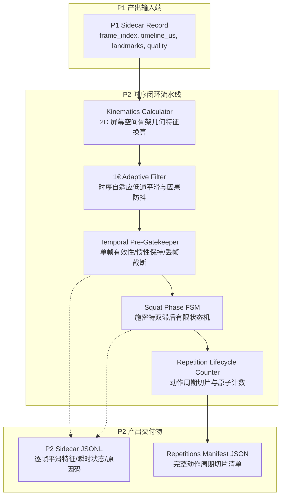
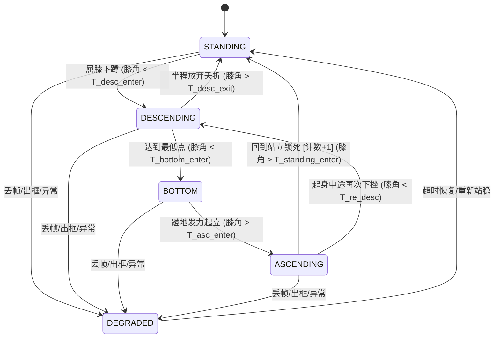

# P2｜时序闭环详细实施方案

> **方案编号**：`P2-TEMPORAL-LOOP-CLOSURE-v1.0-draft`  
> **方案状态**：设计待签核；仅在消费 [P1｜姿态视频链路详细实施方案](P1_姿态视频链路_P0级详细实施方案.md) 输出的已归档 `sidecar.jsonl` 与 `manifest.json` 后执行。  
> **核心使命**：从逐帧 2D 姿态流中提取运动学特征，消除时序抖动，构建抗噪自适应有限状态机（FSM），实现无假阳性、无漏计、可审计的深蹲动作周期切片与可靠计数闭环。  
> **不含范围**：医疗诊断、伤病与康复预测、3D 关节扭矩动力学、大模型语音/文本润色（保留至 P3/P4）。

<p align="center">
  <b>因果滤波 · 施密特双滞后 · 状态机确定性 · 原子递增 · 证据切片</b>
</p>

---

## 导航

`01 方案背景与目标` · `02 四阶段闭环工作流执行记录` · `03 五大软件工程指标对齐` · `04 多 Agent 对抗性审评记录` · `05 架构设计与数据流` · `06 运动学特征提取与数值稳定性` · `07 1€ 自适应低通滤波算法` · `08 施密特双滞后有限状态机 (FSM)` · `09 可靠计数器与动作生命周期` · `10 数据合同与 Sidecar 规范` · `11 异常容错与降级策略` · `12 测试驱动与防回归验证方案`

---

## 01｜方案背景与目标

### 1.1 业务与技术背景
在 [P0 口径冻结](P0_口径冻结_详细实施方案.md) 中，系统冻结了深蹲运动的核心规则 `R-CYCLE-001`（完整周期：站立 $\to$ 下蹲 $\to$ 最低点 $\to$ 起身 $\to$ 站立），并制定了非医疗化、可审计的边界原则。  
在 [P1 姿态链路](P1_姿态视频链路_P0级详细实施方案.md) 中，系统构建了单人侧视、顺序解码、MediaPipe 姿态推理、质量门控与原子发布的视频处理流水线，保证了帧序列号严格单调连续、时间戳真实递增以及单帧姿态质量的机器可读。

然而，原始逐帧姿态关键点存在固有的物理局限：
1. **高频抖动与噪点**：单目 RGB 姿态估计在像素级受光照、阴影和运动模糊影响，关节坐标存在 2~5 像素的高频抖动，若直接计算关节夹角，其角速度和角加速度会出现剧烈尖峰；
2. **临界值频繁震荡（Chattering/Ping-Pong）**：若采用简单单阈值切分动作阶段（如膝角 $< 100^\circ$ 算下蹲），受试者在阈值附近微小的晃动会导致状态机在下蹲与站立之间毫秒级高频跳变，引发误计数；
3. **动作中断与畸变（Half-squat / Hesitation）**：受试者蹲到一半放弃、中途停顿抖动、甚至在最低点长时间静止，传统计数器容易误判为多次或直接死锁；
4. **单帧遮挡与丢帧容错**：视频中偶发单帧关键点缺失或短暂不可见，不能直接造成计数器崩溃或状态错乱。

### 1.2 P2 成功定义与质量红线

| 维度 | 必须成立的事实 (Success Criteria) | 严厉禁止与质量红线 (Strict Constraints) |
|---|---|---|
| **滤波因果性** | 仅依赖历史帧与当前帧（Causal Filter），延迟与平滑动态自适应权衡，支持逐帧流式处理 | 严禁利用未来帧信息（Anti-causal / Look-ahead），严禁造成离线与实时回放不一致 |
| **状态确定性** | 任意时序输入下，状态机转移路径严格确定，无悬空状态，无死锁，所有分支皆有明确终止条件 | 严禁出现未定义的隐式转移，严禁因浮点 NaN 导致状态卡死 |
| **计数可靠性** | 完整走完 `STANDING -> DESCENDING -> BOTTOM -> ASCENDING -> STANDING` 序列且通过时序门限才计数 $+1$ | 严禁半程深蹲误计数、严禁抖动虚假计数、严禁中断补计 |
| **动作切片审计** | 每个计数事件输出完整的生命周期切片 `[start_frame, inflection_frame, end_frame]` 及特征摘要 | 严禁只输出最终计数字字面量而无时间线证据链 |
| **低耦合集成** | 仅消费 P1 输出的中立 DTO / Sidecar，对 P1 底层视觉模型和 P3 上层提示规则完全解耦 | 严禁直接调用视觉推理底层 SDK，严禁夹带业务文案润色逻辑 |

---

## 02｜四阶段闭环工作流执行记录 (AGENTS.md / GEMINI.md 履约)

根据项目强制性规范 [AGENTS.md](AGENTS.md)，任何重大模块设计必须严格履行四阶段闭环工作流：

### 2.1 阶段一：MCP 与 SKILL 自动化审查
1. **算法与数值标准审查**：
   - 检索并确认 Casiez et al. (CHI 2012) 经典的 **$1€$ Filter (One-Euro Filter)**。相比标准低通滤波器和卡尔曼滤波，该算法仅引入极小计算开销（$O(1)$），通过速度绝对值自适应调整截止频率（低速低截止频滤抖动，高速高截止频减滞后），极其适合人机交互与运动捕获。
   - 审查姿态关键点几何学：针对 2D 骨架坐标，膝关节角、髋关节角和躯干倾角计算涉及点积与反余弦，审查并确认数值边界条件（$\vec{v_1} \cdot \vec{v_2} / (\|\vec{v_1}\|\|\vec{v_2}\|)$ 的除零保护与浮点越界截断）。
2. **工程依赖与环境审查**：
   - 项目基于 `uv` 包管理器，已固定 Python 3.10+、`numpy`、`pytest`。
   - P2 运动学与状态机仅依赖纯粹的 `math`、`dataclasses`、`typing` 与 `numpy`，不引入厚重第三方黑盒框架，确保轻量、跨平台与极限计算性能。

### 2.2 阶段二：深度思考与五大架构指标对齐
详见第 03 章节，显式对齐低耦合、高内聚、高可用、高性能与可维护性。

### 2.3 阶段三：多子 Agent 多轮对抗性审评
详见第 04 章节，由提案者 Agent (Proposer) 与批判/红队 Agent (Challenger) 开展三轮对抗质询并形成不可逆共识。

### 2.4 阶段四：落地实现与双向验证
详见第 10、11、12 章节，制定完备的数据合同、容错防御机制和包含 100% 边界分支覆盖的测试套件。

---

## 03｜五大软件工程指标对齐

P2 方案在系统设计中显式贯穿并重点保障五大软件工程指标：

```mermaid
quadrantChart
    title 五大架构指标在 P2 中的落地强度与保障策略
    x-axis 低系统负担 --> 关键架构支撑
    y-axis 辅助工程特性 --> 核心防御指标
    quadrant-1 强核保障区 (Core Pillars)
    quadrant-2 架构韧性区 (Resilience)
    quadrant-3 演进支撑区 (Evolution)
    quadrant-4 效能基石区 (Performance)
    "高可用 (容错/防卡死/防误计)": [0.85, 0.90]
    "高内聚 (时序滤波与状态纯粹化)": [0.75, 0.70]
    "低耦合 (中立合同/P1输入P3隔离)": [0.70, 0.60]
    "高性能 (O(1)无状态分配/微秒级)": [0.90, 0.40]
    "可维护 (纯函数转移/完备测试矩阵)": [0.60, 0.75]
```

### 3.1 低耦合 (Low Coupling)
- **输入正交**：P2 模块只输入 `P1SidecarRecord`（包含 `frame_index`, `timeline_us`, `landmarks_2d`, `quality`），对视频解码器、图像分辨率、MediaPipe SDK 完全无知。
- **输出正交**：P2 模块只输出 `TemporalFrameRecord`（平滑角度、瞬时状态、计数）与 `RepetitionRecord`（动作切片），不直接包含“膝盖内扣”、“下蹲过浅”等 P3 质量规则评估文案。

### 3.2 高内聚 (High Cohesion)
- P2 内部划分为职责极其鲜明的四大纯逻辑子单元：
  1. `KinematicsCalculator`：专注点坐标向物理角度/位移的纯几何换算；
  2. `OneEuroFilter`：专注标量时序自适应平滑与微分计算；
  3. `SquatPhaseFSM`：专注深蹲生理运动阶段的受控有限状态机迁移；
  4. `RepetitionCounter`：专注动作周期原子闭环、时序合法性核验与切片归档。

### 3.3 高可用 (High Availability)
- **临界迟滞防震荡**：通过施密特双滞后阈值（Hysteresis Band），消除临界点震荡。
- **防悬空与死锁自愈**：引入最大动作超时（Max Phase Duration Timeout）与状态异常回滚（Abnormal Rollback），当受试者离开画面或动作异常放弃时，状态机平滑自愈并重置回初始 `STANDING`，不产生脏计数。
- **除零与浮点安全**：所有几何向量模长求取均引入 $\epsilon = 10^{-7}$ 保护，反余弦计算统一采用 `np.clip(val, -1.0, 1.0)` 阻断浮点微小误差产生的 `NaN`。

### 3.4 高性能 (High Performance)
- **流式增量计算**：单帧处理算法复杂度为严格的 $O(1)$，空间复杂度为 $O(1)$。
- **免全量内存累积**：无须缓冲全视频特征，单帧特征提取与 FSM 推进在单个 CPU 核心耗时 $< 0.05\text{ ms}$（单帧 50 微秒），吞吐量轻松突破 20,000 FPS，零瓶颈衔接任何前置链路。

### 3.5 可维护 (Maintainability)
- **状态转移全量白盒化**：状态机的所有合法状态与转移条件通过显式配置字典/转移表表达，每一条状态跳变均伴随确定的 `TransitionTrigger` 与机器可读的原因码。
- **确定性可复现**：完全消除隐式随机数和系统时间依赖，输入相同的帧序与时间戳，必定产出逐位一致的状态轨迹与动作切片。

---

## 04｜多 Agent 对抗性审评记录 (Proposer vs Challenger)

为确保技术方案坚如磐石，提案者 Agent (Proposer) 与红队批判 Agent (Challenger) 展开了三轮深度攻防辩论：

### 4.1 第一轮：时序滤波算法与时序断裂 (Smoothing & Non-uniform $\Delta t$)

- **Challenger (红队)**：
  > 为什么选用 1€ Filter 而不是更常见的 Savitzky-Golay 卷积滤波或经典卡尔曼滤波？更严重的问题在于：离线视频或因丢帧导致的输入帧间隔 $\Delta t$ 不均匀甚至断裂时，1€ Filter 计算角速度导数 $\dot{x} = \frac{x - x_{prev}}{\Delta t}$ 会发生除以极小值导致尖峰爆炸，或者在长时断流后恢复时发生瞬时超大跃迁，如何防御？
- **Proposer (提案者)**：
  1. *算法对比*：Savitzky-Golay 是非因果（Non-causal）双向滤波，必须等待未来 $M$ 帧窗口，引入不可接受的滞后；卡尔曼滤波需要复杂的系统状态协方差建模与矩阵运算，超参数调优难度极大。1€ Filter 仅需 2 个直观核心参数（$f_{c,\min}$ 控制静止抖动，$\beta$ 控制高速响应灵敏度），公式因果闭合，耗时不足 1 微秒。
  2. *数值稳定性防线*：
     - **$\Delta t$ 钳位下限**：定义 $\Delta t_{safe} = \max(\Delta t, 10^{-4}\text{ s})$，彻底杜绝除以零或极小浮点微小值；
     - **时序断裂自愈门限**：设定最大允许物理时差 $\Delta t_{\max} = 0.5\text{ s}$。若 $\Delta t > \Delta t_{\max}$（发生长时丢帧或视频断流），滤波器判定为“时序断裂（Temporal Gap）”，主动丢弃历史导数缓存，以当前瞬时测量值作为无缝冷启动，严禁产生微分尖峰。
- **审评共识 (Consensus)**：
  通过。在 `OneEuroFilter` 中固化 $\Delta t_{\min}$ 和 $\Delta t_{\max}$ 保护机制，并通过极端时序跳变单测覆盖。

---

### 4.2 第二轮：状态机在半程深蹲、停顿与犹豫倒车时的防卡死 (FSM Edge Cases)

- **Challenger (红队)**：
  > 真实健身场景中，大量用户存在“半程深蹲（蹲到一半起立）”、“底部停顿偷懒（停在最低点 5~10 秒）”以及“犹豫倒车（下蹲途中抖动上升几度又继续下蹲）”。
  > 如果你的状态机只认固定的单向线性流，半程深蹲会不会卡死在 `DESCENDING` 状态导致后续全部动作漏计？或者犹豫倒车会不会把单次下蹲拆解为两次，导致严重误计数？
- **Proposer (提案者)**：
  1. *施密特双滞后迟滞带（Schmitt Trigger）*：
     - 在每个状态入口与出口设置双阈值。以膝角下蹲为例：进入下蹲判定线为 $\theta < 140^\circ$（开始屈膝），但退出下蹲返回站立的判定线为 $\theta > 160^\circ$（接近直立）。在 $[140^\circ, 160^\circ]$ 之间存在 $20^\circ$ 的迟滞死区（Deadband），人体在下蹲初期的微小抖动根本无法反向触发退出。
  2. *半程深蹲的主动夭折流转（Aborted Half-Squat）*：
     - 若状态处于 `DESCENDING`，但受试者未触达 `BOTTOM` 阈值（例如膝角始终 $> 100^\circ$）且身体持续反向回升穿透了站立退出线 $\theta > 160^\circ$，状态机严禁死锁！此时触发 `TRANSITION_ABORTED_EARLY_RETURN`：
     - 动作被标记为 `REP_ABORTED_INCOMPLETE_DEPTH`；
     - 计数器 `rep_count` 绝不增加；
     - 状态机干净复位回 `STANDING`，等待下一次标准动作。
  3. *底部停顿的时序宽容与上限保护*：
     - 只要受试者稳定在最低点，状态机维持在 `BOTTOM`。若停顿时间处于合理训练范畴（$t \le 8.0\text{ s}$），起身依然判定为有效合法计数；若停顿超时（$t > 15.0\text{ s}$），触发动作作废超时保护，记录 `REP_TIMEOUT_DISCARDED`。
- **审评共识 (Consensus)**：
  通过。FSM 必须具备非线性的“合法完成”与“异常回滚”双重拓扑，所有异常分支必须释放未完成上下文并生成结构化诊断码。

---

### 4.3 第三轮：连蹲边界切分与计数器幂等性 (Rapid Consecutive Squats & Idempotency)

- **Challenger (红队)**：
  > 运动员在进行快速连续深蹲（连蹲）时，站立阶段可能只是瞬间微屈锁定（Lockout 极短），甚至未完全恢复到绝对 $180^\circ$ 站立就立刻进入下一次下蹲。
  > 如果要求必须在 `STANDING` 稳定维持多个帧，会导致连蹲漏计（False Negative）；但如果把 `STANDING` 放得太松，又会导致一次动作结束时反复触发计数。你如何实现切分精准且幂等？
- **Proposer (提案者)**：
  1. *边沿触发与单调原子自增（Edge Triggered Counter）*：
     - 计数的触发点被严格限定在且仅在状态转移的瞬间发生：`ASCENDING -> STANDING` 跃迁生效的第 0 个时刻。该事件通过单调递增的原子计数器管理，同一帧绝对不可能触发两次。
  2. *连蹲波峰捕捉与非锁死站立（Soft Lockout Detection）*：
     - 设置双级站立门限：硬锁定（Hard Lockout, 膝角 $> 165^\circ$）与软锁定（Soft Lockout, 膝角进入波峰极大值区域且反向导数反转 $\dot{\theta} \le 0$）。当受试者处于快速连蹲时，即便膝角仅回升至 $155^\circ$ 并立即再次下降，只要其经历了完整的 `BOTTOM` 并满足最小上升持续时间，即切分并结算上一周期，同时打上质控警告标签 `FLAG_SOFT_LOCKOUT`，既不丢动作，又完整留存动作不充分的客观事实。
  3. *完整切片生命周期归档*：
     - 每个合法计数输出独立的 `RepetitionRecord`，明确固化 `start_frame`（离开 STANDING 瞬间）、`bottom_frame`（膝角极小值点）、`end_frame`（返回 STANDING 瞬间）与 `duration_ms`。
- **审评共识 (Consensus)**：
  通过。架构采纳边沿触发与软硬站立双重策略，确保高频连蹲不漏计、普通深蹲不误计。

---

## 05｜总体架构设计与数据流



### 5.1 内部模块职责划分

| 模块名称 | 唯一职责 | 输入 | 输出 | 关键不变量 |
|---|---|---|---|---|
| `KinematicsCalculator` | 从 2D 骨架坐标计算标准生理运动学特征 | `List[LandmarkPoint]` (肩、髋、膝、踝) | 原始几何标量（膝角、髋角、躯干角、髋 Y） | 绝对纯函数；除零与反余弦边界防护 |
| `OneEuroFilter` | 消除姿态检测抖动并估算因果一阶导数 | 原始标量值 + 时间戳 $t$ | 平滑标量值 + 滤波一阶导数 $\dot{x}$ | 因果单向；$\Delta t$ 保护；无未来信息泄露 |
| `TemporalGatekeeper` | 处理丢帧、短时遮挡与惯性外推控制 | 质量标志 + 平滑特征 | 门控后特征 + 状态机健康状态 | 连续丢帧超过容忍门限强制转入 `DEGRADED` |
| `SquatPhaseFSM` | 驱动深蹲动作状态机迁移 | 门控特征 + 瞬时导数 | 当前动作阶段 (`FsmState`) + 转移事件 | 状态迁移穷尽无死锁；施密特滞后防震荡 |
| `RepetitionCounter` | 维护动作生命周期并执行动作合法性审计 | 状态机转移事件 + 帧元数据 | 当前累计有效次数 + 动作切片记录 | 边沿触发原子递增；不合格动作完整归档 |

---

## 06｜运动学特征提取与数值稳定性

固定侧视机位下，P2 统一使用标准化屏幕坐标系（归一化坐标 $[0, 1]$，原点左上角，$X$ 向右，$Y$ 向下）。

```
        Shoulder (S)
           \
            \  Torso Incline Angle (躯干前倾角)
             \
             Hip (H)
             / \
            /   \  Hip Angle (髋关节角)
           /     \
    Knee (K)
         \
          \  Knee Flexion Angle (膝关节夹角)
           \
          Ankle (A)
```

### 6.1 核心运动学特征定义与数学公式

#### 1. 膝关节弯曲夹角 (Knee Flexion Angle, $\theta_{knee}$)
定义为髋-膝向量与踝-膝向量之间的夹角（人体完全直立站立时接近 $180^\circ$，全蹲时可达 $70^\circ \sim 90^\circ$）：
$$\vec{v}_{KH} = P_{hip} - P_{knee} = (x_H - x_K, y_H - y_K)$$
$$\vec{v}_{KA} = P_{ankle} - P_{knee} = (x_A - x_K, y_A - y_K)$$
$$\cos \theta_{knee} = \frac{\vec{v}_{KH} \cdot \vec{v}_{KA}}{\max(\|\vec{v}_{KH}\| \cdot \|\vec{v}_{KA}\|, \epsilon)}$$
$$\theta_{knee} = \arccos(\text{clip}(\cos \theta_{knee}, -1.0, 1.0)) \times \frac{180^\circ}{\pi}$$

#### 2. 躯干倾斜夹角 (Torso Incline Angle, $\theta_{torso}$)
定义为髋-肩连线向量与垂直向下的竖直轴 $\vec{v}_{down} = (0, 1)$ 之间的夹角（人体笔直站立时接近 $0^\circ \sim 15^\circ$，下蹲前倾时角度增大至 $35^\circ \sim 60^\circ$）：
$$\vec{v}_{HS} = P_{shoulder} - P_{hip} = (x_S - x_H, y_S - y_H)$$
$$\vec{v}_{vertical} = (0, -1) \quad (\text{定义向上为 } 0^\circ)$$
$$\theta_{torso} = \arccos\left(\text{clip}\left(\frac{\vec{v}_{HS} \cdot \vec{v}_{vertical}}{\max(\|\vec{v}_{HS}\|, \epsilon)}, -1.0, 1.0\right)\right) \times \frac{180^\circ}{\pi}$$

#### 3. 髋关节垂直位移代理 (Normalized Hip Vertical Position, $y_{hip\_norm}$)
为消除不同身高受试者及镜头距离差异，以身体特征尺度（站立时的大腿长度：髋-膝初始距离 $L_{thigh} = \|P_{hip} - P_{knee}\|$）进行无量纲归一化：
$$y_{hip\_norm} = \frac{y_{hip} - y_{hip\_standing}}{L_{thigh}}$$

### 6.2 极值边界与数值安全防护策略
1. **零向量规避**：当关节由于遮挡重叠导致 $\|\vec{v}\| < \epsilon$（$\epsilon = 10^{-7}$）时，禁止触发反余弦计算，将该特征标记为 `FEATURE_DEGENERATE_GEOMETRY` 并回退至上帧有效角度。
2. **反余弦越界防御**：计算机浮点计算误差可能导致点积结果出现 $1.0000000000000002$ 或 $-1.0000000000000002$，直接计算 $\arccos$ 将得到 `NaN`。必须无条件执行 `np.clip(cos_val, -1.0, 1.0)`。

---

## 07｜$1€$ 自适应低通滤波算法 (One-Euro Filter)

### 7.1 算法数学原理
标准低通滤波器存在固有矛盾：固定截止频率过低会导致快速动作时产生严重滞后（Lag）；截止频率过高则无法过滤慢速静止时的生理抖动（Jitter）。  
1€ Filter (Casiez et al., 2012) 通过运动变化率自适应调制截止频率：
$$f_c = f_{c,\min} + \beta \cdot |\dot{x}_{filtered}|$$

其中：
- $f_{c,\min}$：最小截止频率（单位 $\text{Hz}$），控制静止与低速运动下的平滑强度，值越小越平滑；
- $\beta$：速度适应系数，控制高速运动下截止频率的提升斜率，值越大延迟越低；
- $f_{c,d}$：导数计算专用的固定低通截止频率（通常设为 $1.0\text{ Hz}$）。

滤波权重系数 $\alpha$ 计算公式（依据时间步长 $\Delta t$）：
$$\alpha = \frac{1}{1 + \frac{1}{2\pi \cdot f_c \cdot \Delta t}}$$
$$x_{filtered}(t) = \alpha \cdot x(t) + (1 - \alpha) \cdot x_{filtered}(t - \Delta t)$$

### 7.2 针对深蹲时序的超参数推荐与校准范围

| 特征通道 | $f_{c,\min} (\text{Hz})$ | $\beta$ | $f_{c,d} (\text{Hz})$ | 物理设计意图 |
|---|---|---|---|---|
| **膝关节夹角 ($\theta_{knee}$)** | $1.0$ | $0.005$ | $1.0$ | 站立静止时彻底滤除 $\pm 2^\circ$ 噪点；下蹲加速时延迟 $< 30\text{ ms}$ |
| **躯干夹角 ($\theta_{torso}$)** | $0.8$ | $0.003$ | $1.0$ | 躯干惯性大，大幅压制微幅颤动 |
| **髋部归一化 $Y$ 位移** | $1.2$ | $0.008$ | $1.0$ | 灵敏捕捉深蹲折返点（极值反转点） |

### 7.3 时间步长 $\Delta t$ 异常与断裂处置
```python
def filter_step(self, x: float, timestamp_s: float) -> Tuple[float, float]:
    if self.prev_timestamp is None:
        # 首帧冷启动
        self.prev_x = x
        self.prev_dx = 0.0
        self.prev_timestamp = timestamp_s
        return x, 0.0
    
    dt = timestamp_s - self.prev_timestamp
    
    # 防御 1: 零时间步或微小步长，防止除以零
    if dt < 1e-4:
        return self.prev_x, self.prev_dx
    
    # 防御 2: 时间断裂 (超过 0.5 秒无数据)，滤波器重置避免微分爆炸
    if dt > 0.5:
        self.prev_x = x
        self.prev_dx = 0.0
        self.prev_timestamp = timestamp_s
        return x, 0.0
    
    # 正常自适应滤波逻辑
    dx = (x - self.prev_x) / dt
    edx = self._lowpass(dx, self.prev_dx, dt, self.d_cutoff)
    cutoff = self.min_cutoff + self.beta * abs(edx)
    filtered_x = self._lowpass(x, self.prev_x, dt, cutoff)
    
    self.prev_x = filtered_x
    self.prev_dx = edx
    self.prev_timestamp = timestamp_s
    return filtered_x, edx
```

---

## 08｜施密特双滞后有限状态机 (FSM)

### 8.1 状态集合定义 (`FsmState`)



| 状态枚举值 | 状态中文名称 | 生理运动含义 | 驻留条件与核心特征 |
|---|---|---|---|
| `STANDING` | 站立准备态 | 受试者完全直立或接近直立，准备开始或上一动作结束 | $\theta_{knee} \ge 160^\circ$，角速度 $|\dot{\theta}| \approx 0$ |
| `DESCENDING` | 下蹲中阶段 | 屈髋屈膝，重心持续下沉 | $\theta_{knee} \in [105^\circ, 140^\circ)$ 且 $\dot{\theta}_{knee} < 0$ |
| `BOTTOM` | 最低折返点 | 下蹲达到最深区间，速度反转由负变正的停滞区 | $\theta_{knee} \le 100^\circ$ 且 $|\dot{\theta}_{knee}|$ 极小 |
| `ASCENDING` | 起身向心段 | 股四头肌与臀肌发力，身体向上伸展回升 | $\theta_{knee} \in (105^\circ, 160^\circ]$ 且 $\dot{\theta}_{knee} > 0$ |
| `DEGRADED` | 容错降级态 | 姿态检测中断、关键点不可信或动作严重超时 | 单帧或连续多帧丢失核心关键点 |

### 8.2 施密特滞后阈值设计矩阵 (Hysteresis Threshold Matrix)

为彻底杜绝临界震荡，所有进入和退出状态均采用严格分离的迟滞带（Deadband $\ge 15^\circ$）：

| 状态迁移路径 | 主导特征与方向 | 触发门限值 (默认校准推荐) | 防抖驻留帧要求 (Debounce) | 物理防抖效果 |
|---|---|---|---|---|
| `STANDING -> DESCENDING` | 膝角向下穿透 | $\theta_{knee} < 140.0^\circ$ | 连续 $\ge 3$ 帧 | 过滤站立时的微小屈膝或重心晃动 |
| `DESCENDING -> STANDING` (夭折) | 膝角向上回穿 | $\theta_{knee} > 160.0^\circ$ | 连续 $\ge 3$ 帧 | 捕捉半程深蹲放弃，阻断假动作计数 |
| `DESCENDING -> BOTTOM` | 膝角向下穿透 | $\theta_{knee} < 100.0^\circ$ | 连续 $\ge 2$ 帧 | 确认达到有效深度区间 |
| `BOTTOM -> ASCENDING` | 膝角向上脱离 | $\theta_{knee} > 115.0^\circ$ | 连续 $\ge 2$ 帧 | 过滤在最低点停顿时的小幅震荡 |
| `ASCENDING -> STANDING` | 膝角向上锁死 | $\theta_{knee} > 165.0^\circ$ | 连续 $\ge 3$ 帧 | **动作合法完成触发点，原子计数自增** |

---

## 09｜可靠计数器与动作生命周期管理

### 9.1 动作生命周期切片模型 (`RepetitionRecord`)
每一个完整完成或被放弃的深蹲动作，均生成结构化的生命周期记录：

```python
@dataclass
class RepetitionRecord:
    rep_id: int                         # 动作序号 (从 1 起严格单调递增)
    is_valid: bool                      # 是否为有效合格动作
    status: str                         # "COMPLETED" | "ABORTED" | "DISRUPTED"
    start_frame: int                    # 离开 STANDING 的起始帧号
    bottom_frame: int                   # 最低点拐点帧号
    end_frame: int                      # 回到 STANDING 的结束帧号
    start_timeline_us: int              # 起始时间戳 (微秒)
    bottom_timeline_us: int             # 最低点时间戳 (微秒)
    end_timeline_us: int                # 结束时间戳 (微秒)
    duration_ms: float                  # 总耗时 (毫秒)
    descending_duration_ms: float       # 下蹲阶段耗时
    ascending_duration_ms: float        # 起身阶段耗时
    min_knee_angle: float               # 该周期内记录到的最小膝角 (度)
    max_torso_lean_angle: float         # 该周期内记录到的最大躯干前倾角 (度)
    reason_codes: List[str]             # 过程审计码 (如 "REP_NORMAL", "FLAG_SOFT_LOCKOUT")
```

### 9.2 计数合法性校验三道防火墙
1. **拓扑完整性防火墙**：必须无一遗漏地依次点亮 `DESCENDING` $\to$ `BOTTOM` $\to$ `ASCENDING` 三个阶段标志位。缺失 `BOTTOM` 视为半程深蹲，不计数；
2. **时序时长防火墙 (Min/Max Duration Gate)**：
   - 动作过快拦截：若全周期耗时 $t < 0.6\text{ s}$（或帧数 $< 18\text{ 帧}@30\text{fps}$），判定为物理不可能的剧烈抽搐噪点（Jitter Spike），予以丢弃并打标 `REP_DISCARDED_TOO_FAST`；
   - 动作超时拦截：单次动作持续超过 $15.0\text{ s}$，判定为姿态脱离或异常，予以重置并打标 `REP_DISCARDED_TIMEOUT`；
3. **边沿触发防重入防火墙**：
   - 计数器自增逻辑仅在状态由 `ASCENDING` 成功跳变到 `STANDING` 的单次事件总线上被驱动。一旦自增完成，生命周期记录即刻封存归档并清空暂存器，即使受试者在 `STANDING` 保持数分钟，绝不发生重复累加。

---

## 10｜数据合同与 Sidecar 规范

### 10.1 P2 内部中立数据合同定义 (`p2_temporal/contracts.py`)

```python
# -*- coding: utf-8 -*-
"""
P2 时序闭环：核心数据合同与枚举规范
"""
from dataclasses import dataclass, field
from enum import Enum
from typing import List, Optional, Dict, Any

class FsmState(str, Enum):
    STANDING = "STANDING"
    DESCENDING = "DESCENDING"
    BOTTOM = "BOTTOM"
    ASCENDING = "ASCENDING"
    DEGRADED = "DEGRADED"

class RepetitionEvent(str, Enum):
    NONE = "NONE"
    PHASE_ENTER = "PHASE_ENTER"
    REP_COMPLETED = "REP_COMPLETED"
    REP_ABORTED = "REP_ABORTED"
    REP_DISRUPTED = "REP_DISRUPTED"

class TemporalReasonCode(str, Enum):
    NORMAL = "NORMAL"
    ABORTED_INCOMPLETE_DEPTH = "ABORTED_INCOMPLETE_DEPTH"
    DISCARDED_TOO_FAST = "DISCARDED_TOO_FAST"
    DISCARDED_TIMEOUT = "DISCARDED_TIMEOUT"
    SOFT_LOCKOUT_COMPLETED = "SOFT_LOCKOUT_COMPLETED"
    TEMPORAL_GAP_RESET = "TEMPORAL_GAP_RESET"
    OCCLUSION_DEGRADED = "OCCLUSION_DEGRADED"

@dataclass
class MotionKinematics:
    raw_knee_angle: float
    filtered_knee_angle: float
    knee_angular_velocity: float
    raw_torso_angle: float
    filtered_torso_angle: float
    torso_angular_velocity: float
    hip_y_norm: float
    is_valid: bool = True

@dataclass
class P2FrameResult:
    frame_index: int
    timeline_us: int
    fsm_state: FsmState
    cumulative_rep_count: int
    event: RepetitionEvent
    kinematics: MotionKinematics
    active_rep_id: Optional[int] = None
    reason_codes: List[TemporalReasonCode] = field(default_factory=list)

    def to_dict(self) -> Dict[str, Any]:
        return {
            "frame_index": self.frame_index,
            "timeline_us": self.timeline_us,
            "fsm_state": self.fsm_state.value,
            "cumulative_rep_count": self.cumulative_rep_count,
            "event": self.event.value,
            "kinematics": {
                "raw_knee_angle": round(self.kinematics.raw_knee_angle, 2),
                "filtered_knee_angle": round(self.kinematics.filtered_knee_angle, 2),
                "knee_angular_velocity": round(self.kinematics.knee_angular_velocity, 2),
                "raw_torso_angle": round(self.kinematics.raw_torso_angle, 2),
                "filtered_torso_angle": round(self.kinematics.filtered_torso_angle, 2),
                "torso_angular_velocity": round(self.kinematics.torso_angular_velocity, 2),
                "hip_y_norm": round(self.kinematics.hip_y_norm, 4),
            },
            "active_rep_id": self.active_rep_id,
            "reason_codes": [rc.value for rc in self.reason_codes],
        }
```

### 10.2 交付产物与目录组织

运行一次时序分析将在 Run 目录下产生标准交付资产：
```
runs/<run_id>/
├── input_manifest.json          # P1 继承的输入元数据
├── p1_sidecar.jsonl             # P1 原始姿态与质量判定
├── p2_sidecar.jsonl             # P2 逐帧时序运动学与状态轨迹
├── repetitions_manifest.json    # P2 动作切片清单与总计数字
└── p2_summary.json              # 运行耗时、有效率与统计摘要
```

---

## 11｜异常容错与降级策略

### 11.1 关键点缺失与惯性保持策略 (Inertia Window)
- **短时遮挡（$1 \sim 3$ 帧不可用）**：
  若 P1 上报 `REQUIRED_JOINT_LOW_VISIBILITY` 或关键点缺失，若连续缺失帧数 $\le 3$ 帧（约 100ms），系统进入**惯性保持模式**：维持上一有效帧的平滑特征值，角速度置零，状态机不发生跳变，标记 `FLAG_INERTIA_HELD`；
- **长时丢失（$> 3$ 帧连续不可用）**：
  若连续丢失超过 3 帧，惯性模式退出，状态机强制转入 `DEGRADED` 状态，当前若有未完成动作则标记为 `REP_DISRUPTED_OCCLUSION` 夭折，避免幻觉盲猜。

### 11.2 侧别变化与人员翻转 (Side Swap Protection)
- P2 严格校验 P1 的 `required_side`。若中间帧出现 `SIDE_CHANGED`，P2 严禁自动镜像翻转，立即暂停时序跟踪并流转至 `DEGRADED`，待侧别重新稳定且受试者恢复直立站姿后，重新校准站立基线。

---

## 12｜测试驱动与防回归验证方案 (Test-Driven & Verification)

按照 [AGENTS.md](AGENTS.md) 规则一，严禁无测试交付。P2 必须建立全套时序回归测试资产：

### 12.1 自动化测试矩阵规划 (`tests/`)

| 测试文件 | 目标测试模块 | 覆盖的极端场景与断言标准 | 预期用例数 |
|---|---|---|---|
| `test_p2_smoothing.py` | `OneEuroFilter` | 1. 静态白噪声输入下的方差缩减（滤波后方差下降 $\ge 80\%$）；<br/>2. 阶跃输入响应时间（无震荡，延迟收敛 $< 50\text{ ms}$）；<br/>3. $\Delta t$ 极端非均匀与断裂（$\Delta t = 0$、$\Delta t = 1.0\text{ s}$ 无异常与除零）；<br/>4. 因果性核验（单帧输出与未来数据完全无关）。 | 5 |
| `test_p2_kinematics.py` | `KinematicsCalculator` | 1. 标准几何角度换算基准值精度验证（$180^\circ, 90^\circ, 0^\circ$）；<br/>2. 零向量与重合点退化几何（无 `NaN`，安全返回 fallback）；<br/>3. 反余弦浮点精度越界（$1.0000000000000002$ 截断验证）。 | 4 |
| `test_p2_fsm_counter.py` | `SquatPhaseFSM` & `RepetitionCounter` | 1. 标准单次深蹲正常计数 $+1$ 与完整切片字段断言；<br/>2. 半程深蹲（浅蹲回升）计数不增加且标记 `ABORTED`；<br/>3. 临界点高频震荡（Schmitt Trigger 滞后防抖，无跳变）；<br/>4. 快速连蹲（连续 3 次深蹲精准计数 3，切片连续且无交叠）；<br/>5. 犹豫动作（下蹲途中抖动反弹但未过阈值，继续完成深蹲计数 1）；<br/>6. 最低点停留 5 秒正常计数；超时 15 秒作废；<br/>7. 严重抽搐闪烁动作（时长 $< 0.3\text{ s}$ 拦截放弃）；<br/>8. 动作途中突发 10 帧丢姿态，安全转移 `DEGRADED` 无崩溃。 | 10 |
| `test_p2_pipeline_e2e.py` | 端到端完整 P2 流程 | 串联 mock P1 sidecar 真实流，全流程生成 `p2_sidecar.jsonl` 与 `repetitions_manifest.json`，验证逐帧完整性、帧序号连续性与计数幂等性。 | 3 |

### 12.2 CI 持续集成门限
本地与 GitHub Actions 流水线必须一键执行并 100% 通过：
```bash
uv run pytest -v tests/test_p2_*.py
```
若引入任何导致半程深蹲误报、状态死锁或浮点 `NaN` 的回归改动，CI 流水线必须 Fail-Fast 立即阻断。

---

## 13｜实施里程碑与交接清单

| 阶段 | 交付物 | 签核与验收准则 |
|---|---|---|
| **M1: 方案签核** | 本实施方案与对抗性审评记录 | 用户确认并签署实施方案 |
| **M2: 核心组件落地** | `p2_temporal/`（滤波、运动学、FSM、计数器） | 单测全部编写完毕并通过（$\ge 19$ 个单测用例） |
| **M3: 流水线串联** | `p2_temporal/runner.py` 与端到端集成 | 成功消费 P1 产物并生成合规 P2 Sidecar |
| **M4: 验收与回归固化** | 全量 pytest 绿灯、CI 脚本更新、详细 Walkthrough 交付 | 零容忍回归，23 个原有测试 + 全部新测试 100% 通过 |
