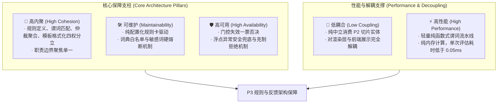
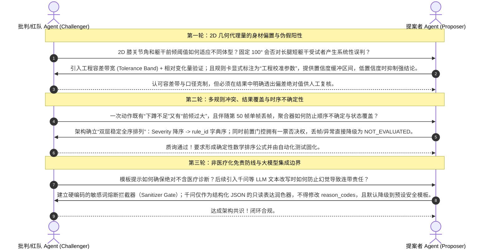
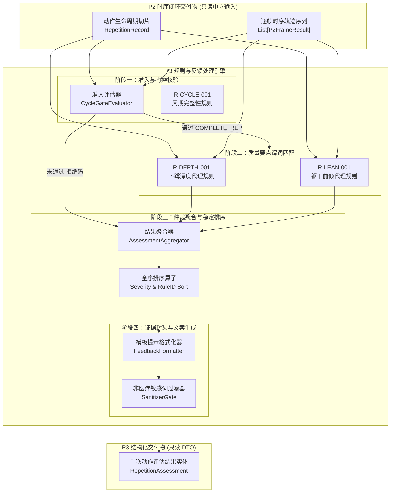
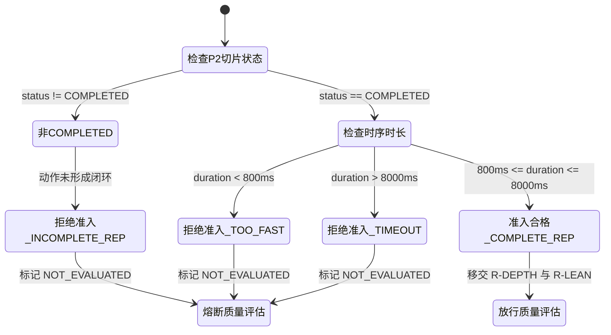
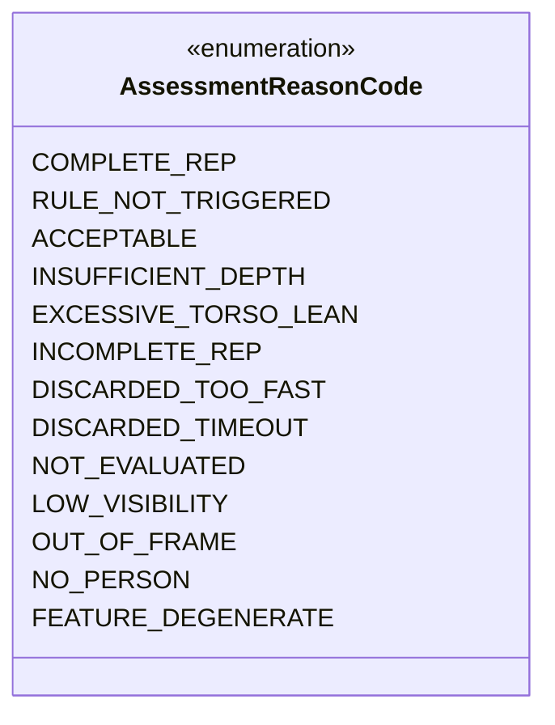
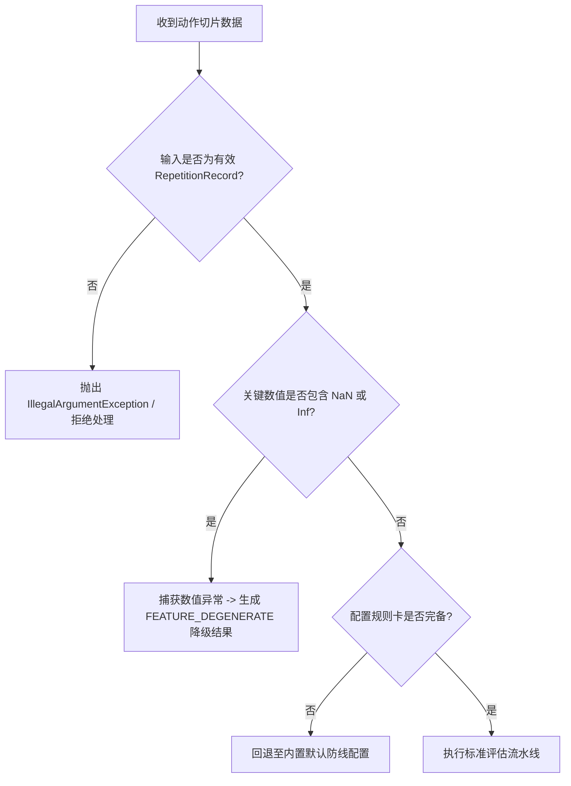
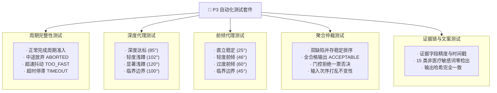

# P3｜规则与反馈详细实施方案

> **方案编号**：`P3-RULES-FEEDBACK-ENGINE-v1.0-draft`  
> **方案状态**：设计待签核；仅在消费 [P2｜时序闭环详细实施方案](P2_时序闭环_详细实施方案.md) 输出的 `RepetitionRecord` 与 `P2FrameResult` 时序切片流后执行。  
> **核心使命**：基于已冻结的规则卡集，对深蹲动作切片进行三类核心规则判定（周期完整性、下蹲深度代理、躯干前倾代理），输出确定性原因码、严重度排序的结构化结论、带有时间戳与数值偏差的证据链，以及非医疗化模板反馈。  
> **不含范围**：医疗诊断、损伤预测、关节扭矩生物力学动力学、直接利用大模型决定动作对错（保留受限的只读文本润色扩展接口）。

<p align="center">
  <b>三类规则 · 确定性原因码 · 证据链对齐 · 严重度聚合 · 非医疗化提示</b>
</p>

---

## 导航

`01 方案背景与目标` · `02 四阶段闭环工作流执行记录` · `03 五大软件工程指标对齐` · `04 多 Agent 对抗性审评记录` · `05 架构拓扑与数据流` · `06 三类核心规则深度设计` · `07 原因码体系与拒绝矩阵` · `08 确定性结果聚合策略` · `09 证据链留痕与模板反馈生成` · `10 数据合同与解耦设计备忘` · `11 异常容错与降级策略` · `12 测试驱动与防回归验证方案`

---

## 01｜方案背景与目标

### 1.1 业务与技术背景
在本项目的前序建设中，已建立起完整的工程基线链路：
- 在 [P0 口径冻结](P0_口径冻结_详细实施方案.md) 中，通过 G0~G6 准入门禁确立了单人侧视受控场景、非医疗化免责边界、规则卡集规范（`R-CYCLE-001`, `R-DEPTH-001`, `R-LEAN-001`）以及无效拒绝矩阵；
- 在 [P1 姿态视频链路](P1_姿态视频链路_P0级详细实施方案.md) 中，完成了基于 MediaPipe 的逐帧姿态提取、帧序单调递增、有效性门控（`G1/G2`）及无业务倾向的中立 DTO 导出；
- 在 [P2 时序闭环](P2_时序闭环_详细实施方案.md) 中，完成了因果自适应 One-Euro 滤波、2D 运动学角度计算、施密特双滞后有限状态机（FSM）与可靠动作周期切片提取，输出了结构化动作实体 `RepetitionRecord`。

然而，如何从纯粹的“动作完成事件与时序特征”跨越到“对训练者有指导意义的动作要点评估”，面临以下核心痛点：
1. **规则与文案硬编码耦合**：传统健身 Demo 往往在状态机中硬编码 `if knee_angle < 90: print("太棒了")`，逻辑与文案交织，导致阈值不可调、规则不可解释、无法针对不同人群和机位进行工程校准；
2. **多缺陷并存时的判定混乱**：受试者在一次深蹲中可能同时出现“深度不足”与“躯干严重前倾”，若缺乏明确的严重度与优先级仲裁机制，输出反馈会出现随机覆盖、自相矛盾；
3. **缺乏证据链与可回溯审计**：单纯给出“动作不规范”的标签缺乏可信度，必须提供具体的物理证据（如：在第 45 帧处测得膝角为 $108.5^\circ$，距离合格标准差 $8.5^\circ$）；
4. **医疗化与越界承诺风险**：系统易滑向“预防腰肌损伤”、“矫正骨盆前倾”等不可证明的医学推断，引发伦理与学术答辩危机；
5. **异常与低质量数据未克制拒绝**：在动作中断、出框、超速丢弃等场景下，强行给出质量评分会带来极高假阳性与误导性。

### 1.2 P3 成功定义与质量红线

| 维度 | 必须成立的事实 (Success Criteria) | 严厉禁止与质量红线 (Strict Constraints) |
|---|---|---|
| **三类规则全覆盖** | 完整实现 `R-CYCLE-001` (周期完整性)、`R-DEPTH-001` (下蹲深度代理)、`R-LEAN-001` (躯干前倾代理) 的计算与判定 | 严禁遗漏三类规则中任何一项，严禁将未标定的 3D 关节力矩列为强规则 |
| **原因码确定性** | 每次评估输出预定义枚举的原因码集合，相同输入特征必须产生 100% 确定且唯一的输出原因码 | 严禁产生未定义的模糊状态字符串，严禁因浮点舍入导致判定随机抖动 |
| **克制拒绝机制** | 任意前置门控失败（未完成周期、出框、关键点不可信、严重丢帧）时，输出 `NOT_EVALUATED` 并一票否决所有质量好坏评价 | 严禁对无效或异常动作强行给出好/坏评分，严禁伪造完整动作报告 |
| **证据链完备留痕** | 评估结果必须携带证据元数据（触发帧号、时间戳、测量物理量、设定阈值、偏差量），支持逐帧对照回放 | 严禁输出孤立的布尔判定结果而无底层几何与时序物理证据 |
| **非医疗化表达** | 所有反馈文本严格基于运动学客观描述（如“下蹲深度不足”、“躯干前倾过大”），措辞限于“建议”、“注意” | 严禁使用“损伤风险”、“骨骼矫正”、“康复治疗”、“病理畸变”等医疗断言 |
| **规则配置解耦** | 规则阈值、严重度、容差与模板文案完全由版本化规则卡配置（`RuleCardConfig`）驱动 | 严禁在评估算法实现代码中硬编码任何魔法数字（Magic Numbers） |

---

## 02｜四阶段闭环工作流执行记录 (AGENTS.md / GEMINI.md 履约)

根据项目强制性规范 [AGENTS.md](AGENTS.md) 与 [GEMINI.md](GEMINI.md)，任何重大模块设计必须严格履行四阶段闭环工作流：

### 2.1 阶段一：MCP 与 SKILL 自动化审查
1. **规则引擎与评估系统最佳实践审查**：
   - 审查模式匹配、事实断言（Fact Assertion）与谓词执行（Predicate Evaluation）架构；针对离线/微秒级低延迟场景，采用轻量纯函数式谓词流水线，避免引入重量级规则引擎（如 Drools/CLIPS 等解释型巨石框架），确保 $O(1)$ 或 $O(K)$ 复杂度；
   - 审查运动科学与人体姿态评估基准：固定侧视下，膝关节屈曲角以股骨大转子-膝关节-外踝为三点，躯干相对竖直角以肩关节-髋关节向量相对垂直重力线为基准；
2. **依赖与环境审查**：
   - 仅依赖 Python 3.10+ 标准库（`dataclasses`, `enum`, `typing`）及底层数值库 `numpy`；
   - 模板格式化完全基于结构化插槽，杜绝动态 `eval` 或未经检验的字符串注入；
   - 满足 CI 持续集成要求，所有测试均可通过 `uv run pytest -v tests/` 快速执行。

### 2.2 阶段二：深度思考与五大架构指标对齐
详见第 03 章节，显式保障低耦合、高内聚、高可用、高性能与可维护性。

### 2.3 阶段三：多 Agent 对抗性审评
详见第 04 章节，由提案者 Agent (Proposer) 与批判/红队 Agent (Challenger) 展开三轮深度对抗质询并达成不可逆技术共识。

### 2.4 阶段四：落地实现与双向验证规划
详见第 10、11、12 章节，制定纯中立数据合同、解耦伪代码备忘录及 100% 覆盖边界的自动化测试矩阵。

---

## 03｜五大软件工程指标对齐



### 3.1 低耦合 (Low Coupling)
- **纯粹输入消费**：P3 仅消费 P2 产生的纯中立 DTO `RepetitionRecord` 与 `P2FrameResult`，对底层视频编码器、OpenCV 绘图函数及 MediaPipe 神经网络一无所知；
- **纯粹输出交付**：P3 输出结构化 DTO `RepetitionAssessment`，不直接在画面上渲染文字或生成 MP4，渲染层（P4）仅作为只读订阅者消费该 DTO 进行展示。

### 3.2 高内聚 (High Cohesion)
- 系统划分为职责高度专注的四大独立子模块：
  1. `RuleCardRegistry`：专注于规则卡元数据、阈值配置与版本化注册；
  2. `RulePredicateEngine`：专注于对单一规则的物理量比对与证据提取；
  3. `AssessmentAggregator`：专注于多规则并发判定时的仲裁、严重度排序与总体状态归纳；
  4. `FeedbackFormatter`：专注于从结构化原因码向标准化、非医疗化训练要点文案的转换。

### 3.3 高可用 (High Availability)
- **拒绝优先原则（Refusal First）**：当遇到动作未完成（`INCOMPLETE_REP`）、时间异常（`DISCARDED_TOO_FAST` / `DISCARDED_TIMEOUT`）或关键点低质量时，一律阻断质量评分，安全降级为 `NOT_EVALUATED`；
- **异常边界兜底**：若出现浮点数缺失（`NaN` / `Inf`）或不可预期的几何退化，系统自动将其捕获并归类为 `FEATURE_DEGENERATE` 原因码，绝不崩溃中断。

### 3.4 高性能 (High Performance)
- **微秒级规则计算**：评估计算全部为标量比较与字典查找，无矩阵求逆或耗时数值积分，单个 Repetition 评估总耗时 $< 0.05 \text{ ms}$；
- **内存零冗余分配**：避免产生大量中间对象，数据结构采用精简 `@dataclass(slots=True)`。

### 3.5 可维护性 (Maintainability)
- **规则即配置**：新增规则（如未来增加“膝盖内扣代理”）仅需在配置中注入新的 `RuleCardConfig` 及对应纯谓词，评估器内核代码零修改（遵循开闭原则 OCP）；
- **词典白名单机制**：文案模板独立维护在模板字典中，支持随时按需多语言扩展或文字微调，彻底告别“改一句话就要重新编译/测试全流程”的痛点。

---

## 04｜多 Agent 对抗性审评记录 (AGENTS.md 履约)

根据规范，在方案落地前启动多 Agent 对抗辩论，以下为提案者 Agent 与红队 Agent 的 3 轮实录：



### 4.1 第一轮对抗：2D 几何代理量的身材偏置与伪假阳性
- **红队质疑**：人类下肢长度比（股骨/胫骨比例）个体差异巨大。长股骨人群在达到大腿平行地面时，膝关节内角通常略大于短股骨人群；且固定侧视角若有 $\pm 5^\circ$ 偏差，角度测量值会有系统性漂移。直接以单一硬阈值（如 $100^\circ$）划定“浅蹲”，是否存在大量假阳性？
- **提案防御**：
  1. **口径收缩**：在 P0 中已明确定义，本系统输出的是“基于 2D 屏幕几何的训练辅助提示代理量”，绝不声称是临床生物力学金标准；
  2. **容差带设计（Deadband / Tolerance Band）**：规则不采用零容差刀割，而是引入容差带宽 $\Delta_{tol}$（如标定 $100^\circ$，容差 $3^\circ$，处于 $100^\circ \sim 103^\circ$ 时给出边际提示而非严重违规）；
  3. **证据全透出**：结果中不仅输出“浅蹲”码，且同时记录 `measured_val: 102.1`, `threshold: 100.0`, `margin: +2.1`，答辩和核验时一目了然。
- **达成共识**：采纳容差带机制，并在输出证据中包含完整物理量与偏离标定值。

### 4.2 第二轮对抗：多规则冲突、结果覆盖与时序不确定性
- **红队质疑**：当受试者在动作中既下蹲不足，又发生前倾，甚至上升过程出现抖动，如果由不同规则独立触发，最终呈现给用户的评语顺序是否会因字典无序迭代而随机变动？如果门控与质量规则同时报警，系统听谁的？
- **提案防御**：
  1. **双层绝对稳定全序排列**：制定确定性排序规范，违规集合首先按 `Severity` 权重从高到低排序；在相同严重度下，按 `rule_id` 的 ASCII 字典序严格排列；
  2. **一票否决制门控覆盖**：将规则分为“准入门控类（Gate）”与“质量要点类（Quality）”。前置门控未通过时，直接覆盖并短路质量评价，输出唯一的 `NOT_EVALUATED` 顶层状态。
- **达成共识**：数学上严格定义全序排序算子，并在 CI 中编写反向顺序输入的抗扰测试用例。

### 4.3 第三轮对抗：非医疗化免责防线与大模型集成边界
- **红队质疑**：健身领域经常有学员因为深蹲损伤半月板或下腰椎。若系统文案出现“避免腰肌劳损”、“保护膝盖韧带”，在法律和学术上存在严重风险。此外，方案提及后续支持大模型，若大模型自行发挥输出“诊断”，如何兜底？
- **提案防御**：
  1. **文案词汇白名单与静态模板**：P3 核心只提供确定性静态安全模板字典，词汇仅限于动作物理指令（“下蹲”、“髋部”、“挺胸”、“竖直”），禁止出现任何解剖病理词汇；
  2. **敏感词熔断过滤器（Sanitizer Gate）**：任何输出文本必须经过敏感词过滤门禁，若出现“损伤、病、康复、医、疼、骨折”等词汇，测试与运行直接阻断报错；
  3. **大模型只读降级设计**：大模型被严格限定在只读展示层，只能改写表述口吻，绝对禁止改写 `reason_codes`，且一旦网络超时或 Schema 校验失败，毫秒级熔断回退到 P3 静态模板。
- **达成共识**：将敏感词过滤提升为自动化单元测试的一道硬门禁。

---

## 05｜架构拓扑与数据流

P3 处于业务评估的核心层，全流程数据流转完全遵循单向无环图（DAG）：



---

## 06｜三类核心规则深度设计

系统首版严格冻结并实现以下三条规则，禁止引入未经 P0 批准的冗余规则：

### 6.1 `R-CYCLE-001`：周期完整性与准入规则 (Cycle Integrity Rule)



- **规则编号**：`R-CYCLE-001`
- **规则名称**：深蹲完整周期与时序有效性准入规则
- **规则分类**：`GATE_RULE`（门控类规则，一票否决）
- **物理与运动学依据**：正常深蹲需经历完整的离心收缩（下蹲）与向心收缩（起身），动作过快（$<800\text{ ms}$）多为检测抖动或弹震式借力，动作过长（$>8000\text{ ms}$）说明受试者脱离动作或中途停滞；
- **输入参数**：
  - `rep_record.status`: P2 状态机最终状态（期望 `"COMPLETED"`）；
  - `rep_record.duration_ms`: 动作总历时（单位毫秒）；
  - `rep_record.descending_duration_ms`: 下蹲历时；
  - `rep_record.ascending_duration_ms`: 起身历时。
- **判定谓词逻辑**：
  1. 若 `rep_record.status != "COMPLETED"`，直接触发不完整原因码 `INCOMPLETE_REP`；
  2. 若 `duration_ms < 800.0`，触发超速原因码 `DISCARDED_TOO_FAST`；
  3. 若 `duration_ms > 8000.0`，触发超时原因码 `DISCARDED_TIMEOUT`；
  4. 若各阶段均合法，判定准入通过，输出 `COMPLETE_REP`。
- **输出原因码**：`COMPLETE_REP` | `INCOMPLETE_REP` | `DISCARDED_TOO_FAST` | `DISCARDED_TIMEOUT`。

### 6.2 `R-DEPTH-001`：下蹲深度代理规则 (Squat Depth Proxy Rule)

- **规则编号**：`R-DEPTH-001`
- **规则名称**：最低点膝关节屈曲角深度代理规则
- **规则分类**：`QUALITY_RULE`（质量要点类规则）
- **物理与运动学依据**：侧视视角下，大腿与小腿之间的夹角（膝关节内角 $\theta_{knee}$）在最低点（`BOTTOM`）达到最小值。当大腿近似平行地面时，侧视 2D 膝关节内角通常在 $90^\circ \sim 100^\circ$ 附近。若夹角显著过大（如 $> 100^\circ$），表明下蹲过浅，股四头肌与臀肌未得到充分活动；
- **输入参数**：
  - `rep_record.min_knee_angle`: 全周期平滑后膝关节内角最小值；
  - `rep_record.bottom_frame`: 最低点对应的视频帧号；
  - `rep_record.bottom_timeline_us`: 最低点对应的时间戳；
  - `threshold_deg`: 标定深度阈值（默认 `100.0°`）；
  - `tolerance_deg`: 允许容差带（默认 `3.0°`）。
- **判定谓词逻辑**：
  $$\Delta_{depth} = \theta_{min\_knee} - \Theta_{depth\_threshold}$$
  1. 若 $\theta_{min\_knee} \le \Theta_{depth\_threshold}$（即 $\Delta_{depth} \le 0$）：下蹲深度充分，输出 `RULE_NOT_TRIGGERED`；
  2. 若 $\Theta_{depth\_threshold} < \theta_{min\_knee} \le \Theta_{depth\_threshold} + \Delta_{tol}$：深度边际轻微不足，触发 `INSUFFICIENT_DEPTH`，严重度标记为 `WARNING_MILD`；
  3. 若 $\theta_{min\_knee} > \Theta_{depth\_threshold} + \Delta_{tol}$：严重浅蹲，触发 `INSUFFICIENT_DEPTH`，严重度标记为 `WARNING_SEVERE`。
- **证据记录**：
  - `measured_value`: $\theta_{min\_knee}$ (精确到小数点后 2 位)；
  - `threshold_value`: $\Theta_{depth\_threshold}$；
  - `delta_value`: $\Delta_{depth}$；
  - `evidence_frame`: `bottom_frame`；
  - `evidence_timeline_us`: `bottom_timeline_us`。
- **输出原因码**：`RULE_NOT_TRIGGERED` | `INSUFFICIENT_DEPTH`。

### 6.3 `R-LEAN-001`：躯干前倾姿态代理规则 (Torso Forward Lean Rule)

- **规则编号**：`R-LEAN-001`
- **规则名称**：动作全周期最大躯干前倾代理规则
- **规则分类**：`QUALITY_RULE`（质量要点类规则）
- **物理与运动学依据**：侧视视角下，肩关节与髋关节连线向量相对于重力铅垂线（屏幕竖直向下线）的夹角 $\theta_{torso}$ 表征身体前倾程度。徒手深蹲时适度前倾（$20^\circ \sim 35^\circ$）属正常平衡机制，但若前倾超过阈值（如 $\ge 45^\circ$），通常反映核心力量未收紧或髋关节活动度受限，导致躯干过多代偿；
- **输入参数**：
  - `rep_record.max_torso_lean_angle`: 全周期平滑后躯干相对竖直垂线的最大夹角；
  - `threshold_deg`: 标定前倾阈值（默认 `45.0°`）；
  - `tolerance_deg`: 允许容差带（默认 `3.0°`）。
- **判定谓词逻辑**：
  $$\Delta_{lean} = \theta_{max\_torso} - \Theta_{lean\_threshold}$$
  1. 若 $\theta_{max\_torso} \le \Theta_{lean\_threshold}$（即 $\Delta_{lean} \le 0$）：躯干直立稳定，输出 `RULE_NOT_TRIGGERED`；
  2. 若 $\Theta_{lean\_threshold} < \theta_{max\_torso} \le \Theta_{lean\_threshold} + \Delta_{tol}$：躯干轻微前倾，触发 `EXCESSIVE_TORSO_LEAN`，严重度标记为 `WARNING_MILD`；
  3. 若 $\theta_{max\_torso} > \Theta_{lean\_threshold} + \Delta_{tol}$：严重前倾，触发 `EXCESSIVE_TORSO_LEAN`，严重度标记为 `WARNING_SEVERE`。
- **证据记录**：
  - `measured_value`: $\theta_{max\_torso}$ (精确到小数点后 2 位)；
  - `threshold_value`: $\Theta_{lean\_threshold}$；
  - `delta_value`: $\Delta_{lean}$；
  - `evidence_frame`: 全周期最大前倾所在帧；
  - `evidence_timeline_us`: 对应时间戳。
- **输出原因码**：`RULE_NOT_TRIGGERED` | `EXCESSIVE_TORSO_LEAN`。

---

## 07｜原因码体系与拒绝矩阵

### 7.1 原因码字典（全量枚举）



| 原因码 (Reason Code) | 所属阶段/规则 | 严重度 (Severity) | 语义解释与触发条件 |
|---|---|---|---|
| `COMPLETE_REP` | `R-CYCLE-001` | `INFO` | 动作完整走完站立-下蹲-最低点-起身-站立序列，准入质量评价 |
| `RULE_NOT_TRIGGERED` | 各质量规则 | `INFO` | 对应质量规则未命中，表明该项特征在标准范围内 |
| `ACCEPTABLE` | 综合仲裁 | `INFO` | 整次动作完整且所有质量规则均合格 |
| `INSUFFICIENT_DEPTH` | `R-DEPTH-001` | `WARNING` | 最低点膝关节屈曲角超出允许上限，下蹲幅度不足 |
| `EXCESSIVE_TORSO_LEAN`| `R-LEAN-001` | `WARNING` | 躯干相对竖直向下垂线的前倾角超过允许阈值 |
| `INCOMPLETE_REP` | `R-CYCLE-001` | `REJECT` | 动作中途放弃、未走完完整状态迁移 |
| `DISCARDED_TOO_FAST` | `R-CYCLE-001` | `REJECT` | 动作总耗时 $<800\text{ ms}$，判定为高频抖动或异常瞬态 |
| `DISCARDED_TIMEOUT` | `R-CYCLE-001` | `REJECT` | 动作总耗时 $>8000\text{ ms}$，判定为超时停滞或非正常运动 |
| `LOW_VISIBILITY` | P1 传递 | `REJECT` | 关键点可见度均值不足，姿态置信度过低 |
| `OUT_OF_FRAME` | P1 传递 | `REJECT` | 人体关键部位超出镜头画面边界 |
| `NO_PERSON` | P1 传递 | `REJECT` | 画面中未检测到有效人体 |
| `FEATURE_DEGENERATE` | 运动学计算 | `REJECT` | 关键点坐标重合导致向量模长为 0，几何特征退化 |
| `NOT_EVALUATED` | 综合仲裁 | `REJECT` | 触发任意前置拒绝条件时，整次动作标记为不予评估 |

### 7.2 拒绝与降级处理矩阵 (Refusal Matrix)

当视频或时序链路出现异常时，系统严格执行“拒绝评价”政策，防止假阳性结论输出：

| 异常输入场景 | P1/P2 底层状态 | P3 仲裁行为 | 最终综合状态 | 最终提示文案策略 |
|---|---|---|---|---|
| 画面无人/背景空镜 | `NO_PERSON` | 立即短路，不执行规则卡 | `NOT_EVALUATED` | 输出拒绝说明：“未识别到人体，本次不作评价” |
| 受试者半身出框 | `OUT_OF_FRAME` | 立即短路，不执行规则卡 | `NOT_EVALUATED` | 输出拒绝说明：“人体超出拍摄画面，本次不作评价” |
| 严重遮挡/弱光低置信 | `LOW_VISIBILITY` | 立即短路，不执行规则卡 | `NOT_EVALUATED` | 输出拒绝说明：“关键点置信度不足，本次不作评价” |
| 蹲下一半后站起 | `ABORTED` | `R-CYCLE-001` 报 `INCOMPLETE_REP` | `NOT_EVALUATED` | 输出动作说明：“深蹲动作未完成，不计入有效动作” |
| 极速晃动抖动 | `DISCARDED_TOO_FAST` | 抑制深度与前倾规则计算 | `NOT_EVALUATED` | 输出动作说明：“动作节奏过快，本次不作质量评价” |
| 最低点蹲下后静止长坐 | `DISCARDED_TIMEOUT` | 抑制深度与前倾规则计算 | `NOT_EVALUATED` | 输出动作说明：“动作超时，本次不作质量评价” |

---

## 08｜确定性结果聚合策略

### 8.1 聚合版本与状态映射
- **聚合策略版本**：`aggregation_policy_version: "AGGR-SQUAT-v1.0"`
- **综合状态等级定义**：
  1. `ACCEPTABLE`（规范/合格）：准入通过，且违规列表为空；
  2. `NEEDS_IMPROVEMENT`（待改进）：准入通过，但存在 1 个或多个质量违规；
  3. `NOT_EVALUATED`（不予评估）：前置门控未通过。

### 8.2 稳定全序排列算子 (Strict Total Ordering)
当一次动作触发多个违规项（如同时存在 `INSUFFICIENT_DEPTH` 与 `EXCESSIVE_TORSO_LEAN`）时，系统采用数学上严格确定的全序排序函数对违规列表排序：

$$\text{SortKey}(v) = \Big( -\text{Weight}(v.severity),\; v.rule\_id \Big)$$

其中严重度权重映射表为：
$$\text{Weight}(s) = \begin{cases} 
30, & s = \text{WARNING\_SEVERE} \\
20, & s = \text{WARNING\_MILD} \\
10, & s = \text{WARNING} \\
0, & s = \text{INFO} 
\end{cases}$$

> [!IMPORTANT]
> 排序算子确保：在相同严重度下，永远按照 `rule_id` 字典序严格排列。无论多线程执行、底层遍历顺序如何变动，输出结果数组具有 100% 字节级一致性。

---

## 09｜证据链留痕与模板反馈生成

### 9.1 结构化证据实体结构
每一次违规必须绑定证据快照，杜绝“空口无凭”：
```json
{
  "rule_id": "R-DEPTH-001",
  "reason_code": "INSUFFICIENT_DEPTH",
  "severity": "WARNING_SEVERE",
  "evidence": {
    "feature_name": "min_knee_angle",
    "measured_value": 108.45,
    "threshold_value": 100.0,
    "delta_value": 8.45,
    "unit": "degrees",
    "trigger_frame_index": 42,
    "trigger_timeline_us": 1400000
  },
  "feedback_text": "提示：下蹲深度不足（测得膝角 108.5°，标准建议 ≤ 100.0°），建议髋关节继续下沉至大腿约平行地面。"
}
```

### 9.2 非医疗静态模板字典

| 判定结果 | 模板 Key | 格式化文本规范 (非医疗化客观提示) |
|---|---|---|
| 合格深蹲 | `TPL_ACCEPTABLE` | `"动作规范，下蹲深度充分，躯干姿态稳定。"` |
| 下蹲不足 (轻度) | `TPL_DEPTH_MILD` | `"提示：下蹲深度稍浅（测得膝角 {measured}°，参考标准 ≤ {threshold}°），建议下蹲时大腿进一步下沉。"` |
| 下蹲不足 (重度) | `TPL_DEPTH_SEVERE` | `"提示：下蹲深度显著不足（测得膝角 {measured}°，参考标准 ≤ {threshold}°），建议髋关节继续下沉至大腿约平行地面。"` |
| 躯干前倾 (轻度) | `TPL_LEAN_MILD` | `"提示：躯干略有前倾（测得前倾角 {measured}°，参考标准 ≤ {threshold}°），建议下蹲时收紧核心，挺起胸部。"` |
| 躯干前倾 (重度) | `TPL_LEAN_SEVERE` | `"提示：躯干过度前倾（测得前倾角 {measured}°，参考标准 ≤ {threshold}°），建议保持抬头挺胸，目视前方，避免上身过多下压。"` |
| 动作未完成 | `TPL_INCOMPLETE` | `"动作未完成，未经历完整起蹲周期，不计入有效深蹲。"` |
| 动作超速/过快 | `TPL_TOO_FAST` | `"动作完成过快（历时 {duration_ms}ms，建议 ≥ 800ms），请放慢动作节奏以获得训练效果。"` |
| 动作超时停滞 | `TPL_TIMEOUT` | `"动作耗时过长，本次不作动作质量评估。"` |
| 姿态无效/不可评 | `TPL_NOT_EVALUATED` | `"姿态置信度不足或画面不完整，本次不作质量评价。"` |

### 9.3 敏感词过滤门禁 (Sanitizer Gate)
系统在格式化文案输出前，强制经过敏感词扫描器，命中以下词库之一直接抛出防御性异常：
```python
DISALLOWED_MEDICAL_TERMS = [
    "损伤", "伤害", "疼痛", "疾病", "病理", "治疗", "康复", "矫正", 
    "骨折", "半月板", "韧带撕裂", "关节炎", "腰肌劳损", "骨盆畸形", "医疗"
]
```

---

## 10｜数据合同与解耦设计备忘

依据项目规范 [AGENTS.md](AGENTS.md) 3.1，方案文档采用轻量类型签名与抽象伪代码呈现核心骨架，避免冗长代码与真实源码脱节。

### 10.1 数据传输对象契约 (Data Contracts)

```python
from dataclasses import dataclass, field
from enum import Enum
from typing import List, Optional, Dict, Any

class AssessmentStatus(str, Enum):
    ACCEPTABLE = "ACCEPTABLE"
    NEEDS_IMPROVEMENT = "NEEDS_IMPROVEMENT"
    NOT_EVALUATED = "NOT_EVALUATED"

class Severity(str, Enum):
    INFO = "INFO"
    WARNING_MILD = "WARNING_MILD"
    WARNING_SEVERE = "WARNING_SEVERE"
    REJECT = "REJECT"

@dataclass(slots=True)
class RuleEvidence:
    feature_name: str
    measured_value: float
    threshold_value: float
    delta_value: float
    unit: str
    trigger_frame_index: int
    trigger_timeline_us: int

    def to_dict(self) -> Dict[str, Any]: ...

@dataclass(slots=True)
class RuleViolation:
    rule_id: str
    reason_code: str
    severity: Severity
    evidence: Optional[RuleEvidence] = None
    feedback_text: str = ""

    def to_dict(self) -> Dict[str, Any]: ...

@dataclass(slots=True)
class RepetitionAssessment:
    rep_id: int
    overall_status: AssessmentStatus
    primary_reason_code: str
    violations: List[RuleViolation] = field(default_factory=list)
    summary_feedback: str = ""
    aggregation_policy_version: str = "AGGR-SQUAT-v1.0"

    def to_dict(self) -> Dict[str, Any]: ...
```

### 10.2 解耦设计备忘录 (Design Memo & Pseudocode)

```python
# [Design Memo: P3 评估执行骨架]
class SquatAssessmentEngine:
    def __init__(self, config: RuleSetConfiguration):
        self.config = config
        self.cycle_evaluator = CycleIntegrityEvaluator(config.cycle_rule)
        self.depth_evaluator = SquatDepthEvaluator(config.depth_rule)
        self.lean_evaluator = TorsoLeanEvaluator(config.lean_rule)
        self.aggregator = AssessmentAggregator(config.aggregation_policy)
        self.formatter = FeedbackFormatter(config.templates)

    def evaluate_repetition(self, rep: RepetitionRecord) -> RepetitionAssessment:
        # 1. 准入门禁规则检查 (R-CYCLE-001)
        gate_res = self.cycle_evaluator.evaluate(rep)
        if not gate_res.is_passed:
            # 门控失败：立即短路，一票否决
            return self.aggregator.build_refusal_assessment(rep, gate_res)

        # 2. 质量要点规则并发执行
        violations = []
        if depth_vio := self.depth_evaluator.evaluate(rep):
            violations.append(depth_vio)
            
        if lean_vio := self.lean_evaluator.evaluate(rep):
            violations.append(lean_vio)

        # 3. 确定性全序排序与状态聚合
        sorted_violations = self.aggregator.sort_violations(violations)
        overall_status = self.aggregator.determine_status(sorted_violations)

        # 4. 生成证据化模板反馈
        summary_text = self.formatter.compose_summary(overall_status, sorted_violations)

        return RepetitionAssessment(
            rep_id=rep.rep_id,
            overall_status=overall_status,
            primary_reason_code=self.aggregator.get_primary_code(overall_status, sorted_violations),
            violations=sorted_violations,
            summary_feedback=summary_text,
            aggregation_policy_version=self.config.aggregation_policy.version
        )
```

---

## 11｜异常容错与降级策略



1. **数值防御保护**：在计算前对 `min_knee_angle` 与 `max_torso_lean_angle` 进行 `math.isnan()` 与 `math.isinf()` 检查，若命中，返回 `FEATURE_DEGENERATE`，抑制异常扩散；
2. **规则配置缺省兜底**：若用户未指定配置，系统默认加载内置的 `DefaultSquatRuleSet`，确保开箱即用；
3. **文案格式化安全隔离**：若插槽参数因故缺失，格式化器回退到无参数的静态兜底文案，绝不引发 `KeyError` 导致主流程中断。

---

## 12｜测试驱动与防回归验证方案 (TDD 履约)

根据规范第一章，有变更必有测试。P3 必须构建全方位的自动化回归测试用例，覆盖正常、边界及异常故障场景：



### 12.1 规划的测试文件与场景矩阵

| 测试文件 | 目标测试用例清单 | 核心断言与防回归目标 |
|---|---|---|
| `tests/test_p3_cycle_rule.py` | 1. `test_cycle_rule_normal_completed`<br>2. `test_cycle_rule_aborted_incomplete`<br>3. `test_cycle_rule_too_fast_rejected`<br>4. `test_cycle_rule_timeout_rejected` | 断言 `COMPLETE_REP` 放行，断言异常场景准确触发拒绝码并抑制评价 |
| `tests/test_p3_depth_rule.py` | 1. `test_depth_rule_pass_deep_squat`<br>2. `test_depth_rule_fail_shallow_squat`<br>3. `test_depth_rule_tolerance_band`<br>4. `test_depth_rule_evidence_snapshot` | 断言膝角 $>100^\circ$ 必报 `INSUFFICIENT_DEPTH`，断言证据帧与角度偏差完全正确 |
| `tests/test_p3_lean_rule.py` | 1. `test_lean_rule_pass_upright`<br>2. `test_lean_rule_fail_excessive_lean`<br>3. `test_lean_rule_tolerance_band`<br>4. `test_lean_rule_evidence_snapshot` | 断言前倾角 $>45^\circ$ 必报 `EXCESSIVE_TORSO_LEAN`，断言时间戳与测量值对齐 |
| `tests/test_p3_aggregator.py` | 1. `test_aggregator_all_passed_acceptable`<br>2. `test_aggregator_dual_defects_deterministic_order`<br>3. `test_aggregator_gate_rejection_overrides_quality`<br>4. `test_aggregator_order_invariance_under_input_shuffling` | 断言多缺陷输出稳定全序，断言门控一票否决覆盖质量项，断言打乱输入顺序输出完全一致 |
| `tests/test_p3_feedback_sanitizer.py` | 1. `test_feedback_formatter_all_templates`<br>2. `test_feedback_sanitizer_zero_medical_terms`<br>3. `test_feedback_sanitizer_fault_injection_blocked` | 断言所有模板严格填入，断言零包含医疗/病理/诊断禁用词汇，注入敏感词必被拦截 |
| `tests/test_p3_pipeline_e2e.py` | 1. `test_p3_end_to_end_from_p2_record`<br>2. `test_p3_export_schema_validation`<br>3. `test_p3_reproducibility_hash_consistency` | 模拟消费 P2 输出真实切片，断言输出 DTO 模式合法性与跨次重现哈希一致性 |

### 12.2 CI 持续集成门禁命令
所有提交与合并必须在根目录下执行并通过：
```bash
uv run pytest -v tests/test_p3_*.py
```
若出现任何逻辑回退或断言失败，CI 流水线强制挂掉（Fail Fast）。
