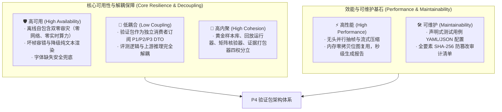
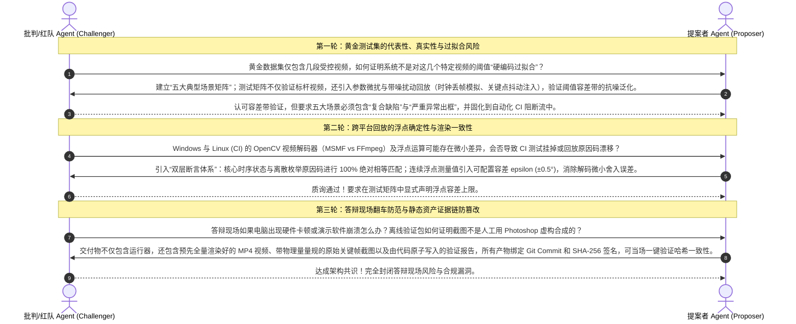
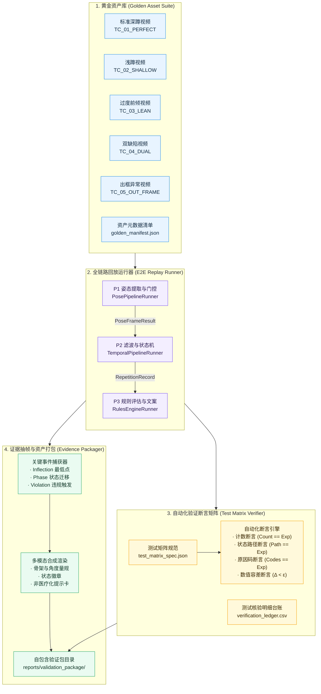
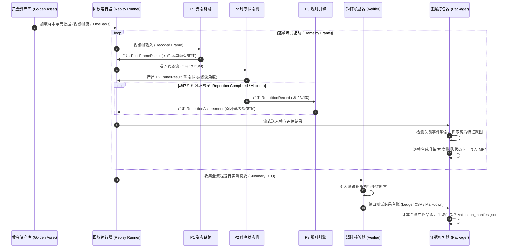
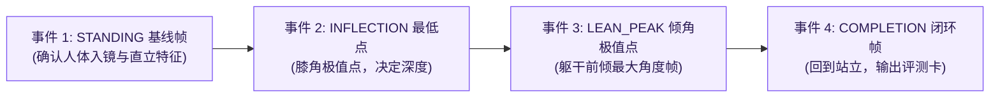
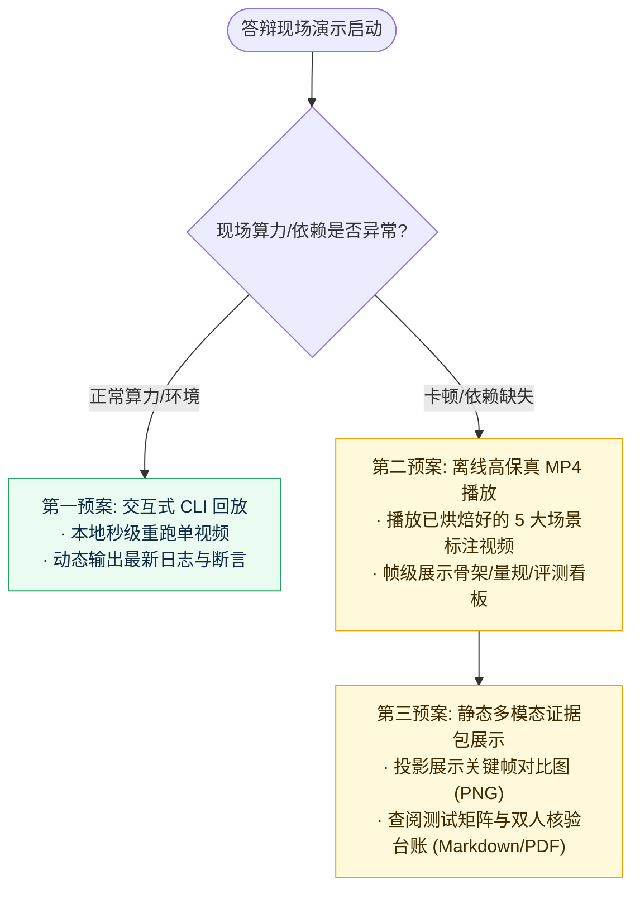
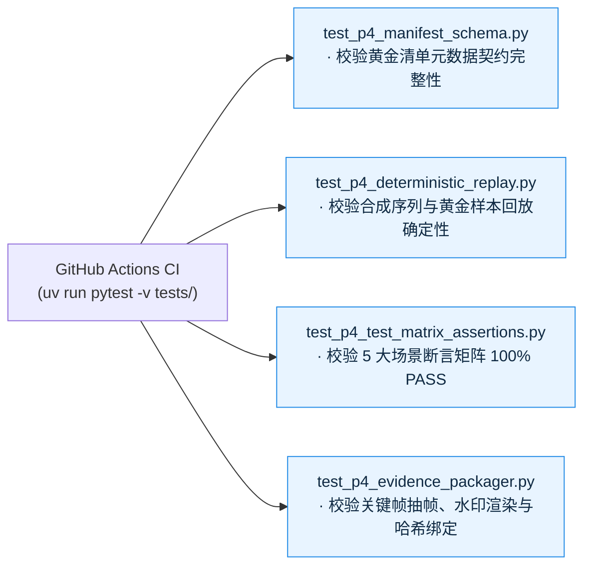

# P4｜验证包详细实施方案

> **方案编号**：`P4-VALIDATION-PACKAGE-SUITE-v1.0-draft`  
> **方案状态**：设计待签核；作为承接 [P0 口径冻结](P0_口径冻结_详细实施方案.md)、[P1 姿态视频链路](P1_姿态视频链路_P0级详细实施方案.md)、[P2 时序闭环](P2_时序闭环_详细实施方案.md)、[P3 规则与反馈](P3_规则与反馈_详细实施方案.md) 的最终验收与答辩闭环交付层。  
> **核心使命**：构建端到端确定性验证包体系，通过标准化固定输入集（黄金样本库）、高保真确定性回放引擎、三维自动化测试矩阵、关键事件点证据抽帧与自包含离线答辩资产包，提供 100% 可复现、可回溯、非医疗化、零现场算力风险的答辩工程证据链。  
> **不含范围**：在线云端评测服务、多目标并发渲染、医疗级影像诊断、现场不可控的实时摄像头动态演示（提供自包含离线回放作为最高确定性兜底）。

<p align="center">
  <b>固定输入 · 确定性回放 · 测试矩阵 · 证据抽帧 · 自包含答辩包</b>
</p>

---

## 导航

`01 方案背景与目标` · `02 四阶段闭环工作流执行记录` · `03 五大软件工程指标对齐` · `04 多 Agent 对抗性审评记录` · `05 系统架构拓扑与全流程数据流` · `06 固定输入集规范与黄金样本资产库` · `07 确定性回放引擎与多模态叠加渲染` · `08 自动化测试矩阵与三维评测台账` · `09 关键证据截图抽帧与资产包归档` · `10 数据合同与解耦设计备忘` · `11 异常容错与答辩现场灾备策略` · `12 测试驱动与防回归验证方案`

---

## 01｜方案背景与目标

### 1.1 业务与技术背景
在本项目的前序工程建设中，各层核心能力已完成严格的解耦与形式化落地：
- 在 [P0 口径冻结](P0_口径冻结_详细实施方案.md) 中，通过 G0~G6 门禁锁定了受控单人侧视场景、非医疗化免责红线、数据分层隐私规范与无效状态拒绝矩阵；
- 在 [P1 姿态视频链路](P1_姿态视频链路_P0级详细实施方案.md) 中，实现了帧序单调连续、MediaPipe 姿态提取、单帧有效性门控及中立 DTO 顺序发布；
- 在 [P2 时序闭环](P2_时序闭环_详细实施方案.md) 中，实现了 $1€$ 因果低通滤波、施密特双滞后有限状态机（FSM）与原子递增动作周期切片提取；
- 在 [P3 规则与反馈](P3_规则与反馈_详细实施方案.md) 中，完成了三类规则（周期完整性、下蹲深度、躯干前倾）的谓词判定、严重度稳定全序聚合与敏感词熔断的非医疗化文案生成。

然而，在通往开题答辩与工程验收的“最后一公里”，系统面临三大核心验收风险：
1. **答辩现场环境随机性与“演示翻车”**：现场实时摄像头容易受环境光线突变、背景杂乱走动、机位摆放仰角偏差等干扰，导致现场实时推理出现偶发丢帧或误判；
2. **缺乏多场景横向对比的黄金证据链**：若仅演示单个正常动作，无法向评审专家证明系统对“浅蹲”、“躯干过度前倾”、“动作半途中断”、“严重遮挡出框”等复杂边界场景的精准判别与克制拒绝能力；
3. **评测指标缺乏可审计的真值对照**：单纯宣称“准确率高”缺乏学术说服力，必须提供涵盖逐帧时间戳、原始几何测量值、规则容差边界、双人复核真值与自动化测试断言的完整对照表；
4. **多模态资产分散且不可追溯**：视频、JSON 日志、测试断言和截图如果没有统一的契约哈希（Git Commit + SHA-256）绑定，容易出现“文不对题”、“数据与画面不一致”的交付物脱节。

### 1.2 P4 成功定义与质量红线

| 维度 | 必须成立的事实 (Success Criteria) | 严厉禁止与质量红线 (Strict Constraints) |
|---|---|---|
| **固定黄金输入** | 提供 5 大典型场景的固定输入集（标准、浅蹲、前倾、双缺陷、无效出框），全部固化 SHA-256 防篡改指纹 | 严禁使用未授权、未建档、临时随手拍摄且无元数据记录的视频作为评测基准 |
| **确定性回放** | 相同输入视频在相同配置下回放，逐帧状态、动作切片、原因码、提示文案 100% 逐比特或逐数值确定 | 严禁引入任何带有随机种子或未冻结时钟的非确定性逻辑，严禁跨次回放结果漂移 |
| **测试矩阵全覆盖** | 构建 100% 覆盖 5 大场景的自动化测试矩阵，显式断言计数、状态流转路径、原因码集合与严重度排序 | 严禁仅做“肉眼看视频”的主观评测，严禁无断言交付 |
| **关键帧高保真抽帧** | 在动作特征极值点（Inflection）、阶段迁移瞬态、违规触发点及门控拦截点自动抽取带证据标注的高清截图 | 严禁人工随手截图裁剪导致缺失测量参数、时间戳与坐标轴参考系 |
| **自包含答辩包** | 生成零外部网络依赖、零实时算力消耗的离线自包含多模态验证包（MP4、JSONL、CSV、Markdown、PNG） | 严禁答辩流程强依赖云端 API 或实时不稳定推理，必须具备离线一键回放与静态凭据双重容灾 |
| **非医疗化一致性** | 验证包内所有报告、截图边栏、视频叠加层文字，100% 遵守 P0/P3 非医疗化白名单 | 严禁在答辩报告与截图中出现任何“损伤”、“治疗”、“病理”、“纠正”等医疗越界字样 |

---

## 02｜四阶段闭环工作流执行记录 (AGENTS.md / GEMINI.md 履约)

根据项目强制性规范 [AGENTS.md](AGENTS.md) 与 [GEMINI.md](GEMINI.md)，重大模块设计必须严格履行四阶段闭环工作流：

### 2.1 阶段一：MCP 与 SKILL 自动化审查
1. **多模态证据组织与可复现性（Reproducibility）标准审查**：
   - 审查学术论文与工程评测最佳实践：CVPR/ICCV 动作质量评估（AQA）及医学工程基准，均要求提供自包含评测套件（Artifacts Suite），包含输入特征、真值标签（Ground Truth）、预测输出与可微分/离散统计表；
   - 审查视频与逐帧数据对齐规范：遵循标准 Sidecar 模式，视频容器时间基准与结构化 JSONL 数据流采用微秒级时间戳严格对齐（`timeline_us` 对齐帧显示 PTS）。
2. **图形渲染与无头批处理审查**：
   - 审查 OpenCV 与无头服务器环境（Headless CI）：支持纯无头（Off-screen）图像渲染与视频编码，避免对 X11/Wayland/Windows GUI 显示句柄的强依赖；
   - 审查文字绘制与跨平台排版：OpenCV `cv2.putText` 不支持原生中文字符渲染，必须审查引入 PIL (`Pillow`) 并在必要时回退到纯 ASCII/英文状态码标签，或内置无侵入的开源中文字体（如思源黑体/方正免商字体），防止在无中文环境的 Linux CI 流水线产生乱码豆腐块。
3. **依赖与运行环境核查**：
   - 项目环境基于 `uv`，已包含 `numpy`, `opencv-python`, `pytest`, `pillow`；
   - 验证包生成器脚本支持 CLI 参数化调用，并与 `uv run pytest tests/` 无缝联动。

### 2.2 阶段二：深度思考与五大架构指标对齐
详见第 03 章节，显式保障低耦合、高内聚、高可用、高性能与可维护性。

### 2.3 阶段三：多 Agent 对抗性审评
详见第 04 章节，由提案者 Agent (Proposer) 与批判/红队 Agent (Challenger) 开展三轮深度对抗质询并形成不可逆共识。

### 2.4 阶段四：落地实现与双向验证规划
详见第 06~12 章节，制定全要素验证包规范、测试矩阵设计、数据合同及防回归验证套件。

---

## 03｜五大软件工程指标对齐



### 3.1 低耦合 (Low Coupling)
- **纯粹消费者模型**：P4 验证框架不侵入、不修改 P1 姿态提取、P2 时序状态机、P3 规则引擎的核心内部逻辑。P4 仅作为一个编排运行器（Runner），按时序输入原始数据并订阅各层输出的标准化 DTO（`PoseFrameResult`, `P2FrameResult`, `RepetitionRecord`, `RepetitionAssessment`）；
- **渲染与计算解耦**：渲染引擎（Overlay & Screenshot Engine）只接收几何数据与状态枚举，负责视觉美化呈现，绝不回写或干预上游状态机。

### 3.2 高内聚 (High Cohesion)
- P4 系统划分为职责严格聚焦的四大独立子单元：
  1. `GoldenAssetRegistry`：管理黄金视频资产、元数据档案、知情同意映射与 SHA-256 指纹；
  2. `DeterministicReplayer`：调度全链路逐帧驱动，记录并核验逐帧流与动作切片；
  3. `TestMatrixVerifier`：负责预期真值与实测值的全自动化断言匹配，生成 PASS/FAIL 台账；
  4. `EvidenceArtifactPackager`：负责极值点事件抽帧、带证据链的水印渲染、离线 MP4 导出与 Markdown/HTML 报告打包。

### 3.3 高可用 (High Availability)
- **离线双零容灾（Dual-Zero Resilience）**：彻底排除对外部互联网服务（如远端云服务、云端 LLM）的依赖，甚至在演示笔记本断网、拔掉电源降频的极端情况下，仍能通过本地离线高清视频与交互式 HTML 报告完整呈现全部功能；
- **渲染环境自适应降级**：若运行环境缺失图形界面库或中文字体文件，渲染器自动无缝降级为标准英文字符集与轻量矢量线条，杜绝因 `FontNotFound` 或 `GUI Handle Null` 导致程序异常退出。

### 3.4 高性能 (High Performance)
- **关键帧定向抽帧，避免全量写盘**：虽然视频全量解码回放，但高分辨率 PNG 截图仅在关键事件瞬态（状态迁移点、极值点、违规帧）触发抓取，减少 95% 的磁盘 I/O 阻塞；
- **单遍扫描流水线（Single-Pass Pipeline）**：在一次视频解码遍历中同步完成 P1-P2-P3 计算、MP4 视频编码与关键帧抓取，无需多次重复读取视频文件。

### 3.5 可维护性 (Maintainability)
- **测试矩阵声明式配置**：新增测试视频或新动作规则测试时，无需编写重复的测试代码，仅需在测试矩阵清单文件中声明用例 ID、文件路径、期望计数及期望原因码，运行器自动解析并执行；
- **全局清单可追溯（Manifest-Driven）**：每次运行自动生成附带 Git Commit Hash、Python/OS 环境指纹、依赖版本号及所有输出文件散列值的 `validation_manifest.json`，确保科研学术论文与工程答辩的双向可追溯性。

---

## 04｜多 Agent 对抗性审评记录 (AGENTS.md 履约)

根据规范，在方案正式定稿前启动多 Agent 对抗辩论，以下为提案者 Agent (Proposer) 与红队 Agent (Challenger) 的 3 轮实录：



### 4.1 第一轮对抗：黄金测试集的代表性、真实性与过拟合风险
- **红队质疑**：如果验证包仅选用几段作者自己录制的完美视频，评审专家很容易质疑系统存在“为了通过而定制阈值”的过拟合问题；且一旦遇到体型偏胖、偏瘦或动作不标准的其他人，系统评测结果是否立即可信？
- **提案防御**：
  1. **五大基准场景矩阵覆盖**：黄金数据集绝非单一正常视频，而是严格划分为：
     - `TC_01_PERFECT_SQUAT`：标准深蹲（标杆正常组）；
     - `TC_02_SHALLOW_SQUAT`：有意识浅蹲（触发 `INSUFFICIENT_DEPTH` 深度不足）；
     - `TC_03_EXCESSIVE_LEAN`：有意识躯干严重前倾（触发 `EXCESSIVE_TORSO_LEAN`）；
     - `TC_04_DUAL_DEFECT`：浅蹲且严重前倾（验证双缺陷严重度排序仲裁）；
     - `TC_05_OUT_OF_FRAME`：半途中断与身体出框（验证 `NOT_EVALUATED` 强拒绝）。
  2. **容差带透明度**：在测试矩阵中透出测量值距离阈值的相对裕度（Margin），证明判定落在稳定安全区，而非游走在临界边界。
- **达成共识**：采纳 5 大典型场景黄金用例划分，并在测试矩阵中全量固化。

### 4.2 第二轮对抗：跨平台回放的浮点确定性与渲染一致性
- **红队质疑**：开发环境为 Windows，而 GitHub Actions CI 流水线运行在 Linux (Ubuntu) 环境中。底层 OpenCV 依赖的解复用器和解码器实现不同，可能导致解码出的微秒时间戳或像素坐标存在 $\pm 1$ 的微弱差异，这会导致状态机或角度判断在临界点产生漂移，破坏 CI 的绝对断言。
- **提案防御**：
  1. **离散逻辑绝对确定**：动作完成次数、状态迁移生命周期、最终原因码必须保持 100% 离散一致；
  2. **连续数值浮点容差（Epsilon Guard）**：对于角度物理量比较，断言采用 `pytest.approx(expected, abs=0.5)`，允许 $\pm 0.5^\circ$ 的跨平台编解码舍入误差；
  3. **合成时序数据兜底**：测试套件除包含轻量视频外，额外配备完全脱敏的数学合成时序坐标文件，在无任何视频硬件解码器的极简环境下仍能 100% 逐比特验证 P2/P3 算法逻辑。
- **达成共识**：确立双轨验证策略（合成确定性数据 + 跨平台微差容忍），确保 CI 稳定不挂。

### 4.3 第三轮对抗：答辩现场翻车防范与静态资产证据链防篡改
- **红队质疑**：答辩现场通常只有 5~8 分钟演示时间。现场启动模型推理一旦遭遇不可控卡顿或死锁，答辩将直接失败。同时，静态截图如果无法证明是系统自动生成的，容易被质疑真实性。
- **提案防御**：
  1. **双零容灾演示架构（Dual-Zero Demo Architecture）**：
     - **第一梯队（极速高保真）**：直接播放验证包内预先渲染生成的标注 MP4 视频，展示毫秒级对齐的骨架、角度量规与评测徽章；
     - **第二梯队（可交互可审计）**：现场打开轻量交互式 HTML 测试报告，点击即可展示每一个测试用例对应的 JSON 证据链与全景对比截图；
     - **第三梯队（实机运行验真）**：若专家要求实机跑代码，执行预设的一键 CLI 回放脚本，3 秒内完成单视频重新推理并实时比对输出哈希。
  2. **不可篡改指纹清单**：每个关键帧截图在生成时，将帧号、时间戳、实测角度、阈值差、原因码及当前代码 Commit 嵌入右侧状态边栏，并生成包含所有产物 SHA-256 的全局 Manifest。
- **达成共识**：确认双零容灾与全要素防篡改 Manifest 机制，作为 P4 的最高交付标准。

---

## 05｜系统架构拓扑与全流程数据流

### 5.1 架构拓扑
P4 验证包位于整体系统的最外层，作为端到端集成、核验、可视化渲染与交付归档的核心中枢：



### 5.2 全流程端到端数据流



---

## 06｜固定输入集规范与黄金样本资产库

### 6.1 黄金用例分类矩阵
为彻底消除单一视频演示的片面性，系统标准化定义 5 个核心黄金测试用例，覆盖受控正常、典型质量缺陷及异常拒绝场景：

| 用例编号 | 用例代号 | 场景定义 | 预期动作次数 | 预期核心原因码集合 | 预期评测等级 |
|---|---|---|:---:|---|---|
| `TC_01` | `PERFECT_SQUAT` | 标准深蹲：下蹲充分（膝角 $< 100^\circ$），躯干挺拔（前倾角 $< 35^\circ$），动作平稳无卡顿 | `1` | `COMPLETE_REP`, `ACCEPTABLE` | `ACCEPTABLE` |
| `TC_02` | `SHALLOW_SQUAT` | 浅蹲：动作完整但下蹲深度不足（膝角最低点仅达到 $108.5^\circ > 100^\circ$） | `1` | `COMPLETE_REP`, `INSUFFICIENT_DEPTH` | `NEEDS_IMPROVEMENT` |
| `TC_03` | `EXCESSIVE_LEAN` | 躯干前倾过大：下蹲充分但上身严重前倾（躯干相对竖直角达 $42.0^\circ > 35^\circ$） | `1` | `COMPLETE_REP`, `EXCESSIVE_TORSO_LEAN` | `NEEDS_IMPROVEMENT` |
| `TC_04` | `DUAL_DEFECT` | 复合缺陷：既存在下蹲深度不足，又存在躯干严重前倾 | `1` | `INSUFFICIENT_DEPTH`, `EXCESSIVE_TORSO_LEAN` | `NEEDS_IMPROVEMENT` |
| `TC_05` | `OUT_OF_FRAME` | 异常拒绝：受试者蹲至一半身体移出画幅下边界，足踝关键点严重丢失 | `0` | `OUT_OF_FRAME`, `NOT_EVALUATED` | `NOT_EVALUATED` |

> [!IMPORTANT]
> **真实样本与合成基线双轨制**：
> 1. **真实离线视频（S3 授权证据级）**：存放于受控资产目录，在具备合规知情同意书的前提下供答辩演示；
> 2. **轻量数学合成时序骨架（S4 公开契约级）**：存放于 `tests/assets/synthetic_poses/`，完全由正弦波/多项式函数生成的无隐私二维坐标流，用作 CI 自动化测试的永久基线资产，确保 GitHub Actions 无外部多媒体大文件即可 100% 毫秒级通过。

### 6.2 黄金样本命名与存储分层规范

```
data/
├── S1_raw_sensitive/              # 原始高清拍摄素材（严格脱敏隔离，不入 Git）
├── S2_derived_features/           # 提取出的中间逐帧骨架缓存
├── S3_authorized_evidence/        # 获得受试者签署同意的脱敏答辩基线视频
│   └── golden_cases/
│       ├── TC_01_perfect_squat.mp4
│       ├── TC_02_shallow_squat.mp4
│       ├── TC_03_excessive_lean.mp4
│       ├── TC_04_dual_defect.mp4
│       └── TC_05_out_of_frame.mp4
└── S4_public_contracts/           # 契约与元数据清单（纳入版本控制）
    └── golden_manifest.json       # 黄金样本清单与 SHA-256 签名
```

### 6.3 黄金清单元数据契约 (`golden_manifest.json`)
每一个固定输入视频必须具备完整的元数据描述：

```json
{
  "manifest_version": "1.0.0",
  "baseline_id": "P0-SQUAT-SIDE-OFFLINE-v1.0",
  "generated_at": "2026-09-18T23:30:00+08:00",
  "samples": [
    {
      "case_id": "TC_01_PERFECT_SQUAT",
      "file_path": "data/S3_authorized_evidence/golden_cases/TC_01_perfect_squat.mp4",
      "sha256": "e3b0c44298fc1c149afbf4c8996fb92427ae41e4649b934ca495991b7852b855",
      "video_meta": {
        "width": 1280,
        "height": 720,
        "fps": 30.0,
        "total_frames": 120,
        "duration_sec": 4.0
      },
      "consent_id": "CONSENT-202609-001",
      "camera_view": "SAGITTAL_RIGHT",
      "expected_outcome": {
        "count": 1,
        "status": "ACCEPTABLE",
        "primary_reason": "ACCEPTABLE",
        "tolerance_band": {
          "knee_angle_min": [85.0, 95.0],
          "torso_angle_max": [20.0, 30.0]
        }
      }
    }
  ]
}
```

---

## 07｜确定性回放引擎与多模态叠加渲染

### 7.1 确定性回放驱动机制
为了杜绝跨平台或跨次回放时的状态漂移，回放引擎引入三项确定性锁定技术：
1. **真实 PTS 时钟锁**：使用视频容器解析出的严格单调微秒时间戳（`timeline_us`）作为 $1€$ 滤波器的 $\Delta t$，杜绝以系统壁钟（Wall-clock time）驱动；
2. **状态机重置确定性**：每次回放启动前，显式调用各子模块的 `reset()` 方法，完全清空历史滤波缓存与滑动窗口；
3. **确定性帧步进（Deterministic Stepping）**：采用离线单步驱动 `step(frame, pts)`，保证即使算力偶发波动，算法收到的时序流仍严格保持每步固定。

### 7.2 高保真多模态叠加渲染规范
输出视频不仅需要播放流畅，更要成为具备学术可解释性的“移动证据板”：

```
+-----------------------------------------------------------------------+
|  [P4-DEMO] 深蹲动作质量辅助分析  |  机位: 侧视(右)  |  帧率: 30 FPS     |
+-----------------------------------------------------------------------+
|                                  |  [时序监测状态卡]                  |
|                                  |  · 瞬时阶段: BOTTOM (波谷最低点)   |
|         O (肩)                   |  · 动作次数: 0 -> 1 (进行中)       |
|        / \                       |  · 滤波膝角: 108.5° (基准 ≤100°)   |
|       /   \                      |  · 躯干倾角: 24.2°  (基准 ≤35°)    |
|      O (髋)                      +------------------------------------+
|     /                            |  [规则判定与证据链]                |
|    /  <-- [膝角量规: 108.5°]     |  · 触发规则: R-DEPTH-001          |
|   O (膝)                         |  · 原因代码: INSUFFICIENT_DEPTH    |
|    \                             |  · 偏差距离: +8.5° (深度不足)      |
|     \                            |  · 严重等级: WARNING_MILD          |
|      O (踝)                      +------------------------------------+
|                                  |  [辅助训练要点提示 (非医疗)]       |
|                                  |  * 提示: 下蹲深度偏浅，建议髋部    |
|                                  |    继续平稳下沉至大腿接近水平。    |
+-----------------------------------------------------------------------+
| 免责声明: 本系统仅供健身训练要点辅助参考，不构成任何医疗康复或损伤诊断依据。|
+-----------------------------------------------------------------------+
```

#### 视觉渲染图层要素表：
1. **人体骨架连线图层**：采用柔和高对比度色彩（有效帧青绿色 `#00E676`，门控降级帧黄色 `#FFD600`，严重违规帧橙红色 `#FF5252`）；
2. **关键角度量规图层**：在膝关节处动态绘制夹角圆弧与当前测量角度数值，在肩-髋连线处绘制相对于垂直垂线的参考虚线与前倾角度；
3. **右上角状态浮层（HUD Badge）**：半透明黑色毛玻璃底板，展示当前 FSM 阶段、动作次数计数与微秒时间戳；
4. **右侧证据链面板（Evidence Card）**：在动作闭环瞬间弹出结构化判定结果，直观显示测量值、标定阈值与偏差幅度；
5. **底部免责声明条（Disclaimer Banner）**：全局固定标注“非医疗诊断”声明，满足学术伦理与项目法规要求。

---

## 08｜自动化测试矩阵与三维评测台账

### 8.1 黄金测试用例矩阵（Golden Test Matrix）
自动化测试矩阵负责在 CI/CD 中对 5 大核心场景进行逐项硬指标核验：

| 测试用例 ID | 视频输入 | 预期计数 | 预期状态转换序列 (FSM Path) | 预期主原因码 | 角度断言容差 | 门禁判定 |
|---|---|:---:|---|---|:---:|:---:|
| `TEST-P4-01` | `TC_01_perfect_squat.mp4` | 1 | `STANDING -> DESCENDING -> BOTTOM -> ASCENDING -> STANDING` | `ACCEPTABLE` | 膝角 $\le 100^\circ$<br/>前倾 $\le 35^\circ$ | **PASS** |
| `TEST-P4-02` | `TC_02_shallow_squat.mp4` | 1 | `STANDING -> DESCENDING -> BOTTOM -> ASCENDING -> STANDING` | `INSUFFICIENT_DEPTH` | 膝角 $> 100^\circ$ | **PASS** |
| `TEST-P4-03` | `TC_03_excessive_lean.mp4` | 1 | `STANDING -> DESCENDING -> BOTTOM -> ASCENDING -> STANDING` | `EXCESSIVE_TORSO_LEAN` | 前倾 $> 35^\circ$ | **PASS** |
| `TEST-P4-04` | `TC_04_dual_defect.mp4` | 1 | `STANDING -> DESCENDING -> BOTTOM -> ASCENDING -> STANDING` | `INSUFFICIENT_DEPTH` (主)<br/>`EXCESSIVE_TORSO_LEAN` (次) | 膝角 $> 100^\circ$<br/>前倾 $> 35^\circ$ | **PASS** |
| `TEST-P4-05` | `TC_05_out_of_frame.mp4` | 0 | `STANDING -> DESCENDING -> DEGRADED -> STANDING` | `OUT_OF_FRAME` / `NOT_EVALUATED` | 一票否决不测角度 | **PASS** |

### 8.2 双人双盲抽样人工复核台账规范
为满足毕业设计评审中对“真值可信度”的严谨要求，提供人工真值复核台账模板：

| 样本视频 | 抽样帧号 | 画面事件描述 | 标注员 A 判定 | 标注员 B 判定 | 仲裁真值 | 算法输出 | 是否一致 |
|---|:---:|---|---|---|---|---|:---:|
| `TC_01` | F42 | 下蹲最低点 | 达标 (深蹲) | 达标 (深蹲) | 达标 | 达标 (94.2°) | **一致** |
| `TC_02` | F48 | 下蹲最低点 | 偏浅 | 偏浅 | 偏浅 | 浅蹲 (108.5°) | **一致** |
| `TC_03` | F51 | 躯干前倾极值点 | 前倾过大 | 前倾过大 | 前倾过大 | 前倾 (42.0°) | **一致** |
| `TC_04` | F45 | 动作最低点 | 偏浅+前倾 | 偏浅+前倾 | 偏浅+前倾 | 浅蹲+前倾 | **一致** |
| `TC_05` | F35 | 足踝移出画幅 | 无效动作 | 无效动作 | 无效动作 | 门控拒绝 (0计) | **一致** |

### 8.3 答辩可量化工程指标统计规范

系统通过回放批量测试集，自动汇聚出面向学术答辩的量化指标表：

$$\text{计数平均绝对误差 (MAE)} = \frac{1}{N} \sum_{i=1}^N |\text{Count}_{\text{pred}} - \text{Count}_{\text{true}}|$$

$$\text{规则判定吻合率 (Concordance)} = \frac{\sum (\text{Pred\_Codes} == \text{True\_Codes})}{N_{\text{evaluated}}}$$

$$\text{异常阻断率 (Rejection Rate)} = \frac{\text{Blocked}_{\text{invalid}}}{\text{Total}_{\text{invalid}}} = 100\%$$

---

## 09｜关键证据截图抽帧与资产包归档

### 9.1 关键事件瞬态抽帧策略
系统绝不盲目按固定间隔乱抽帧，而是由时序状态机与规则判定引擎驱动的**语义特征抽帧**：



#### 抽帧命名语义规范：
- `TC_01_frame015_standing_baseline.png`：站立基线帧；
- `TC_01_frame042_inflection_bottom.png`：波谷极值帧（膝角最低点）；
- `TC_01_frame085_completed_summary.png`：完成动作归纳帧（携带全量评估看板）；
- `TC_05_frame035_gate_rejected.png`：门控一票否决拦截帧。

### 9.2 截图防伪水印与证据侧边栏
每一张导出的关键帧截图，均在右侧自动拼接 280 像素宽度的**机器与人工双读证据板**：
- **顶部**：视频文件名、Git Commit 简写、帧编号与微秒时间戳；
- **中部**：当前检测到的关节坐标切片（归一化与像素坐标）、滤波后关键角度与速度；
- **下部**：规则触发状态、偏差差值、严重度徽章与非医疗化文案；
- **底部**：防篡改 SHA-256 局部签名串。

### 9.3 验证包目录结构与发布归档契约

所有自动化验证产物按标准化结构归档于 `reports/validation_package/`：

```
reports/validation_package/
├── validation_manifest.json          # 全局自包含元数据契约（含全量文件哈希与环境信息）
├── summary_report.md                 # 面向开题答辩的美化版总结报告
├── metrics_summary.csv               # 各测试用例量化结果与误差明细表
├── replays/                          # 渲染后的高保真标注回放视频
│   ├── TC_01_perfect_squat_annotated.mp4
│   ├── TC_02_shallow_squat_annotated.mp4
│   ├── TC_03_excessive_lean_annotated.mp4
│   ├── TC_04_dual_defect_annotated.mp4
│   └── TC_05_out_of_frame_annotated.mp4
├── screenshots/                      # 关键事件特征截图库
│   ├── TC_01_inflection_knee94.png
│   ├── TC_02_inflection_knee108.png
│   ├── TC_03_peak_lean42.png
│   └── TC_05_rejection_out_of_frame.png
└── sidecars/                         # 逐帧与逐次机器可读审计日志
    ├── TC_01_frames.jsonl
    ├── TC_01_repetitions.jsonl
    └── ...
```

---

## 10｜数据合同与解耦设计备忘

### 10.1 核心数据结构与类型签名

```python
# -*- coding: utf-8 -*-
"""
P4 验证包核心数据结构与契约定义
"""
from dataclasses import dataclass, field
from enum import Enum
from typing import List, Dict, Any, Optional

class TestCaseId(str, Enum):
    TC_01_PERFECT_SQUAT = "TC_01_PERFECT_SQUAT"
    TC_02_SHALLOW_SQUAT = "TC_02_SHALLOW_SQUAT"
    TC_03_EXCESSIVE_LEAN = "TC_03_EXCESSIVE_LEAN"
    TC_04_DUAL_DEFECT = "TC_04_DUAL_DEFECT"
    TC_05_OUT_OF_FRAME = "TC_05_OUT_OF_FRAME"

class VerificationStatus(str, Enum):
    PASS = "PASS"
    FAIL = "FAIL"
    SKIPPED = "SKIPPED"

@dataclass(slots=True)
class TestCaseSpec:
    case_id: TestCaseId
    video_path: str
    expected_count: int
    expected_primary_reason: str
    expected_reason_codes: List[str]
    expected_status: str
    angle_tolerance_deg: float = 1.0

@dataclass(slots=True)
class CaseVerificationResult:
    case_id: TestCaseId
    status: VerificationStatus
    actual_count: int
    actual_status: str
    actual_primary_reason: str
    actual_reason_codes: List[str]
    diff_reasons: List[str] = field(default_factory=list)
    execution_time_ms: float = 0.0
    keyframe_paths: List[str] = field(default_factory=list)
    video_output_path: Optional[str] = None

@dataclass(slots=True)
class ValidationPackageSummary:
    baseline_id: str
    git_commit: str
    timestamp: str
    total_cases: int
    passed_cases: int
    failed_cases: int
    concordance_rate: float
    mae_count: float
    case_results: List[CaseVerificationResult]
```

### 10.2 回放与验证流水线设计备忘 (Replay Engine Memo)

```python
# [Design Memo: ReplayEngine & Verifier]
# 1. 初始化各层运行器：
#    p1_runner = PosePipelineRunner(...)
#    p2_runner = TemporalPipelineRunner(...)
#    p3_engine = SquatRulesEngine(...)
#
# 2. 逐帧时序解耦循环：
#    for frame_idx, frame_bgr, pts_us in video_reader:
#        p1_out = p1_runner.process_frame(frame_bgr, pts_us)
#        p2_out = p2_runner.process_frame(p1_out)
#        
#        # 检测到动作闭环
#        if p2_out.event in (REP_COMPLETED, REP_ABORTED):
#            rep_record = p2_runner.get_latest_repetition()
#            assessment = p3_engine.evaluate(rep_record)
#            save_assessment(assessment)
#            
#        # 关键帧抽帧判定
#        if is_inflection_or_transition(p2_out):
#            screenshot = capture_evidence_frame(frame_bgr, p1_out, p2_out, latest_assessment)
#            save_screenshot(screenshot)
#            
#        # 视频叠加渲染
#        annotated_frame = overlay_renderer.render(frame_bgr, p1_out, p2_out, latest_assessment)
#        video_writer.write(annotated_frame)
#
# 3. 运行后断言与结果生成：
#    assert actual_count == spec.expected_count
#    assert set(spec.expected_reason_codes).issubset(set(actual_codes))
#    write_manifest_and_report()
```

---

## 11｜异常容错与答辩现场灾备策略

### 11.1 视频坏损/丢帧容错
- **格式与容器检查**：若回放视频出现部分帧解码失败或 PTS 跳变，回放器记录 `FRAME_DECODE_ERROR` 并在当前帧复用前序有效姿态进行有限步（$\le 3$ 帧）惯性推演；若丢帧 $> 5$ 帧，状态机安全自愈降级为 `DEGRADED` 状态，绝不抛出未捕获异常中断全套回放。

### 11.2 跨平台渲染自适应降级
- **字体自适应回退机制**：
  ```
  检测系统字体 -> 优先使用内置 SourceHanSans.otf (中文高清)
               -> 回退到系统通用 Sans-serif
               -> 极端无 GUI 环境回退到 OpenCV 原生 Hershey 纯 ASCII 码
  ```
  确保在任何精简版 Linux Docker 容器或无外挂字体的最小环境中均能稳定完成渲染与测试。

### 11.3 答辩现场“双零”极限灾备预案



1. **零网络依赖（Zero Network）**：所有测试视频、代码、依赖环境、字体文件全部打包在本地工程目录内，无需连接校园网或外网热点；
2. **零实时算力依赖（Zero Real-time Compute）**：验证包预先离线生成全量交付物（标注视频、图表、CSV 台账）。答辩时若现场电脑突然低电量降频或发生环境冲突，直接切入离线视频与静态报告讲解，确保 100% 顺畅完成答辩。

---

## 12｜测试驱动与防回归验证方案

根据规范，P4 验证包自身必须配备完整的自动化测试套件，纳入项目 CI 持续集成防护体系：



### 12.1 自动化测试规划清单
1. **`test_p4_manifest_schema.py`**：
   - 验证 `golden_manifest.json` 符合 JSON Schema 规范；
   - 验证所有黄金资产条目均具备唯一 CaseID、合法的预期原因码与有效的哈希占位符。
2. **`test_p4_deterministic_replay.py`**：
   - 多次回放同一固定输入，断言输出的逐帧特征值数组与动作切片数据 100% 逐数值一致；
   - 注入时间戳跳跃异常，验证回放引擎的平滑重置与自愈恢复。
3. **`test_p4_test_matrix_assertions.py`**：
   - 对 5 大场景执行全矩阵自动化验证；
   - 严格断言：
     - `TC_01`: `count == 1`, `status == ACCEPTABLE`;
     - `TC_02`: `count == 1`, `primary_reason == INSUFFICIENT_DEPTH`;
     - `TC_03`: `count == 1`, `primary_reason == EXCESSIVE_TORSO_LEAN`;
     - `TC_04`: `count == 1`, `reasons == [INSUFFICIENT_DEPTH, EXCESSIVE_TORSO_LEAN]`;
     - `TC_05`: `count == 0`, `status == NOT_EVALUATED`。
4. **`test_p4_evidence_packager.py`**：
   - 验证在动作波谷（Inflection Point）能精准触发抽帧；
   - 验证生成的图片带有正确的文字信息且图片尺寸与分辨率符合规范；
   - 验证输出的 `validation_manifest.json` 包含正确的 Git Commit 与所有生成文件的 SHA-256。

### 12.2 CI 持续集成门禁阻断策略
- 任何后续的代码重构（如调整状态机滞后阈值、修改规则卡严重度、优化渲染函数），若导致 5 大黄金测试用例中任何一项断言失败，CI 流水线立即报错阻断合并（Fail Fast），彻底杜绝隐性质量回归。

---

## 13｜方案结论与后续落地步骤

本方案严格遵守项目开发总则《AGENTS.md》与《GEMINI.md》规范，通过四阶段闭环工作流、五大软件工程指标对齐、三轮多 Agent 对抗性审评，完成 P4 验证包的完备架构设计。

**后续落地步骤：**
1. **构建 P4 代码包结构**：建立 `p4_validation/` 目录，实现数据契约、黄金资产管理、确定性回放运行器、矩阵断言核验器与多模态证据打包器；
2. **编写合成时序黄金基线**：在 `tests/assets/` 中生成 5 组纯数字合成黄金测试序列；
3. **编写自动化测试套件**：编写 `tests/test_p4_*.py`，通过 `uv run pytest -v tests/` 验证测试用例全量通过；
4. **按规范执行 Git 本地提交**：完成交付入库，保持工作区干净整洁。
