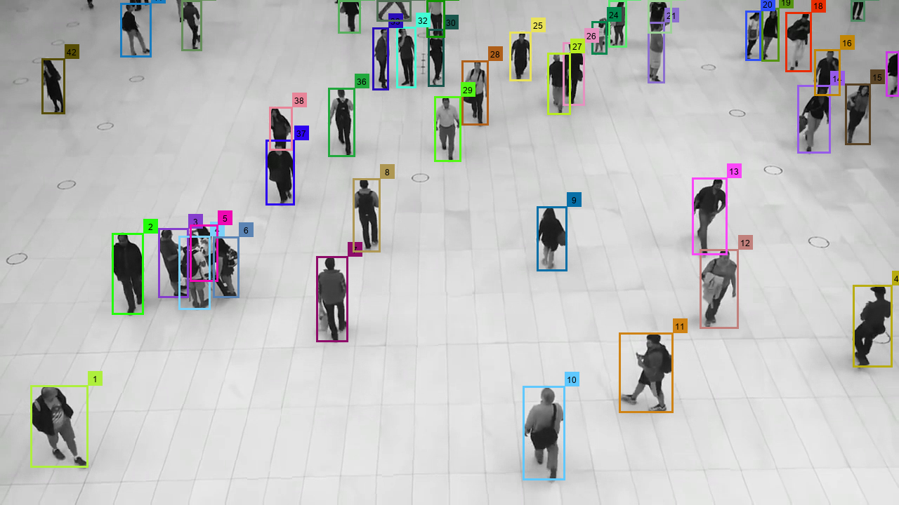
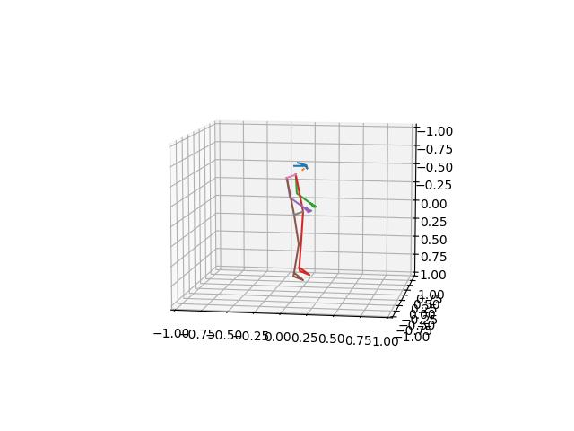
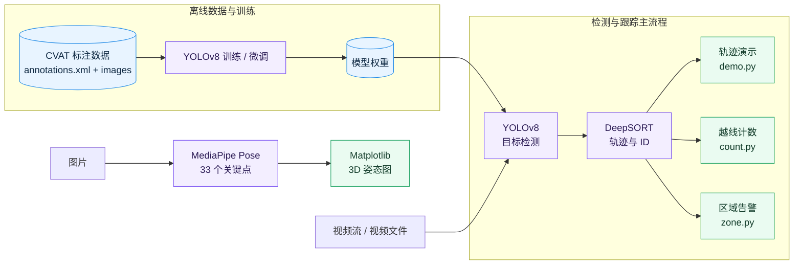

<div align="center">

# 基于 YOLOv8 人体姿态识别的运动检测设计与实现

**行人检测 · 多目标跟踪 · 越线计数 · 区域告警 · 人体姿态估计**


毕业设计原型：以 YOLOv8 完成目标检测，以 DeepSORT 维护目标轨迹，<br>
并提供人流计数、区域入侵告警及独立的人体姿态可视化示例。

[项目概述](#项目概述) · [系统架构](#系统架构) · [快速开始](#快速开始) · [运行示例](#各模块运行方法) · [常见问题](#常见问题)

</div>

> [!IMPORTANT]
> `yolov8-deepsort` 是当前检测与跟踪主流程；`mediapipe-plot-pose-live-main` 是可独立运行的姿态估计示例，尚未接入主流程。

## 项目概述

本项目设计并实现了一套基于计算机视觉的运动检测原型。它由三个边界清晰的模块组成，既可以分别演示，也便于继续扩展和集成。

| 🚶 检测与跟踪 | 📈 场景分析 | 🦴 姿态估计 |
| :---: | :---: | :---: |
| YOLOv8 检测目标，DeepSORT 分配并维护 ID | 支持双向越线计数与多边形区域告警 | MediaPipe 提取 33 个关键点并进行 3D 可视化 |

### 技术栈

| 技术 | 用途 | 版本 |
|------|------|------|
| YOLOv8 | 行人/车辆目标检测 | Ultralytics 8.x |
| DeepSORT | 多目标跟踪与 ID 分配 | 项目内置实现 |
| MediaPipe Pose | 人体 33 个关键点姿态估计 | 0.10.21–0.10.29 |
| OpenCV | 图像处理与视频 I/O | 4.x |
| Matplotlib | 3D 姿态可视化 | 3.6–3.x |

### 核心功能

- 🚶 行人实时检测与多目标跟踪
- 📊 跨线人流量统计（上行/下行计数）
- 🚨 敏感区域入侵检测与告警
- 🏃 人体 3D 姿态关键点实时估计与可视化
- 📹 视频输入/输出支持，检测结果可回放

### 效果预览

<table>
  <tr>
    <td align="center"><b>行人标注与轨迹 ID</b></td>
    <td align="center"><b>MediaPipe 3D 姿态</b></td>
  </tr>
  <tr>
    <td></td>
    <td></td>
  </tr>
</table>

## 系统架构



| 阶段 | 输入 | 处理 | 输出 |
|---|---|---|---|
| 数据准备 | CVAT XML、连续帧图片 | 格式转换、数据划分、可选训练 | YOLOv8 权重 |
| 在线推理 | 视频流或视频文件 | YOLOv8 检测 → DeepSORT 跟踪 | 检测框、目标 ID、轨迹 |
| 场景分析 | 跟踪结果 | 越线判断或区域包含判断 | 双向计数、入侵告警 |
| 姿态示例 | 单张图片 | MediaPipe Pose → Matplotlib | 33 个关键点、3D 姿态图 |

> [!NOTE]
> 图中的离线训练是可选流程；仓库已包含预训练权重，可直接运行检测与跟踪示例。姿态估计目前作为独立入口运行。

---

## 模块说明

### 1. humandetection — 行人检测数据集

**用途：** 为 YOLOv8 模型提供训练/微调用的行人检测标注数据。

**数据格式：** CVAT 标注格式（`annotations.xml`），包含：
- 41 帧连续图像（1280×720 PNG），源视频 `source.mp4`
- 标注类别：`person`（矩形边界框，颜色 `#2a00ff`）
- 标注模式：插值标注（interpolation），帧范围 0-40，共 45 条 `person` 轨迹
- 每帧标注属性：`xtl/ytl`（左上角坐标）、`xbr/ybr`（右下角坐标）、遮挡标志、关键帧标志

**目录结构：**
```
humandetection/
├── annotations.xml          # CVAT 标注文件（含所有帧的边界框坐标）
├── images/                  # 原始图片（frame_000000.PNG ~ frame_000040.PNG）
│   ├── frame_000000.PNG
│   ├── ...
│   └── frame_000040.PNG
└── boxes/                   # 标注可视化图片（带边界框渲染）
    ├── frame_000000.PNG
    ├── ...
    └── frame_000040.PNG
```

**使用方式：**
1. 将 `annotations.xml` 转换为 YOLO 格式（归一化的 class_id + cx + cy + w + h）；
2. 生成 `train/val` 划分与对应的 `.txt` 标签文件；
3. 使用 Ultralytics YOLO 命令行或 Python API 进行训练。

> 转换脚本示例可参考 [Ultralytics 官方文档](https://docs.ultralytics.com/datasets/detect/)。

---

### 2. yolov8-deepsort — 行人检测与跟踪

**核心文件及功能：**

| 文件 | 功能描述 |
|------|----------|
| `objdetector.py` | YOLOv8 目标检测器封装，检测 `person/car/bus/truck` 四类目标 |
| `objtracker.py` | DeepSORT 多目标跟踪器封装，为每个检测目标分配唯一 track ID |
| `demo.py` | **基础演示**：检测 + 跟踪 + 轨迹绘制 + 视频输出 |
| `count.py` | **人流量统计**：基于越线检测的双向计数（上行/下行） |
| `zone.py` | **区域入侵检测**：自定义多边形敏感区域，有人进入时告警 |
| `deep_sort/` | DeepSORT 算法核心实现（卡尔曼滤波、匈牙利匹配、ReID 特征提取） |
| `weights/` | YOLOv8 模型权重文件（yolov8n.pt / yolov8s.pt） |
| `video/` | 测试视频（test_person.mp4 / test_traffic.mp4） |

**关键技术参数（deep_sort.yaml）：**

| 参数 | 默认值 | 说明 |
|------|--------|------|
| `MAX_DIST` | 0.2 | 特征匹配最大余弦距离 |
| `MIN_CONFIDENCE` | 0.3 | 检测置信度阈值 |
| `NMS_MAX_OVERLAP` | 0.5 | 非极大值抑制 IOU 阈值 |
| `MAX_AGE` | 70 | 跟踪目标最大丢失帧数 |
| `N_INIT` | 3 | 确认跟踪所需的连续检测帧数 |
| `NN_BUDGET` | 100 | 特征库最大容量 |

---

### 3. mediapipe-plot-pose-live-main — 人体姿态估计

**用途：** 基于 Google MediaPipe Pose 模型，从图片/视频中提取人体 33 个 3D 关键点，并使用 Matplotlib 进行实时 3D 可视化。

**核心文件：**

| 文件 | 功能描述 |
|------|----------|
| `plot_pose_live.py` | 3D 姿态绘制模块，定义关键点连接关系（LANDMARK_GROUPS） |
| `example.py` | 示例入口：读取图片 → MediaPipe Pose 推理 → 3D 可视化 |

**关键点分组（LANDMARK_GROUPS）：**
- 面部（眼睛、嘴巴）
- 上肢（左右手臂）
- 躯干（左右体侧、肩部、腰部）

**MediaPipe Pose 参数：**
```python
mp_pose.Pose(
    min_tracking_confidence=0.5,   # 跟踪置信度阈值
    min_detection_confidence=0.5,  # 检测置信度阈值
    model_complexity=1,            # 模型复杂度 (0/1/2)
    smooth_landmarks=True,         # 启用关键点平滑
)
```

---

## 快速开始

使用 [uv](https://docs.astral.sh/uv/) 即可一次性准备固定版本的 Python 与全部依赖：

```bash
uv python install 3.10.19
uv sync --locked
```

> [!TIP]
> 无需手动创建或激活虚拟环境。依赖声明位于 `pyproject.toml`，解析结果锁定在 `uv.lock`，`uv sync` 会自动创建并同步根目录下的 `.venv`。

### 系统要求

- **操作系统：** Windows / Linux / macOS
- **Python 版本：** 3.10.19（由 uv 安装和选择）
- **CUDA：** 推荐 CUDA 11.7+（GPU 加速），纯 CPU 也可运行但速度较慢
- **磁盘空间：** 约 2GB（含模型权重）

### 安装步骤

```bash
# 1. 克隆或下载项目，并进入根目录
cd Graduation-Thesis-Project

# 2. 由 uv 安装项目固定的 Python
uv python install 3.10.19

# 3. 严格按 uv.lock 创建/同步环境；锁文件过期时直接失败
uv sync --locked

# 4. 验证解释器与核心 API
uv run --locked python -c "import sys; print(sys.executable); print(sys.version)"
uv run --locked python -c "import mediapipe as mp; assert hasattr(mp, 'solutions'); print('MediaPipe Legacy Solutions OK')"
uv run --locked python -c "import torch; print('CUDA:', torch.cuda.is_available())"
```

首次执行可能需要 uv 下载 Python 和依赖。项目设置要求 uv 管理的 Python，并使用项目内 `.uv-cache`；`uv run --locked` 会在运行前核对锁文件和环境。

### 依赖与锁文件生命周期

```bash
# 添加、删除依赖（同时更新 pyproject.toml、uv.lock 和 .venv）
uv add <package>
uv remove <package>

# 调试辅助工具（如 ipdb）按需安装
uv sync --group debug

# 检查锁文件没有漂移，并精确同步
uv lock --check
uv sync --locked

# 主动升级全部依赖，再验证和提交新的 uv.lock
uv lock --upgrade
uv sync --locked

# 从锁文件导出给仅支持 requirements.txt 的外部系统；导出物不作为依赖源
uv export --locked --format requirements.txt --output-file requirements-export.txt
```

> 日常安装与运行只认 `pyproject.toml` 和 `uv.lock`。导出的 `requirements-export.txt` 是临时兼容产物，不应手工维护或提交。

仓库内 `yolov8-deepsort/easydict/setup.py` 是第三方 EasyDict 源码自带的元数据，不是本项目的安装入口；项目使用根依赖中的 PyPI `easydict`，仍由 uv 锁定和安装。

### 模型权重下载

YOLOv8 权重文件会在首次运行时自动下载到本地缓存，也可手动下载放置到 `yolov8-deepsort/weights/`：

| 模型 | 文件 | 说明 |
|------|------|------|
| YOLOv8n | `weights/yolov8n.pt` | Nano 版本，最快速度 |
| YOLOv8s | `weights/yolov8s.pt` | Small 版本，速度与精度平衡 |

DeepSORT ReID 特征提取权重已内置在 `deep_sort/deep_sort/deep/checkpoint/ckpt.t7`，无需额外下载。

---

## 各模块运行方法

### 行人检测与跟踪（demo.py）

最基础的检测+跟踪演示，绘制跟踪轨迹并输出视频文件。

```bash
cd yolov8-deepsort

# 直接运行（默认读取 ./video/test_person.mp4，输出 result.mp4）
uv run --locked python demo.py
```

**可修改参数（在 demo.py 中编辑）：**
- `VIDEO_PATH`：输入视频路径（默认 `./video/test_person.mp4`）
- `RESULT_PATH`：输出视频路径（默认 `result.mp4`）

**效果说明：** 窗口中显示实时检测框、跟踪 ID、运动轨迹线，同时输出为 MP4 视频文件。

---

### 行人计数（count.py）

在画面中央画一条计数线，统计双向穿越人数。

```bash
cd yolov8-deepsort

# 直接运行（默认读取 ./video/test.mp4）
uv run --locked python count.py
```

**可修改参数（在 count.py 中编辑）：**
- `VIDEO_PATH`：输入视频路径（默认 `./video/test.mp4`）
- `pt1` / `pt2`：计数线的起点和终点坐标（默认画面中央水平线）
- `trail_length`：轨迹保留长度（默认 50 帧）

**效果说明：**
- 窗口左上角实时显示：`DOWN: N , UP: M`
- 每个行人的 ROI 截图自动保存到 `./directory/{track_id}/` 目录
- 行人轨迹以彩色线条绘制在画面中

---

### 区域入侵检测（zone.py）

自定义多边形敏感区域，行人进入时触发告警。

```bash
cd yolov8-deepsort

# 直接运行（默认读取 ./video/test_person.mp4）
uv run --locked python zone.py
```

**可修改参数（在 zone.py 中编辑）：**
- `VIDEO_PATH`：输入视频路径
- `polygonPoints`：多边形顶点坐标列表，格式 `[[x1,y1], [x2,y2], ...]`
- `fillColor`：区域填充颜色

**效果说明：**
- 敏感区域以半透明黄色覆盖显示
- 行人进入区域时，红色文字告警 `Warning! ID: {track_id}`
- 行人运动轨迹以红色圆点绘制

---

### 人体姿态估计（example.py）

使用 MediaPipe 从图片中提取人体 3D 姿态关键点并可视化。

```bash
cd mediapipe-plot-pose-live-main

# 直接运行（默认读取当前目录下 cxk5.jpg）
uv run --locked python example.py
```

**可修改参数（在 example.py 中编辑）：**
- `image = cv2.imread("cxk5.jpg")`：修改为你的图片路径
- 若使用摄像头，取消 `cap = cv2.VideoCapture(0)` 注释并将 `image = cap.read()` 放入循环
- `min_tracking_confidence` / `min_detection_confidence`：调整检测灵敏度
- `model_complexity`：0=最快, 1=均衡, 2=最准确

**输出：**
- OpenCV 窗口显示原始图片
- Matplotlib 3D 窗口显示人体关键点骨骼连接图
- 自动保存 3D 姿态图为 `cxk5result.jpg`

---

## 端到端完整流程指南

以下是从数据准备到系统运行的完整流程：

### 阶段一：准备（已完成）

1. ✅ 标注数据集已准备好（`humandetection/`）
2. ✅ YOLOv8 预训练权重已下载（`weights/yolov8s.pt`）
3. ✅ DeepSORT ReID 模型已内置（`checkpoint/ckpt.t7`）

### 阶段二：模型训练（可选，如需自定义训练）

```bash
# 1. 将 CVAT 标注转换为 YOLO 格式（需编写转换脚本或使用工具）
# 转换后数据结构：
# datasets/
#   images/train/  +  labels/train/*.txt
#   images/val/    +  labels/val/*.txt

# 2. 使用 Ultralytics YOLO 训练
yolo detect train \
  data=dataset.yaml \
  model=yolov8s.pt \
  epochs=100 \
  imgsz=640 \
  batch=16
```

### 阶段三：检测与跟踪

```bash
# 进入检测跟踪模块
cd yolov8-deepsort

# 3a. 基础检测+跟踪演示
uv run --locked python demo.py

# 3b. 人流量统计
uv run --locked python count.py

# 3c. 区域入侵检测
uv run --locked python zone.py
```

### 阶段四：姿态估计

```bash
# 进入姿态估计模块
cd mediapipe-plot-pose-live-main

# 将待分析图片放入当前目录，修改 example.py 中的图片路径
uv run --locked python example.py
```

### 高级：检测 + 姿态串联

若需对检测到的每个行人进行姿态估计，可组合使用两个模块：

```python
# 伪代码示意
from objdetector import Detector
from objtracker import update as tracker_update
import mediapipe as mp

detector = Detector()
mp_pose = mp.solutions.pose.Pose(...)

while True:
    frame = capture.read()
    output_frame, bboxes = tracker_update(detector, frame)
    for (x1, y1, x2, y2, _, track_id) in bboxes:
        person_roi = frame[y1:y2, x1:x2]       # 裁剪行人区域
        results = mp_pose.process(person_roi)    # 姿态估计
        # 在 frame 上绘制姿态关键点 ...
```

---

## 目录结构

```
Graduation-Thesis-Project/
│
├── README.md                              # 项目总览文档（本文件）
├── 开题报告_基于YOLOv8人体姿态识别的运动检测设计与实现.md  # 开题报告
│
├── humandetection/                        # 模块一：行人检测数据集
│   ├── annotations.xml                    # CVAT 标注文件（person 类，41 帧）
│   ├── images/                            # 原始图片（41 张 1280×720 PNG）
│   │   ├── frame_000000.PNG
│   │   ├── ...
│   │   └── frame_000040.PNG
│   └── boxes/                             # 带标注框的可视化图片
│       ├── frame_000000.PNG
│       ├── ...
│       └── frame_000040.PNG
│
├── yolov8-deepsort/                       # 模块二：行人检测与跟踪
│   ├── objdetector.py                     # YOLOv8 检测器封装
│   ├── objtracker.py                      # DeepSORT 跟踪器封装 + 绘制
│   ├── demo.py                            # 基础演示：检测+跟踪+轨迹+输出
│   ├── count.py                           # 人流量统计（越线双向计数）
│   ├── zone.py                            # 区域入侵检测（多边形告警）
│   ├── weights/                           # 模型权重
│   │   ├── yolov8n.pt                     # YOLOv8 Nano
│   │   └── yolov8s.pt                     # YOLOv8 Small
│   ├── video/                             # 测试视频
│   │   ├── test_person.mp4                # 行人场景测试视频
│   │   └── test_traffic.mp4               # 交通场景测试视频
│   ├── directory/                         # count.py 输出：按 track_id 存储行人 ROI 截图
│   │   ├── 1/                             # (track_id 子目录，含时间戳命名的 jpg 截图)
│   │   ├── 2/
│   │   └── ...
│   ├── deep_sort/                         # DeepSORT 核心算法
│   │   ├── configs/deep_sort.yaml         # 跟踪参数配置
│   │   ├── deep_sort/
│   │   │   ├── deep_sort.py               # DeepSORT 主入口
│   │   │   ├── deep/                      # 深度特征提取（ReID）
│   │   │   │   ├── feature_extractor.py   # CNN 特征提取器
│   │   │   │   ├── model.py               # 网络模型定义
│   │   │   │   ├── train.py               # 训练脚本
│   │   │   │   ├── evaluate.py            # 评估脚本
│   │   │   │   ├── test.py                # 测试脚本
│   │   │   │   ├── original_model.py      # 原始模型实现
│   │   │   │   ├── prepare_person.py      # 行人 ReID 数据准备
│   │   │   │   ├── prepare_car.py         # 车辆 ReID 数据准备
│   │   │   │   └── checkpoint/
│   │   │   │       └── ckpt.t7            # 预训练 ReID 权重
│   │   │   └── sort/                      # SORT 跟踪核心
│   │   │       ├── detection.py           # 检测框数据结构
│   │   │       ├── tracker.py             # 跟踪器主逻辑
│   │   │       ├── track.py               # 单条轨迹状态
│   │   │       ├── kalman_filter.py       # 卡尔曼滤波预测
│   │   │       ├── linear_assignment.py   # 匈牙利算法匹配
│   │   │       ├── nn_matching.py         # 最近邻特征匹配
│   │   │       ├── iou_matching.py        # IOU 距离匹配
│   │   │       └── preprocessing.py       # 检测框预处理
│   │   └── utils/                         # 工具函数
│   │       ├── parser.py                  # YAML 配置解析器
│   │       ├── draw.py                    # 绘制工具
│   │       ├── io.py                      # 结果读写
│   │       ├── log.py                     # 日志
│   │       ├── evaluation.py              # 评估指标
│   │       ├── json_logger.py             # JSON 日志
│   │       ├── tools.py                   # 通用工具
│   │       └── asserts.py                 # 断言工具
│
└── mediapipe-plot-pose-live-main/         # 模块三：人体姿态估计
    ├── plot_pose_live.py                  # 3D 姿态关键点绘制
    ├── example.py                         # 示例入口（图片→姿态→可视化）
    ├── README.md                          # 模块说明
    ├── LICENSE                            # 开源许可
    ├── cxk1.jpg ~ cxk5.jpg               # 测试图片
    └── cxk1result.jpg ~ cxk5result.jpg   # 姿态估计输出结果
```

---

## 常见问题

### Q1: 运行时提示 CUDA out of memory？
- 将 `objdetector.py` 中的 `self.device` 改为 `'cpu'`；
- 或使用更小的模型（`yolov8n.pt` 替代 `yolov8s.pt`）。

### Q2: OpenCV 无法读取视频？
- 检查视频路径是否正确（默认使用相对路径，需在 `yolov8-deepsort/` 目录下运行）；
- 检查 `pyproject.toml` 是否保留 `opencv-contrib-python`，然后执行 `uv sync --locked` 恢复锁定环境。

### Q3: MediaPipe 姿态估计结果不稳定？
- 提高 `min_detection_confidence` 和 `min_tracking_confidence` 阈值；
- 增大 `model_complexity` 至 2（精度最高但更慢）。

### Q4: 如何更换检测目标类别？
- 修改 `objdetector.py` 中的 `OBJ_LIST`，添加或删除感兴趣的目标类别（类别名需与 YOLO 标签一致）。

### Q5: 计数不准确怎么办？
- 调整 `deep_sort.yaml` 中的 `MAX_AGE`（增大可容忍更长遮挡）；
- 调整计数线位置（在 `count.py` 中修改 `pt1` 和 `pt2`），避免放置在目标密集区域；
- 降低 `MIN_CONFIDENCE` 可检测更多目标（但可能引入误检）。

---

## 技术参考

- [Ultralytics YOLOv8](https://docs.ultralytics.com/)
- [DeepSORT: Simple Online and Realtime Tracking with a Deep Association Metric](https://arxiv.org/abs/1703.07402)
- [MediaPipe Pose](https://developers.google.com/mediapipe/solutions/vision/pose_landmarker)
- [CVAT Annotation Tool](https://www.cvat.ai/)

---

> 📧 如有问题或建议，请通过项目 Issue 反馈。
