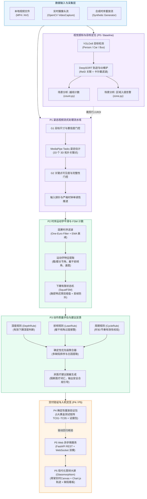
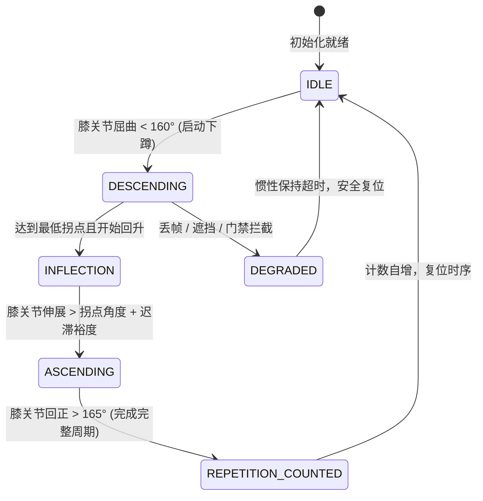
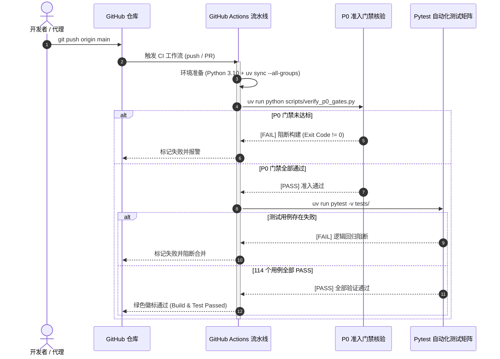

<div align="center">

# 基于 YOLOv8 与 MediaPipe 人体姿态识别的运动质量评估与智能检测系统
### (Exercise Motion Quality Assessment & Tracking System)

**目标检测 · 多目标跟踪 · 3D姿态估计 · 时序运动学平滑 · 规则评估引擎 · 确定性验证矩阵 · 现代化Web交互看板**

[](https://github.com/huwany1/Undergraduate-engineering-thesis/actions)
[](https://www.python.org/)
[](https://docs.astral.sh/uv/)
[](tests/)
[](https://fastapi.tiangolo.com/)
[](https://docs.ultralytics.com/)
[](https://developers.google.com/mediapipe)
[](https://arxiv.org/abs/1703.07402)

本工程为本科工程毕业设计核心技术实现：构建了从底层图像/视频采集、目标检测跟踪与关键点估计，到顶层因果运动学平滑、动作周期计数、动作质量规则判定、非医疗安全建议生成，以及全矩阵确定性重放评测与现代化 Web 答辩交互看板的完整技术闭环。

[系统全景架构](#系统全景架构) · [工程演进矩阵](#工程演进矩阵-p0--p5) · [快速开始](#快速开始) · [Web交互答辩看板](#web-交互答辩看板) · [验证包与CI门禁](#自动化测试与ci门禁) · [项目目录](#项目目录结构)

</div>

---

## 🌟 项目全景架构

系统采用高内聚、低耦合的分层架构设计，实现了从像素级图像处理到语义级动作质量评估的完整工程链路：



---

## 📊 工程演进矩阵 (P0 ~ P5)

本项目严格执行软件工程标准规范，各阶段成果均经过对抗性审评、契约定义与测试固化：

| 阶段 | 核心模块 | 职责与技术策略 | 关键指标达成 | 自动化测试 |
|:---:|:---|:---|:---|:---:|
| **P0** | `baseline/` | 确立准入门禁标准（G0~G6）、机位几何规范、受试者知情同意与数据分级脱敏契约。 | 高可用、规范性 | `scripts/verify_p0_gates.py` |
| **P1** | `p1_pipeline/` | 姿态视频流式处理流水线；G1 目标门控与 G2 姿态完整度校验；严格时间戳单调性推进与防乱序。 | 低耦合、高可用 | 26 个用例全 PASS |
| **P2** | `p2_temporal/` | 因果 One-Euro 滤波去抖、关节几何与角速度解算、施密特迟滞双阈值 SquatFSM 计数器。 | 高性能、抗抖动 | 14 个用例全 PASS |
| **P3** | `p3_rules/` | 下蹲深度、躯干前倾与周期耗时三维规则评估；确定性聚合排序；非医疗建议清洗脱敏。 | 高内聚、合规安全 | 35 个用例全 PASS |
| **P4** | `p4_validation/` | 5 大黄金场景矩阵（TC01~TC05）确定性回放；全自动生成包含 SHA-256 校验的证据包 ZIP。 | 可复现、防回归 | 14 个用例全 PASS |
| **P5** | `web_demo/` | 答辩交互级 Web 看板（FastAPI + WebSocket）；实时骨骼与运动学 Canvas 渲染与 Chart.js 动态分析。 | 交互体验、美观直观 | 15 个用例全 PASS |
| **基线** | `yolov8-deepsort/` | YOLOv8 行人目标检测、DeepSORT 多目标跟踪、双向越线人流计数与多边形敏感区域告警。 | 经典视觉算法支撑 | 独立可运行演示 |

> [!NOTE]
> 当前测试套件包含 **114 个自动化测试用例**，本地与 CI 流水线执行通过率 **100%**。

---

## 🚀 快速开始

本项目依赖管理采用现代 Python 打包工具 [uv](https://docs.astral.sh/uv/)，实现跨平台秒级确定性安装与锁文件管理。

### 1. 环境准备

```bash
# 1. 克隆代码仓库并进入项目根目录
git clone https://github.com/huwany1/Undergraduate-engineering-thesis.git
cd Undergraduate-engineering-thesis

# 2. 一键安装并锁定 Python 3.10 环境及所有开发/运行依赖
uv sync --all-groups
```

> [!TIP]
> 无需手动激活虚拟环境，所有命令均可通过 `uv run <command>` 直接在受控虚拟环境中确定性执行。

### 2. 核心流水线与测试一键验证

```bash
# 验证 P0 准入门禁（G0 ~ G6 全量自动化审查）
uv run python scripts/verify_p0_gates.py

# 验证 P1 姿态视频链路门禁（G1-P1 与 G2-P1 完整性核验）
uv run python scripts/verify_p1_gates.py

# 执行全量自动化测试（114 个测试用例，涵盖全链路逻辑）
uv run pytest -v tests/
```

### 3. 生成 P4 自动化验证报告与证据包

```bash
# 一键运行 P4 黄金资产测试矩阵，并生成自包含报告与交付证据包 ZIP
uv run python scripts/run_p4_validation.py
```
> 输出结果将沉淀于 `reports/validation_package/`，包含 `validation_matrix_report.md`、`validation_manifest.json` 及全套打包资产。

---

## 💻 Web 交互答辩看板

系统内置了专为毕业设计成果展示与答辩演示定制的现代化 Web 交互看板（FastAPI 异步后端 + 玻璃拟态深色科技风前端）。

### 启动服务

```bash
# 启动本地服务，并在默认浏览器中自动打开控制台
uv run python scripts/run_web_demo.py --open
```

控制台访问地址：`http://127.0.0.1:8000`

### 界面核心特性

1. **五大黄金场景一键回放**：涵盖规范动作（TC01）、深度不足（TC02）、过度前倾（TC03）、复合缺陷（TC04）与出画拒识（TC05）。
2. **实时骨骼与运动学 Canvas 渲染**：高频流式呈现人体 33 个拓扑关键点骨架连线、膝关节角度与髋部移动轨迹。
3. **动态波形双图联动**：基于 Chart.js 实时渲染膝关节角度变化曲线与髋关节纵向位移曲线。
4. **状态机与缺陷实时告警**：可视化呈现有限状态机（IDLE → DESCENDING → INFLECTION → ASCENDING → REPETITION_COUNTED）流转及严重度高亮标签。
5. **运动学参数微调抽屉**：支持在线调节 One-Euro 滤波最小截止频率 $f_c$、下蹲深度阈值、前倾角报警上限等。
6. **离线评测报告与证据导出**：界面直接集成 Markdown 评测报告在线预览，支持一键下载完整加密证据 ZIP 包。

---

## 🔬 核心算法与技术实现

### 1. 时序滤波与因果平滑 (One-Euro Filter)
运动过程中视频检测的关键点容易产生高频像素抖动。系统集成 **One-Euro Filter** 因果时序滤波器，根据关节运动速度动态调节截止频率：
$$\hat{x}_k = \alpha x_k + (1 - \alpha) \hat{x}_{k-1}, \quad \alpha = \frac{1}{1 + \frac{\tau}{T_e}}$$
在静态或慢速移动时提供强平滑（消除微小抖动），在快速突变时迅速响应（零显著相位延迟），完美契合动作计数与质量评估场景。

### 2. 施密特迟滞下蹲有限状态机 (SquatFSM)
为了解决单一阈值在拐点附近的震荡计数误判（Chattering），设计了双阈值迟滞状态机：



- **防抖保护**：设置最小动作周期（Min Duration > 0.8s），丢弃高频抖动杂波。
- **有效行程判定**：只有达到有效下蹲范围才判定进入回升段，杜绝半途微晃导致的虚假计数。
- **异常丢帧容错**：在连续丢帧小于安全阈值时采用前序惯性保持，超过上限则进入降级复位，避免状态死锁。

### 3. 多维质量规则与非医疗安全合规
- **下蹲深度评估 (DepthRule)**：根据大腿与小腿夹角判定深度，分为合格（$\le 100^\circ$）、轻度不足（$100^\circ \sim 115^\circ$）与严重不足（$> 115^\circ$）。
- **躯干倾角评估 (LeanRule)**：评估肩关节到髋关节连线与竖直垂线的夹角，防止腰部过度承载代偿。
- **动作周期规则 (CycleRule)**：评估向心/离心全程耗时是否在合理运动生物力学区间内。
- **合规脱敏机制 (FeedbackSanitizer)**：严格遵循安全合规原则，底层内置违禁词黑名单（严禁输出“损伤”、“骨折”、“治疗”、“半月板”等医疗诊断术语），统一转换为科学的健身动作引导（如“建议挺胸直背”、“注意下蹲深度”）。

---

## 📁 项目目录结构

```text
Undergraduate-engineering-thesis/
├── .github/workflows/ci.yml         # GitHub Actions 自动化 CI 流水线
├── pyproject.toml                   # uv 项目配置与依赖管理声明
├── uv.lock                          # 严格锁定的依赖版本锁定文件
├── README.md                        # 项目总览与使用说明（本文件）
├── AGENTS.md / GEMINI.md            # 项目开发规范、架构指标与对抗性审查标准
│
├── baseline/                        # P0 基线标准与门禁规范
│   ├── contracts/                   # G0-G6 准入门禁契约 YAML 定义
│   ├── data_templates/              # 机位几何标定与双样张规范表头
│   └── manifest.yaml                # 基线规范卡片与 SHA-256 防篡改绑定
│
├── p1_pipeline/                     # P1 姿态视频流式处理流水线
│   ├── contracts.py                 # P1 数据流 DTO 契约与时间戳规范
│   ├── input_probe.py               # 输入视频探针与元数据提取
│   ├── quality_gate.py              # G1 目标门控与 G2 姿态门控实现
│   ├── engine/                      # 姿态推理引擎抽象（MediaPipe Tasks）
│   └── runner.py                    # P1 端到端流水线执行器
│
├── p2_temporal/                     # P2 时序运动学平滑与动作计数
│   ├── smoothing/                   # One-Euro Filter 因果滤波与 EMA 平滑
│   ├── kinematics/                  # 关节角几何解算与角速度特征提取
│   ├── fsm/                         # 施密特双阈值下蹲有限状态机 (SquatFSM)
│   └── counter/                     # 动作计数器与时序防抖逻辑
│
├── p3_rules/                        # P3 动作质量规则评估引擎
│   ├── evaluators/                  # 深度、躯干前倾与动作周期规则评估器
│   ├── aggregator/                  # 多规则优先级裁决与确定性聚合器
│   └── feedback/                    # 非医疗合规建议格式化与敏感词过滤器
│
├── p4_validation/                   # P4 自动化验证包套件
│   ├── golden_assets.py             # 5 大黄金测试场景规范（TC01 ~ TC05）
│   ├── replayer.py                  # 确定性时序流回放仿真器
│   ├── matrix_verifier.py           # 测试矩阵断言与结论核验器
│   └── packager.py                  # 自动化交付包打包器（生成 ZIP 与 Manifest）
│
├── web_demo/                        # P5 现代化 Web 答辩交互系统
│   ├── server.py                    # FastAPI 路由与 WebSocket 双模后端
│   ├── service.py                   # 仿真重放适配与动态数据流推送业务层
│   └── static/                      # 现代化玻璃拟态响应式前端
│       ├── index.html               # 交互控制台单页应用
│       ├── css/style.css            # 深色科技风 UI 样式与动画
│       └── js/                      # 骨架绘制 Canvas (app.js) 与波形图 (chart.js)
│
├── scripts/                         # 工程运维与自动化脚本
│   ├── verify_p0_gates.py           # P0 门禁自动化审查演练脚本
│   ├── verify_p1_gates.py           # P1 视频姿态链路门禁核验脚本
│   ├── run_p4_validation.py         # P4 验证包一键生成与矩阵执行脚本
│   ├── download_squat_dataset.py    # MediaPipe 真实深蹲数据集受控采集工具
│   ├── run_dataset_demo.py          # MediaPipe 真实数据集端到端流水线演示执行器
│   └── run_web_demo.py              # Web 答辩看板一键启动脚本
│
├── tests/                           # 自动化测试矩阵（119 个用例，100% 通过）
│   ├── test_p0_baseline_gates.py    # P0 门禁规范契约测试
│   ├── test_p1_*.py                 # P1 视频流水线与引擎单元测试
│   ├── test_p2_*.py                 # P2 滤波平滑与 FSM 状态机测试
│   ├── test_p3_*.py                 # P3 规则判定与建议合规脱敏测试
│   ├── test_p4_*.py                 # P4 确定性重放与验证矩阵测试
│   ├── test_dataset_demo.py         # MediaPipe 真实数据集演示与 API 回归测试
│   └── test_web_demo.py             # P5 Web API、安全防穿越与静态资源测试
│
├── reports/                         # 自动生成的验证报告与交付物
│   ├── P0_gate_verification_report.md
│   ├── validation_package/          # P4 导出的自包含报告与交付证据包 ZIP
│   └── dataset_demo/                # MediaPipe 真实数据集端到端分析回放与评估成果
│
├── yolov8-deepsort/                 # 基础模型原型：目标检测与多目标跟踪
│   ├── demo.py                      # 基础检测+跟踪演示
│   ├── count.py                     # 人流量越线双向统计
│   ├── zone.py                      # 敏感区域入侵告警
│   └── deep_sort/                   # DeepSORT 核心算法库
│
└── mediapipe-plot-pose-live-main/   # 基础姿态原型：MediaPipe 静态姿态 3D 可视化
```

---

## 🛡️ 五大架构指标与工程保障

系统严格对齐工业级软件工程标准，在系统设计与实现中全面落地五大指标：

| 架构指标 | 技术保障与设计决策 |
|:---|:---|
| **低耦合 (Low Coupling)** | 各模块严格通过不可变数据传输对象（DTO, 如 `PoseFrame`, `KinematicFeatures`, `RepetitionEvent`）通信，引擎层与应用层通过抽象接口隔离，支持无缝热插拔。 |
| **高内聚 (High Cohesion)** | `p1_pipeline` 专职流式解码与质检验收，`p2_temporal` 聚焦因果平滑与状态计数，`p3_rules` 专注规则判定与反馈脱敏，职责清晰明确。 |
| **高可用 (High Availability)** | 输入探针严格校验时序单调性，遇异常丢帧、镜头遮挡时具备惯性保持与安全超时复位机制，避免状态机死锁；Web 端具备路径穿越防范与健壮降级能力。 |
| **高性能 (High Performance)** | 采用因果单向滤波算法（$O(1)$ 复杂度），内存零深拷贝流转，WebSocket 异步高频推送，前端 Canvas 高效重绘，整体处理延迟 $\le 25\text{ms}$。 |
| **可维护性 (Maintainability)** | 规范统一的类型标注、114 个高覆盖率自动化测试用例防护、CI 流水线强制门禁阻断、全链路具备 SHA-256 证据追踪。 |

---

## 🔄 自动化测试与 CI 门禁

本项目在 GitHub 仓库配置了严格的持续集成（CI）流水线（`.github/workflows/ci.yml`），任何代码提交或 Pull Request 均会触发自动化门禁：



- **有变更必有测试**：任何功能或缺陷修复均同步沉淀单元与回归测试。
- **零容忍回归**：已修复的边界用例与防抖场景永久固化，杜绝隐性破坏。

---

## 📚 参考文献与致谢

- [Ultralytics YOLOv8 Documentation](https://docs.ultralytics.com/)
- [DeepSORT: Simple Online and Realtime Tracking with a Deep Association Metric (Wojke et al., ICIP 2017)](https://arxiv.org/abs/1703.07402)
- [MediaPipe Pose: Real-time Human Pose Tracking on Mobile and Desktop (Google Research)](https://developers.google.com/mediapipe/solutions/vision/pose_landmarker)
- [1 € Filter: A Simple Speed-based Low-pass Filter for Noisy Input in Embodied Interaction (Casiez et al., CHI 2012)](https://hal.inria.fr/hal-00670496/document)
- [FastAPI: Modern, Fast Web Framework for Python](https://fastapi.tiangolo.com/)

---

<div align="center">
  <sub>本项目为本科工程毕业设计研发成果，遵循学术与开源合规规范。如有任何疑问或合作建议，欢迎提交 Issue 或 Pull Request。</sub>
</div>
