<div align="center">

# 基于 YOLOv8 与 MediaPipe 人体姿态识别的运动质量评估与智能检测系统
### (Exercise Motion Quality Assessment & Tracking System)

<p align="center">
  <b><a href="README.md">简体中文</a></b> |
  <b><a href="README_EN.md">English</a></b>
</p>

**目标检测 · 多目标跟踪 · 3D姿态估计 · 因果运动学平滑 · 运动损伤评估 · 多切片生物力学看板 · DeepSeek AI 教练 · 硬件加速双模 · 现代化Web交互**

[](https://github.com/huwany1/Undergraduate-engineering-thesis/actions)
[](https://www.python.org/)
[](https://docs.astral.sh/uv/)
[](tests/)
[](https://fastapi.tiangolo.com/)
[](https://docs.ultralytics.com/)
[](https://developers.google.com/mediapipe)
[](web_demo/llm_coach.py)
[](web_demo/hardware.py)

本工程为本科工程毕业设计核心技术实现：构建了从底层图像/视频采集、目标检测跟踪与关键点估计，到顶层因果运动学平滑、动作周期计数、动作质量规则判定、运动损伤风险评估、连续动作多切片生物力学统计、DeepSeek 事实锚定大模型 AI 教练，以及全矩阵确定性重放评测与现代化 Web 答辩交互看板的完整技术闭环。

[系统全景架构](#-系统全景架构) · [工程演进矩阵](#-工程演进矩阵-p0--p5) · [快速开始](#-快速开始) · [Web交互答辩看板](#-web-交互答辩看板) · [核心算法与技术实现](#-核心算法与技术实现) · [五大架构指标](#-五大架构指标与工程保障) · [项目目录](#-项目目录结构)

</div>

---

## 🌟 系统全景架构

系统采用高内聚、低耦合的分层架构设计，实现了从像素级图像处理到语义级动作质量评估与大模型智能指导的完整工程链路：

```mermaid
flowchart TD
    %% 输入层
    subgraph INPUT[" 数据输入与采集层 "]
        direction TB
        V1["本地视频文件 / 在线上传<br/>(MP4 / AVI / MOV)"]
        V2["实时摄像头视频流<br/>(OpenCV VideoCapture / WebSocket)"]
        V3["合成确定性时序流<br/>(Synthetic Generator)"]
        V4["MediaPipe 真实深蹲基准数据集<br/>(Standard / Deep / Front-View)"]
    end

    %% 预处理与检测跟踪层
    subgraph VISION[" 视觉感知与目标定位 (P0 / Baseline) "]
        direction TB
        YOLO["YOLOv8 目标检测<br/>(Person / Car / Bus)"]
        TRACK["DeepSORT 轨迹与ID维护<br/>(ReID 关联 + 卡尔曼滤波)"]
        LINE["场景分析: 越线计数 (count.py)"]
        ZONE["场景分析: 区域入侵告警 (zone.py)"]
        
        YOLO --> TRACK
        TRACK --> LINE
        TRACK --> ZONE
    end

    %% P1 流水线
    subgraph P1[" P1 姿态视频流式处理流水线 "]
        direction TB
        G1["G1 目标尺寸与置信度门控"]
        ENG["MediaPipe Tasks 姿态估计<br/>(33 个 3D 拓扑关键点)"]
        G2["G2 关键点可见度与完整性门控"]
        HW["硬件加速探针 (GPU/CPU 双模)<br/>(DirectML / ROCm / Vulkan / MSMF / AVX2)"]
        
        G1 --> ENG --> G2
        HW -. 硬件模式注入 .-> ENG
    end

    %% P2 时序运动学
    subgraph P2[" P2 时序运动学平滑、FSM计数与切片看板 "]
        direction TB
        FILTER["因果时序滤波<br/>(One-Euro Filter + EMA 衰减)"]
        KIN["运动学特征提取<br/>(髋/膝关节角、躯干前倾角、速度)"]
        FSM["下蹲有限状态机 (SquatFSM)<br/>(施密特迟滞双阈值 + 丢帧防抖)"]
        ANALYTICS["连续动作多切片下钻引擎<br/>(单次耗时、极值深度、对称度与整组统计)"]
        
        FILTER --> KIN --> FSM --> ANALYTICS
    end

    %% P3 规则引擎
    subgraph P3[" P3 动作质量评估、损伤风险与 AI 教练 "]
        direction TB
        subgraph RULES[" 多维评估规则矩阵 "]
            R_DEPTH["深度规则 (DepthRule)"]
            R_LEAN["前倾规则 (LeanRule)"]
            R_CYCLE["周期规则 (CycleRule)"]
            R_VALGUS["膝外翻损伤风险 (ValgusRule)"]
            R_PELVIC["骨盆倾斜代偿 (PelvicRule)"]
            R_HEEL["脚跟离地代偿 (HeelRule)"]
            R_ASYM["双侧不对称评估 (AsymmetryRule)"]
        end
        AGG["确定性优先级聚合器<br/>(缺陷等级排序与主因提取)"]
        LLM["DeepSeek LLM 智能教练<br/>(生物力学事实锚定 Grounded Prompt)"]
        FALLBACK["本地确定性安全降级引擎<br/>(非医疗词汇脱敏与专家建议生成)"]
        
        RULES --> AGG
        AGG --> LLM
        AGG --> FALLBACK
        LLM -. 网络异常/未配Key时优雅降级 .-> FALLBACK
    end

    %% P4 验证包与 P5 Web 交互
    subgraph PRESENTATION[" 交付验证与人机交互 (P4 / P5) "]
        direction TB
        P4_RUNNER["P4 确定性重放验证包<br/>(5大黄金测试矩阵 TC01~TC05 + 证据包)"]
        P5_SERVER["P5 Web 异步微服务<br/>(FastAPI REST + WebSocket 双模 + 后台 Worker)"]
        P5_UI["P5 现代化答辩大屏 (Glassmorphism)<br/>(实时骨架Canvas + 动态Chart.js + 切片看板 + AI教练对话)"]
        
        P5_SERVER <--> P5_UI
    end

    %% 跨层连接
    INPUT --> VISION
    INPUT --> P1
    VISION -. 裁剪行人ROI .-> P1
    P1 --> P2
    P2 --> P3
    P3 --> PRESENTATION
    P4_RUNNER -. 驱动回归核验 .-> P5_SERVER

    classDef input fill:#E8F4FF,stroke:#228BE6,color:#102A43;
    classDef core fill:#F3EEFF,stroke:#7950F2,color:#2B1B54;
    classDef algo fill:#EAFBF1,stroke:#20A464,color:#123C2A;
    classDef app fill:#FFF4E6,stroke:#FD7E14,color:#341A04;
    class INPUT input;
    class VISION,P1 core;
    class P2,P3 algo;
    class PRESENTATION app;
```



---

## 📊 工程演进矩阵 (P0 ~ P5)

本项目严格执行软件工程标准规范，各阶段成果均经过对抗性审评、契约定义与测试固化：

| 阶段 | 核心模块 | 职责与技术策略 | 关键指标达成 | 自动化测试 |
|:---:|:---|:---|:---|:---:|
| **P0** | `baseline/` | 确立准入门禁标准（G0~G6）、机位几何规范、受试者知情同意与数据分级脱敏契约。 | 高可用、规范性 | `scripts/verify_p0_gates.py` |
| **P1** | `p1_pipeline/` | 姿态视频流式处理流水线；G1 目标门控与 G2 姿态完整度校验；时间戳严格单调推进；CPU/GPU 双模硬件探针。 | 低耦合、高可用 | 26 个用例全 PASS |
| **P2** | `p2_temporal/` | 因果 One-Euro 滤波去抖、关节几何与角速度解算、施密特迟滞双阈值 SquatFSM 计数器、连续动作多切片下钻统计引擎。 | 高性能、抗抖动 | 28 个用例全 PASS |
| **P3** | `p3_rules/` | 下蹲深度/前倾/周期动作规范判定；膝外翻/骨盆倾斜/脚跟离地/不对称损伤风险评估；DeepSeek AI 教练与非医疗脱敏降级。 | 高内聚、合规安全 | 50 个用例全 PASS |
| **P4** | `p4_validation/` | 5 大黄金场景矩阵（TC01~TC05）确定性回放；全自动生成包含 SHA-256 校验的证据包 ZIP。 | 可复现、防回归 | 14 个用例全 PASS |
| **P5** | `web_demo/` | 答辩交互级 Web 看板（FastAPI + WebSocket）；实时 Webcam 采集、在线视频异步上传分析、实时骨架 Canvas 渲染、宏观看板与 AI 对话。 | 交互体验、美观直观 | 50 个用例全 PASS |
| **基线** | `yolov8-deepsort/` | YOLOv8 行人目标检测、DeepSORT 多目标跟踪、双向越线人流计数与多边形敏感区域告警。 | 经典视觉算法支撑 | 独立可运行演示 |

> [!NOTE]
> 当前测试套件包含 **198 个自动化测试用例**，覆盖全链路算法、时序平滑、规则判定、网络通信、安全防护与大模型降级逻辑，本地与 CI 流水线通过率 **100%**。

---

## 🚀 快速开始

本项目依赖管理采用现代 Python 打包工具 [uv](https://docs.astral.sh/uv/)，实现跨平台秒级确定性安装与锁文件管理。

### 1. 环境准备

```bash
# 1. 克隆代码仓库并进入项目根目录
git clone https://github.com/huwany1/Undergraduate-engineering-thesis.git
cd Undergraduate-engineering-thesis

# 2. 一键安装并锁定 Python 3.10 环境及所有开发/运行依赖
uv sync --all-groups
```

> [!TIP]
> 无需手动激活虚拟环境，所有命令均可通过 `uv run <command>` 直接在受控虚拟环境中确定性执行。

### 2. 环境变量配置（可选：DeepSeek 大模型 AI 教练）

系统支持通过环境变量接入 DeepSeek API 作为智能教练。系统根目录提供了安全的模板文件 `.env.example`：

```bash
# 复制配置文件模板
cp .env.example .env

# 编辑 .env 文件并配置您的 DeepSeek API Key（若不配置，系统将自动使用内置专家规则平滑降级）
# DEEPSEEK_API_KEY=sk-xxxxxxxxxxxxxxxxxxxxxxxxxxxxxxxx
```

### 3. 门禁验证与全量自动化测试

```bash
# 验证 P0 准入门禁（G0 ~ G6 全量自动化审查）
uv run python scripts/verify_p0_gates.py

# 验证 P1 姿态视频链路门禁（G1-P1 与 G2-P1 完整性核验）
uv run python scripts/verify_p1_gates.py

# 执行全量自动化测试套件（198 个测试用例，100% 全量通过）
uv run pytest -v tests/
```

### 4. 运行 Web 交互答辩控制台

```bash
# 启动本地服务，自动探测硬件加速环境，并在浏览器中打开控制台
uv run python scripts/run_web_demo.py --open

# 显式指定硬件加速模式（可选：auto / gpu / cpu）
uv run python scripts/run_web_demo.py --accel-mode auto
```

控制台访问地址：`http://127.0.0.1:8000`

---

## 💻 Web 交互答辩看板与系统特性

系统内置了专为毕业设计成果展示与工程答辩定制的现代化 Web 交互看板（FastAPI 异步后端 + 玻璃拟态 Glassmorphism 科技风前端）：

```
┌──────────────────────────────────────────────────────────────────────────────────┐
│  EXERCISE POSE QUALITY TELEMETRY CONSOLE                        [GPU-ACCEL] ⚡  │
├───────────────┬──────────────────────────────────┬───────────────────────────────┤
│ 侧边栏控制面板 │ 视频流与骨骼动态渲染 Canvas        │ 生物力学数据与AI教练看板       │
│               │                                  │                               │
│ [用例切换]    │  ┌────────────────────────────┐  │ [多切片下钻看板]              │
│ · 黄金矩阵    │  │  Video / Webcam Stream     │  │ · 周期平均耗时: 2.14s         │
│ · 真实数据集  │  │  + 33-Keypoint Skeleton    │  │ · 最低膝关节角: 88.5° (达标)  │
│ · 视频上传    │  │  + Joint Angles (HUD)      │  │ · 躯干倾角均值: 28.3° (良好)  │
│ · 摄像头实时  │  └────────────────────────────┘  │ · 动作完成度得分: 94.2 分     │
│               │                                  │                               │
│ [硬件加速探针] │ 动态运动学生物力学曲线 (Chart.js)│ [DeepSeek AI 教练建议]        │
│ · AMD Radeon  │  /\    /\    /\   膝关节弯曲角   │ "动作下潜深度充分，节律稳定。 │
│ · DirectML    │ ──\/────\/────\/── 髋部纵向位移  │  起立时注意双膝微外展，避免内 │
│ · 60 FPS 流畅 │                                  │  扣，保护关节健康。"          │
└───────────────┴──────────────────────────────────┴───────────────────────────────┘
```

### 界面核心特性

1. **四维多模式信号源输入**：
   - **黄金测试矩阵（TC01~TC05）**：确定性重放规范深蹲、深度不足、过度前倾、复合缺陷与出画拒识。
   - **MediaPipe 真实公开数据集**：集成权威动作基准库（标准侧身、深度屈曲、正面视角）。
   - **用户本地视频上传分析**：支持将手机拍摄的深蹲视频拖拽上传，后台 Worker 异步流式分析并自动归档切片数据。
   - **Webcam 实时摄像头直播**：支持通过浏览器摄像头实时推流，毫秒级响应人体关节点捕获、实时计算膝关节角度并在画板上叠加骨架。
2. **实时骨骼与运动学 Canvas 渲染**：高频流式呈现人体 33 个拓扑关键点骨架连线、膝关节角度与髋部移动轨迹。
3. **动态波形双图联动**：基于 Chart.js 实时渲染膝关节角度变化曲线与髋关节纵向位移曲线。
4. **连续动作多切片下钻看板**：
   - 自动切割完整运动序列中的每一次独立动作周期（Repetition）。
   - 宏观展示每次动作的完成耗时、向心/离心时间比、极值屈膝深度、峰值前倾角及对称性评分。
5. **运动损伤风险评估与合规反馈**：
   - 实时检测**膝外翻（内扣）**、**骨盆严重代偿**、**脚跟悬空离地**及**双侧发力不对称**等潜在伤病隐患。
   - 严格阻断医疗诊断违禁词汇，确保指导意见合规、安全、专业。
6. **DeepSeek 事实锚定大模型 AI 教练**：
   - 将底层计算机视觉提取的准确角度、偏差原因码及生物力学特征作为 Grounded Facts 注入大模型。
   - 生成生动、鼓舞性且富有针对性的运动纠偏建议，并支持用户针对动作进行多轮对话咨询。
   - 具备熔断与降级机制：在网络不可用或无 API 密钥时自动无缝降级为本地专家规则库。
7. **硬件加速双模自适应探测**：
   - 专为现代 CPU/GPU 混合架构优化（如针对 AMD Ryzen 7 8745HS 处理器的 Radeon 780M 核心显卡）。
   - 提供 CPU 纯算模式与 GPU 硬件加速双模在线无缝切换，界面实时呈现硬件运行状态与帧率指标。

---

## 🔬 核心算法与技术实现

### 1. 时序滤波与因果平滑 (One-Euro Filter)
运动过程中视频检测的关键点容易产生高频像素抖动。系统集成 **One-Euro Filter** 因果时序滤波器，根据关节运动速度动态调节截止频率：
$$\hat{x}_k = \alpha x_k + (1 - \alpha) \hat{x}_{k-1}, \quad \alpha = \frac{1}{1 + \frac{\tau}{T_e}}, \quad \tau = \frac{1}{2\pi f_c}, \quad f_c = f_{c,\min} + \beta |\dot{x}_k|$$
在静态或慢速移动时提供强平滑（消除微小抖动），在快速突变时迅速响应（零显著相位延迟），完美契合动作计数与质量评估场景。

### 2. 施密特迟滞下蹲有限状态机 (SquatFSM)
为了解决单一阈值在拐点附近的震荡计数误判（Chattering），设计了双阈值迟滞状态机：


- **防抖保护**：设置最小动作周期（Min Duration > 0.8s），丢弃高频抖动杂波。
- **有效行程判定**：只有达到有效下蹲范围才判定进入回升段，杜绝半途微晃导致的虚假计数。
- **异常丢帧容错**：在连续丢帧小于安全阈值时采用前序惯性保持，超过上限则进入降级复位，避免状态死锁。

### 3. 多维质量与损伤风险评估规则
- **下蹲深度评估 (DepthRule)**：根据大腿与小腿夹角判定深度，分为合格（$\le 100^\circ$）、轻度不足（$100^\circ \sim 115^\circ$）与严重不足（$> 115^\circ$）。
- **躯干倾角评估 (LeanRule)**：评估肩关节到髋关节连线与竖直垂线的夹角，防止腰部过度承载代偿。
- **动作周期规则 (CycleRule)**：评估向心/离心全程耗时是否在合理运动生物力学区间内。
- **膝外翻评估 (ValgusRule)**：通过髋-膝-踝三维连线向量夹角，监测膝关节内扣（Knee Valgus）现象，防范膝关节副韧带慢性损伤。
- **骨盆倾斜评估 (PelvicRule)**：检测左右侧髂前上棘（ASIS）水平连线倾角，避免骨盆代偿性扭曲。
- **脚跟离地评估 (HeelRule)**：检测足跟关键点在屈曲阶段的纵向抬升位移，评估踝关节背屈活动度不足。
- **双侧对称性评估 (AsymmetryRule)**：对比左右下肢屈曲深度与负重偏侧情况。

### 4. 事实锚定的大模型 AI 教练 (DeepSeek LLM Coach)
传统的大语言模型缺乏对物理运动数据的感知，容易产生空泛或偏离事实的“幻觉”。本项目采用**事实锚定提示词（Grounded Prompting）**机制：
1. **结构化事实提取**：从 `p2_temporal` 和 `p3_rules` 中抽取单次动作的精确数据（如：最大屈曲角 86.4°、躯干倾角 41.2°、向心耗时 1.3s、离心耗时 0.9s、主要缺陷代码 `LEAN_SEVERE`）。
2. **非医疗约束注入**：在 System Prompt 中严禁生成医疗诊断、疾病定义与病理性药方，要求以国家健身指导员/运动力学教练口吻输出。
3. **连通性校验与熔断降级**：实现 API 状态探测与错误重试；当 API Key 无效、配额耗尽或网络超时时，0 延迟无感降级为基于预定义专家矩阵的精准规则引擎输出。

---

## 🛡️ 五大架构指标与工程保障

系统严格对齐工业级软件工程标准，在系统设计与实现中全面落地五大指标：

| 架构指标 | 技术保障与具体设计决策 |
|:---|:---|
| **低耦合 (Low Coupling)** | 各模块严格通过不可变数据传输对象（DTO, 如 `PoseFrame`, `KinematicFeatures`, `RepetitionEvent`, `BiomechanicsRecord`）通信；姿态估计引擎、硬件探针与大模型客户端均面向抽象接口编程，支持无缝热插拔。 |
| **高内聚 (High Cohesion)** | `p1_pipeline` 专职流式解码与质检验收，`p2_temporal` 聚焦因果平滑与状态计数，`p3_rules` 专注规则判定与反馈生成，`web_demo` 纯粹承担交互服务与遥测推送，各司其职。 |
| **高可用 (High Availability)** | 输入探针严格校验时序单调性；遇镜头遮挡时具备惯性保持与安全超时复位机制，避免 FSM 死锁；Web 端具备路径穿越防范与健壮异常处理；DeepSeek API 具备全链路熔断与无感本地降级。 |
| **高性能 (High Performance)** | 采用因果单向滤波算法（$O(1)$ 复杂度），内存零深拷贝流转，硬件探针自动适配 GPU 加速后端（DirectML / Vulkan / MSMF），WebSocket 异步高频推送，整体处理延迟 $\le 20\text{ms}$。 |
| **可维护性 (Maintainability)** | 规范统一的 PEP 484 类型标注、198 个高覆盖率自动化测试用例防护、CI 流水线强制门禁阻断、全链路具备 SHA-256 证据追踪，核心模块具备详尽的接口契约说明。 |

---

## 🔄 自动化测试与 CI 门禁

本项目在 GitHub 仓库配置了严格的持续集成（CI）流水线（`.github/workflows/ci.yml`），任何代码提交或 Pull Request 均会触发自动化门禁：


- **有变更必有测试**：任何功能新增或缺陷修复均同步沉淀单元与回归测试。
- **零容忍回归**：已修复的边界用例、防抖场景与安全阻断永久固化为资产，杜绝隐性破坏。

---

## 📁 项目目录结构

```text
Undergraduate-engineering-thesis/
├── .github/workflows/ci.yml         # GitHub Actions 自动化 CI 流水线
├── pyproject.toml                   # uv 项目配置与依赖管理声明
├── uv.lock                          # 严格锁定的依赖版本锁定文件
├── .env.example                     # 环境变量配置模板（含 DeepSeek API 说明）
├── .gitignore                       # 健全的 Git 资产忽略与数据治理规则
├── README.md                        # 中文主文档（本文件）
├── README_EN.md                     # 专业英文工程文档
├── AGENTS.md / GEMINI.md            # 项目开发规范、架构指标与对抗性审查标准
│
├── 开题报告/                        # 本科毕业论文开题材料归档
│   ├── 广州工商学院本科毕业论文（设计）开题报告_修改版.docx
│   ├── 开题报告修改方案_健身动作评估与反馈.md
│   ├── 开题答辩_逐字稿与QA.md
│   ├── 动态运动方向论文选题.md
│   └── 开题报告_纯文本.txt
│
├── 答辩PPT/                         # 毕业设计开题与中期答辩演示幻灯片
│   └── 基于人体姿态时序分析的健身动作规范性评估与反馈系统.pptx
│
├── baseline/                        # P0 基线标准与门禁规范
│   ├── contracts/                   # G0-G6 准入门禁契约 YAML 定义与机位规范
│   ├── data_templates/              # 机位几何标定与双样张规范表头
│   └── manifest.yaml                # 基线规范卡片与 SHA-256 防篡改绑定
│
├── p1_pipeline/                     # P1 姿态视频流式处理流水线
│   ├── contracts.py                 # P1 数据流 DTO 契约与时间戳规范
│   ├── input_probe.py               # 输入视频探针与元数据提取
│   ├── quality_gate.py              # G1 目标门控与 G2 姿态门控实现
│   ├── engine/                      # 姿态推理引擎抽象（MediaPipe Tasks）
│   └── runner.py                    # P1 端到端流水线执行器
│
├── p2_temporal/                     # P2 时序运动学平滑、动作计数与切片统计
│   ├── smoothing/                   # One-Euro Filter 因果滤波与 EMA 平滑
│   ├── kinematics/                  # 关节角几何解算与角速度特征提取
│   ├── fsm/                         # 施密特双阈值下蹲有限状态机 (SquatFSM)
│   ├── counter/                     # 动作计数器与时序防抖逻辑
│   └── analytics/                   # 连续动作多切片下钻与整组生物力学统计
│
├── p3_rules/                        # P3 动作质量规则评估引擎与 AI 教练
│   ├── evaluators/                  # 深度、躯干前倾、周期、膝外翻、骨盆与脚跟评估器
│   ├── aggregator/                  # 多规则优先级裁决与确定性聚合器
│   └── feedback/                    # 非医疗合规建议格式化与敏感词过滤器
│
├── p4_validation/                   # P4 自动化验证包套件
│   ├── golden_assets.py             # 5 大黄金测试场景规范（TC01 ~ TC05）
│   ├── replayer.py                  # 确定性时序流回放仿真器
│   ├── matrix_verifier.py           # 测试矩阵断言与结论核验器
│   └── packager.py                  # 自动化交付包打包器（生成 ZIP 与 Manifest）
│
├── web_demo/                        # P5 现代化 Web 答辩交互系统
│   ├── server.py                    # FastAPI 路由与 WebSocket 双模后端
│   ├── service.py                   # 仿真重放适配与动态数据流推送业务层
│   ├── worker.py                    # 在线视频上传异步离线分析调度器
│   ├── analyzer.py                  # 视频文件分析全链路流水线
│   ├── live_manager.py              # 实时 Webcam 客户端连接与时序会话管理器
│   ├── llm_coach.py                 # DeepSeek 大模型教练适配器与降级引擎
│   ├── hardware.py                  # CPU/GPU 双模硬件探测器与性能监控
│   └── static/                      # 现代化玻璃拟态响应式前端
│       ├── index.html               # 交互控制台单页应用
│       ├── css/style.css            # 深色科技风 UI 样式与动画
│       └── js/                      # 模块化前端架构
│           ├── app.js               # 控制台主应用逻辑与事件总线
│           ├── chart.js             # 运动学波形图表实时渲染
│           └── modules/             # 模块化组件
│               ├── api_client.js        # REST API 统一客户端
│               ├── live_stream.js       # 摄像头实时流捕获与传输
│               ├── llm_coach_ui.js      # AI 教练侧边对话面板
│               ├── rep_selector.js      # 动作切片下钻选择器
│               └── skeleton_renderer.js # Canvas 骨架与 HUD 动态绘制
│
├── scripts/                         # 工程运维与自动化脚本
│   ├── verify_p0_gates.py           # P0 门禁自动化审查演练脚本
│   ├── verify_p1_gates.py           # P1 视频姿态链路门禁核验脚本
│   ├── run_p4_validation.py         # P4 验证包一键生成与矩阵执行脚本
│   ├── download_squat_dataset.py    # MediaPipe 真实深蹲数据集受控采集工具
│   ├── run_dataset_demo.py          # MediaPipe 真实数据集端到端流水线演示执行器
│   └── run_web_demo.py              # Web 答辩看板一键启动脚本
│
├── tests/                           # 自动化测试矩阵（198 个用例，100% 通过）
│   ├── test_p0_baseline.py          # P0 门禁规范契约测试
│   ├── test_p1_*.py                 # P1 视频流水线、引擎与容错测试
│   ├── test_p2_*.py                 # P2 滤波平滑、FSM 状态机与多切片统计测试
│   ├── test_p3_*.py                 # P3 规则判定、损伤风险与建议合规脱敏测试
│   ├── test_p4_*.py                 # P4 确定性重放与验证矩阵测试
│   ├── test_dataset_demo.py         # MediaPipe 真实数据集演示与 API 回归测试
│   ├── test_hardware_acceleration.py# CPU/GPU 双模硬件探测与加速测试
│   ├── test_web_demo*.py            # Web API、Webcam 直播、视频上传与 LLM 测试
│   └── ...
│
├── reports/                         # 自动生成的验证报告与交付物
│   ├── P0_gate_verification_report.md
│   ├── validation_package/          # P4 导出的自包含报告与交付证据包 ZIP
│   ├── dataset_demo/                # MediaPipe 真实数据集端到端分析回放与评估成果
│   └── uploaded_demo/               # 用户运行时上传的视频及切片（受 .gitignore 保护）
│
├── yolov8-deepsort/                 # 基础模型原型：目标检测与多目标跟踪
│   ├── demo.py                      # 基础检测+跟踪演示
│   ├── count.py                     # 人流量越线双向统计
│   ├── zone.py                      # 敏感区域入侵告警
│   └── deep_sort/                   # DeepSORT 核心算法库
│
└── mediapipe-plot-pose-live-main/   # 基础姿态原型：MediaPipe 静态姿态 3D 可视化
```

---

## 📚 参考文献与学术遵循

- **国家标准**：GB/T 7714-2015 信息与文献 参考文献著录规则
- **目标检测**：Ultralytics YOLOv8 Architecture and Object Detection Pipeline (2023)
- **多目标跟踪**：Wojke N, Bewley A, Paulus D. Simple Online and Realtime Tracking with a Deep Association Metric[C]//IEEE ICIP, 2017: 3645-3649.
- **人体姿态估计**：Lugaresi C, Tang J, Nash H, et al. MediaPipe: A Framework for Building Perception Pipelines[J]. arXiv preprint arXiv:1906.08172, 2019.
- **时序平滑滤波**：Casiez G, Roussel N, Vogel D. 1 € Filter: A Simple Speed-based Low-pass Filter for Noisy Input in Embodied Interaction[C]//ACM CHI, 2012: 2527-2530.
- **现代异步框架**：FastAPI: High Performance Modern Python Web Framework (Tiangolo, 2024)

---

<div align="center">
  <sub>本项目为本科工程毕业设计研发成果，遵循学术与开源合规规范。如有任何疑问或合作建议，欢迎提交 Issue 或 Pull Request。</sub>
</div>
