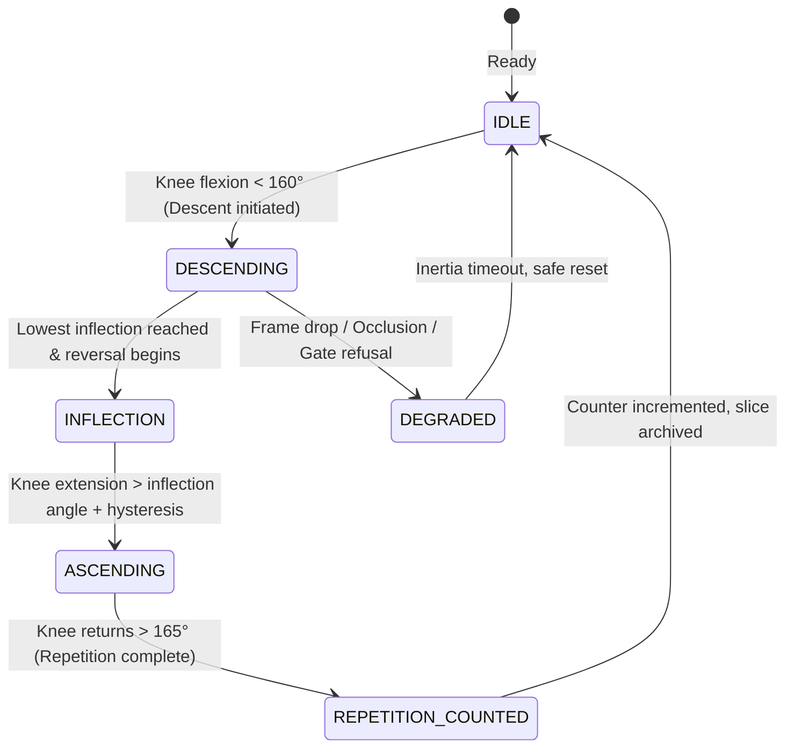
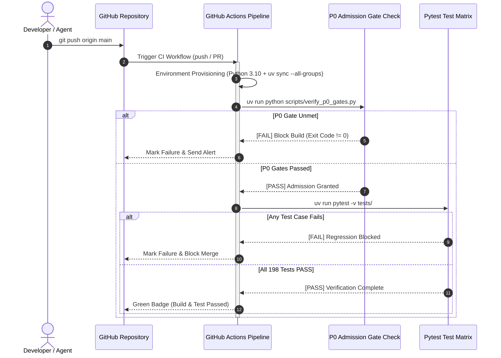

<div align="center">

# Exercise Motion Quality Assessment & Intelligent Tracking System
### Based on YOLOv8 and MediaPipe Pose Estimation

<p align="center">
  <b><a href="README.md">简体中文</a></b> |
  <b><a href="README_EN.md">English</a></b>
</p>

**Object Detection · Multi-Object Tracking · 3D Pose Estimation · Causal Kinematic Smoothing · Sports Injury Assessment · Multi-Rep Biomechanics Dashboard · DeepSeek AI Coach · Hardware Dual-Mode Acceleration · Modern Web Telemetry**

[](https://github.com/huwany1/Undergraduate-engineering-thesis/actions)
[](https://www.python.org/)
[](https://docs.astral.sh/uv/)
[](tests/)
[](https://fastapi.tiangolo.com/)
[](https://docs.ultralytics.com/)
[](https://developers.google.com/mediapipe)
[](web_demo/llm_coach.py)
[](web_demo/hardware.py)

This repository constitutes the core engineering implementation of an undergraduate engineering thesis: creating a complete technological closed-loop from low-level image/video capture, object detection, tracking, and 3D keypoint estimation, to top-level causal kinematic smoothing, repetition counting, motion quality rule verification, injury risk assessment, multi-repetition biomechanical analytics, DeepSeek grounded LLM coaching, deterministic replay evaluation, and a modern Web defense console.

[System Architecture](#-system-architecture) · [Engineering Evolution Matrix](#-engineering-evolution-matrix-p0--p5) · [Quick Start](#-quick-start) · [Web Interactive Telemetry Console](#-web-interactive-telemetry-console) · [Core Algorithms & Implementation](#-core-algorithms--implementation) · [Five Architecture Metrics](#-five-architecture-metrics) · [Project Directory](#-project-directory-structure)

</div>

---

## 🌟 System Architecture

The system adopts a high-cohesion, low-coupling layered architecture, achieving a complete engineering pipeline from pixel-level computer vision processing to semantic-level motion quality assessment and LLM-driven guidance:

```mermaid
flowchart TD
    %% Input Layer
    subgraph INPUT[" Data Input & Ingestion Layer "]
        direction TB
        V1["Local Video Files / Online Upload<br/>(MP4 / AVI / MOV)"]
        V2["Live Webcam Video Stream<br/>(OpenCV VideoCapture / WebSocket)"]
        V3["Synthetic Deterministic Replay Stream<br/>(Synthetic Generator)"]
        V4["MediaPipe Public Squat Benchmark Dataset<br/>(Standard / Deep / Front-View)"]
    end

    %% Perception & Tracking Layer
    subgraph VISION[" Visual Perception & Target Localization (P0 / Baseline) "]
        direction TB
        YOLO["YOLOv8 Object Detection<br/>(Person / Car / Bus)"]
        TRACK["DeepSORT Trajectory & ID Tracking<br/>(ReID Association + Kalman Filter)"]
        LINE["Scene Analysis: Line-Crossing Counter (count.py)"]
        ZONE["Scene Analysis: Restricted Zone Intrusion (zone.py)"]
        
        YOLO --> TRACK
        TRACK --> LINE
        TRACK --> ZONE
    end

    %% P1 Pipeline
    subgraph P1[" P1 Pose Video Streaming Pipeline "]
        direction TB
        G1["G1 Target Size & Confidence Gate"]
        ENG["MediaPipe Tasks Pose Estimation<br/>(33 3D Topology Keypoints)"]
        G2["G2 Keypoint Visibility & Integrity Gate"]
        HW["Hardware Acceleration Probe (GPU/CPU Dual-Mode)<br/>(DirectML / ROCm / Vulkan / MSMF / AVX2)"]
        
        G1 --> ENG --> G2
        HW -. Hardware Mode Injection .-> ENG
    end

    %% P2 Temporal Kinematics
    subgraph P2[" P2 Temporal Kinematics, SquatFSM & Analytics "]
        direction TB
        FILTER["Causal Temporal Filter<br/>(One-Euro Filter + EMA Decay)"]
        KIN["Kinematic Feature Extraction<br/>(Hip/Knee Joint Angles, Trunk Lean, Velocity)"]
        FSM["Squat Finite State Machine (SquatFSM)<br/>(Dual-Threshold Schmitt Hysteresis + Jitter Suppression)"]
        ANALYTICS["Multi-Repetition Slicing & Biomechanics Engine<br/>(Rep Duration, Peak Depth, Symmetry & Set Statistics)"]
        
        FILTER --> KIN --> FSM --> ANALYTICS
    end

    %% P3 Rules & Feedback
    subgraph P3[" P3 Quality Assessment, Injury Risk & AI Coach "]
        direction TB
        subgraph RULES[" Multi-Dimensional Evaluation Matrix "]
            R_DEPTH["Depth Rule (DepthRule)"]
            R_LEAN["Trunk Lean Rule (LeanRule)"]
            R_CYCLE["Cycle Rhythm Rule (CycleRule)"]
            R_VALGUS["Knee Valgus Injury Risk (ValgusRule)"]
            R_PELVIC["Pelvic Tilt Compensation (PelvicRule)"]
            R_HEEL["Heel Raise Compensation (HeelRule)"]
            R_ASYM["Bilateral Asymmetry (AsymmetryRule)"]
        end
        AGG["Deterministic Priority Aggregator<br/>(Severity Ranking & Root-Cause Attribution)"]
        LLM["DeepSeek LLM AI Coach<br/>(Biomechanical Grounded Prompting)"]
        FALLBACK["Local Deterministic Safe Fallback Engine<br/>(Non-Medical Sanitization & Expert Guidance)"]
        
        RULES --> AGG
        AGG --> LLM
        AGG --> FALLBACK
        LLM -. Graceful Degradation on Network/Key Failure .-> FALLBACK
    end

    %% P4 & P5 Presentation
    subgraph PRESENTATION[" Delivery Verification & Human Interaction (P4 / P5) "]
        direction TB
        P4_RUNNER["P4 Deterministic Replay Suite<br/>(5 Golden Cases TC01~TC05 + Evidence Packager)"]
        P5_SERVER["P5 Web Asynchronous Service<br/>(FastAPI REST + WebSocket Dual-Mode + Async Worker)"]
        P5_UI["P5 Modern Defense Dashboard (Glassmorphism)<br/>(Live Skeleton Canvas + Dynamic Chart.js + Rep Selector + AI Coach)"]
        
        P5_SERVER <--> P5_UI
    end

    %% Cross-layer links
    INPUT --> VISION
    INPUT --> P1
    VISION -. Cropped Person ROI .-> P1
    P1 --> P2
    P2 --> P3
    P3 --> PRESENTATION
    P4_RUNNER -. Verifies Regression .-> P5_SERVER

    classDef input fill:#E8F4FF,stroke:#228BE6,color:#102A43;
    classDef core fill:#F3EEFF,stroke:#7950F2,color:#2B1B54;
    classDef algo fill:#EAFBF1,stroke:#20A464,color:#123C2A;
    classDef app fill:#FFF4E6,stroke:#FD7E14,color:#341A04;
    class INPUT input;
    class VISION,P1 core;
    class P2,P3 algo;
    class PRESENTATION app;
```



---

## 📊 Engineering Evolution Matrix (P0 ~ P5)

This project strictly adheres to rigorous software engineering standards. Each development phase undergoes adversarial review, contract definition, and regression-pinned testing:

| Phase | Core Module | Responsibilities & Technical Strategies | Primary Metrics | Automated Tests |
|:---:|:---|:---|:---|:---:|
| **P0** | `baseline/` | Establish admission gate standards (G0~G6), camera geometry specs, informed consent, and data tiering contracts. | High Availability, Compliance | `scripts/verify_p0_gates.py` |
| **P1** | `p1_pipeline/` | Pose video streaming pipeline; G1 target gating and G2 pose integrity validation; strictly monotonic clock enforcement; CPU/GPU dual-mode hardware probe. | Low Coupling, High Availability | 26 Tests (100% Pass) |
| **P2** | `p2_temporal/` | Causal One-Euro filtering, joint geometry/angular velocity calculation, dual-threshold Schmitt SquatFSM counter, and multi-rep biomechanics analytics. | High Performance, Jitter-Resistant | 28 Tests (100% Pass) |
| **P3** | `p3_rules/` | Depth/lean/cycle quality assessment; knee valgus, pelvic tilt, heel raise, asymmetry injury risk assessment; DeepSeek AI coach with non-medical fallback. | High Cohesion, Safe & Compliant | 50 Tests (100% Pass) |
| **P4** | `p4_validation/` | Deterministic replay for 5 golden test scenarios (TC01~TC05); automated generation of self-contained evidence package ZIPs with SHA-256 validation. | Reproducibility, Anti-Regression | 14 Tests (100% Pass) |
| **P5** | `web_demo/` | Defense-grade Web dashboard (FastAPI + WebSocket); live webcam capture, async video upload analysis, real-time skeleton Canvas HUD, dynamic rep breakdown, AI coach chat. | User Experience, Visual Polish | 50 Tests (100% Pass) |
| **Base** | `yolov8-deepsort/` | YOLOv8 pedestrian object detection, DeepSORT multi-object tracking, bidirectional line-crossing counting, and polygon restricted area intrusion alerts. | Classical Vision Foundation | Standalone Runnable Demo |

> [!NOTE]
> The current test suite contains **198 automated test cases**, covering full-pipeline algorithms, temporal smoothing, rule evaluation, network streaming, security constraints, and LLM fallback paths with a **100% pass rate** in local and CI environments.

---

## 🚀 Quick Start

Dependency management utilizes the modern Python package manager [uv](https://docs.astral.sh/uv/) for second-level deterministic installation and lockfile synchronization.

### 1. Environment Setup

```bash
# 1. Clone repository and navigate to root directory
git clone https://github.com/huwany1/Undergraduate-engineering-thesis.git
cd Undergraduate-engineering-thesis

# 2. Synchronize Python 3.10 environment and all project dependencies
uv sync --all-groups
```

> [!TIP]
> Manual virtual environment activation is not required. All commands can be run deterministically within the isolated virtualenv using `uv run <command>`.

### 2. Environment Variables Configuration (Optional: DeepSeek AI Coach)

The system supports integrating DeepSeek API as an AI Coach via environment variables. A clean template `.env.example` is provided:

```bash
# Copy template to .env
cp .env.example .env

# Configure your API key in .env (if left blank, local expert fallback is automatically used)
# DEEPSEEK_API_KEY=sk-xxxxxxxxxxxxxxxxxxxxxxxxxxxxxxxx
```

### 3. Admission Gates Verification & Test Suite Execution

```bash
# Verify P0 admission gates (Automated check for G0 ~ G6 compliance)
uv run python scripts/verify_p0_gates.py

# Verify P1 video pose streaming gates (G1-P1 and G2-P1 integrity)
uv run python scripts/verify_p1_gates.py

# Execute full automated test suite (198 tests with 100% pass rate)
uv run pytest -v tests/
```

### 4. Launching the Web Defense Dashboard

```bash
# Start local server, auto-probe hardware acceleration, and open browser
uv run python scripts/run_web_demo.py --open

# Explicitly specify hardware acceleration mode (options: auto / gpu / cpu)
uv run python scripts/run_web_demo.py --accel-mode auto
```

Console URL: `http://127.0.0.1:8000`

---

## 💻 Web Interactive Telemetry Console

The system features a customized, modern Web telemetry dashboard designed for engineering defense demonstrations (FastAPI asynchronous backend + Glassmorphism dark cyberpunk UI):

```
┌──────────────────────────────────────────────────────────────────────────────────┐
│  EXERCISE POSE QUALITY TELEMETRY CONSOLE                        [GPU-ACCEL] ⚡  │
├───────────────┬──────────────────────────────────┬───────────────────────────────┤
│ Sidebar Nav   │ Video Stream & Skeleton Canvas   │ Biomechanics & AI Coach HUD   │
│               │                                  │                               │
│ [Mode Switch] │  ┌────────────────────────────┐  │ [Multi-Rep Slicing Dashboard] │
│ · Golden Cases│  │  Video / Webcam Stream     │  │ · Avg Duration: 2.14s         │
│ · Real Dataset│  │  + 33-Keypoint Skeleton    │  │ · Min Knee Angle: 88.5° (PASS)│
│ · Video Upload│  │  + Dynamic Joint HUD       │  │ · Trunk Lean Avg: 28.3° (GOOD)│
│ · Live Webcam │  └────────────────────────────┘  │ · Completion Score: 94.2/100  │
│               │                                  │                               │
│ [Hardware]    │ Biomechanical Waveform (Chart.js)│ [DeepSeek AI Coach Advice]    │
│ · AMD Radeon  │  /\    /\    /\   Knee Flexion   │ "Sufficient squat depth with  │
│ · DirectML    │ ──\/────\/────\/── Hip Y-Displace│  stable rhythm. Maintain knee │
│ · 60 FPS Solid│                                  │  outward alignment on ascent."│
└───────────────┴──────────────────────────────────┴───────────────────────────────┘
```

### Key Features

1. **Four-Dimensional Signal Sources**:
   - **Golden Test Matrix (TC01~TC05)**: Deterministic replay of standard squat, shallow squat, excessive forward lean, dual defects, and out-of-frame refusal.
   - **MediaPipe Public Dataset**: Pre-indexed authoritative workout videos (standard side-view, deep flexion, front-view).
   - **User Video Upload & Async Pipeline**: Drag-and-drop phone recordings; processed by background workers to extract full-frame telemetry, keyframes, and rep slices.
   - **Live Webcam Real-time Stream**: Direct browser camera access with millisecond-level skeleton rendering, live joint angle calculation, and instant feedback.
2. **Real-time Skeleton & HUD Canvas**: High-frequency streaming visualization of 33 topological keypoints, connecting bones, knee angle arcs, and hip trajectory.
3. **Dual Dynamic Waveform Charts**: Chart.js synchronization of knee joint angle variation and hip vertical displacement curves.
4. **Multi-Repetition Slicing & Macro Dashboard**:
   - Automatically segments individual repetitions across an exercise set.
   - Summarizes concentric/eccentric duration ratio, peak squat depth, maximum trunk lean, and bilateral symmetry scores.
5. **Sports Injury Risk & Compliance Rules**:
   - Real-time detection of **knee valgus (caving)**, **excessive trunk lean**, **pelvic tilt compensation**, and **heel lift**.
   - Strictly purges clinical terminology to deliver safe, non-medical athletic guidance.
6. **DeepSeek Grounded LLM AI Coach**:
   - Injects precise angles, defect reason codes, and kinematic duration as Grounded Facts into prompts.
   - Generates encouraging, actionable, and personalized coaching guidance with multi-turn conversational support.
   - Built-in circuit breaker: automatically falls back to deterministic expert rule outputs if network timeouts or invalid keys occur.
7. **Dual-Mode Hardware Acceleration Probe**:
   - Optimized for modern heterogeneous architectures (e.g., AMD Ryzen 7 8745HS with Radeon 780M iGPU).
   - Dynamic switching between pure CPU calculation and GPU hardware acceleration (DirectML / ROCm / Vulkan / MSMF).

---

## 🔬 Core Algorithms & Implementation

### 1. Causal Kinematic Smoothing (One-Euro Filter)
Pixel jitter is common in video-based joint detection. The system integrates the causal **One-Euro Filter**, adjusting its cutoff frequency dynamically based on velocity:
$$\hat{x}_k = \alpha x_k + (1 - \alpha) \hat{x}_{k-1}, \quad \alpha = \frac{1}{1 + \frac{\tau}{T_e}}, \quad \tau = \frac{1}{2\pi f_c}, \quad f_c = f_{c,\min} + \beta |\dot{x}_k|$$
This achieves strong jitter reduction during static or slow movements while eliminating phase delay during rapid reversals.

### 2. Dual-Threshold Schmitt Hysteresis State Machine (SquatFSM)
To resolve threshold chattering around inflection points, a dual-threshold state machine was engineered:



- **Anti-Chatter Guard**: Minimum duration threshold (Min Duration > 0.8s) discards transient noise.
- **Valid Stroke Verification**: Only trajectories passing through the valid depth zone transition to the ascent phase.
- **Occlusion Tolerance**: Safe inertia hold maintains state during brief frame drops, gracefully resetting if occlusion exceeds safety limits.

### 3. Multi-Dimensional Quality & Injury Prevention Rules
- **Squat Depth Rule (DepthRule)**: Evaluates thigh-to-shank angle: Passed ($\le 100^\circ$), Mild Defect ($100^\circ \sim 115^\circ$), Severe Defect ($> 115^\circ$).
- **Trunk Lean Rule (LeanRule)**: Evaluates shoulder-hip line relative to the vertical axis to prevent lumbar spinal overload.
- **Cycle Rhythm Rule (CycleRule)**: Evaluates concentric and eccentric movement durations within biomechanically sound intervals.
- **Knee Valgus Rule (ValgusRule)**: Monitors inward collapse of the knee relative to the hip-ankle vector, mitigating cruciate ligament strain.
- **Pelvic Tilt Rule (PelvicRule)**: Detects asymmetric elevation across the anterior superior iliac spines (ASIS).
- **Heel Raise Rule (HeelRule)**: Detects vertical heel displacement during flexion, identifying restricted ankle dorsiflexion.
- **Bilateral Asymmetry Rule (AsymmetryRule)**: Quantifies discrepancy between left and right limb kinematics.

### 4. Grounded LLM AI Coach Architecture
To prevent hallucinations common in general-purpose LLMs, this project implements **Grounded Prompting**:
1. **Structured Fact Extraction**: Key metrics (e.g., peak flexion angle 86.4°, trunk lean 41.2°, concentric 1.3s, eccentric 0.9s, reason code `LEAN_SEVERE`) are compiled deterministically.
2. **Non-Medical Conditioning**: The System Prompt explicitly prohibits diagnostic or prescriptive claims, adopting the persona of a certified strength and conditioning specialist.
3. **Circuit Breaker & Fallback**: Automatic status checks ensure instantaneous fallback to the deterministic expert rule engine upon API unreachability.

---

## 🛡️ Five Architecture Metrics

The system aligns with industrial software engineering standards across five dimensions:

| Architecture Metric | Technical Strategies & Design Decisions |
|:---|:---|
| **Low Coupling** | Inter-module communication relies exclusively on immutable Data Transfer Objects (`PoseFrame`, `KinematicFeatures`, `RepetitionEvent`, `BiomechanicsRecord`). Pose estimation engines, hardware probes, and LLM clients interface via abstract contracts for seamless hot-swapping. |
| **High Cohesion** | `p1_pipeline` is dedicated to video ingestion and admission gating; `p2_temporal` handles causal smoothing and FSM counting; `p3_rules` evaluates biomechanical correctness; `web_demo` strictly manages API serving and telemetry delivery. |
| **High Availability** | Monotonic clocks prevent timing corruption; occlusion inertia guards prevent state machine deadlock; Web endpoints enforce path traversal defenses; DeepSeek integration provides zero-latency fallback to offline rule tables. |
| **High Performance** | Causal single-pass filtering ($O(1)$ complexity), zero-copy memory transfers, GPU backend auto-probing (DirectML / Vulkan / MSMF), and WebSocket high-frequency multiplexing maintain end-to-end processing latencies under $\le 20\text{ms}$. |
| **Maintainability** | Comprehensive PEP 484 type annotations, 198 automated test cases, mandatory CI gatekeepers, and end-to-end SHA-256 evidence hashing guarantee high maintainability. |

---

## 🔄 Automated Testing & CI Gatekeeper

The repository enforces continuous integration via GitHub Actions (`.github/workflows/ci.yml`):



- **Testing Every Change**: All features and bug fixes must include corresponding automated unit/regression tests.
- **Zero-Tolerance for Regressions**: Pinned boundary scenarios and jitter edge cases serve as permanent test assets.

---

## 📁 Project Directory Structure

```text
Undergraduate-engineering-thesis/
├── .github/workflows/ci.yml         # GitHub Actions automated CI pipeline
├── pyproject.toml                   # uv project configuration and dependencies
├── uv.lock                          # Strictly pinned dependency lockfile
├── .env.example                     # Environment template (DeepSeek API instructions)
├── .gitignore                       # Robust Git asset governance & ignore rules
├── README.md                        # Chinese master documentation
├── README_EN.md                     # English master documentation (this file)
├── AGENTS.md / GEMINI.md            # Development rules, metrics, and review standards
│
├── 开题报告/                        # Thesis proposal documentation & drafts
├── 答辩PPT/                         # Proposal and midterm defense presentation slides
│
├── baseline/                        # P0 baseline standards and admission contracts
│   ├── contracts/                   # G0-G6 admission contracts & camera specifications
│   ├── data_templates/              # Calibration & dual-sample specification templates
│   └── manifest.yaml                # Baseline specification card with SHA-256 bindings
│
├── p1_pipeline/                     # P1 pose video streaming pipeline
│   ├── contracts.py                 # P1 DTO contracts and timestamp specs
│   ├── input_probe.py               # Video probe and metadata extraction
│   ├── quality_gate.py              # G1 target gating and G2 pose gating
│   ├── engine/                      # Pose estimation abstraction (MediaPipe Tasks)
│   └── runner.py                    # P1 end-to-end streaming runner
│
├── p2_temporal/                     # P2 temporal smoothing, FSM counter & analytics
│   ├── smoothing/                   # One-Euro causal filter & EMA smoothing
│   ├── kinematics/                  # Joint geometry & angular velocity extraction
│   ├── fsm/                         # Schmitt dual-threshold SquatFSM
│   ├── counter/                     # Repetition counter & anti-jitter logic
│   └── analytics/                   # Multi-rep slicing & biomechanics analytics
│
├── p3_rules/                        # P3 motion quality rules & AI coach
│   ├── evaluators/                  # Depth, trunk lean, cycle, valgus, pelvic & heel rules
│   ├── aggregator/                  # Multi-rule priority arbitrator & aggregator
│   └── feedback/                    # Non-medical feedback sanitizer & expert rules
│
├── p4_validation/                   # P4 automated validation suite
│   ├── golden_assets.py             # 5 golden scenario specs (TC01 ~ TC05)
│   ├── replayer.py                  # Deterministic replay simulator
│   ├── matrix_verifier.py           # Test matrix assertion verifier
│   └── packager.py                  # Delivery package packager (ZIP & Manifest)
│
├── web_demo/                        # P5 modern Web defense interactive console
│   ├── server.py                    # FastAPI REST & WebSocket dual-mode backend
│   ├── service.py                   # Replay adapter and telemetry broadcast service
│   ├── worker.py                    # Asynchronous video upload analysis worker
│   ├── analyzer.py                  # End-to-end video analysis pipeline
│   ├── live_manager.py              # Real-time webcam session manager
│   ├── llm_coach.py                 # DeepSeek LLM coach adapter & fallback engine
│   ├── hardware.py                  # CPU/GPU dual-mode hardware probe
│   └── static/                      # Modern Glassmorphism responsive frontend
│       ├── index.html               # Single-page application interface
│       ├── css/style.css            # Dark cyberpunk visual theme
│       └── js/                      # Modular frontend components
│           ├── app.js               # Application coordinator & event bus
│           ├── chart.js             # Real-time kinematic curves rendering
│           └── modules/             # UI modules (API, Webcam, LLM, Slices, Skeleton)
│
├── scripts/                         # Maintenance and automation scripts
│   ├── verify_p0_gates.py           # P0 admission gates validation script
│   ├── verify_p1_gates.py           # P1 video pose link validation script
│   ├── run_p4_validation.py         # P4 validation suite execution & packaging script
│   ├── download_squat_dataset.py    # MediaPipe benchmark squat dataset downloader
│   ├── run_dataset_demo.py          # Real dataset offline pipeline runner
│   └── run_web_demo.py              # Web defense dashboard one-click launcher
│
├── tests/                           # Automated test suite (198 tests, 100% pass)
│   ├── test_p0_baseline.py          # P0 admission gate contracts
│   ├── test_p1_*.py                 # P1 video pipeline, engine & fault injection
│   ├── test_p2_*.py                 # P2 filter smoothing, FSM & multi-rep analytics
│   ├── test_p3_*.py                 # P3 rules, injury risk & feedback sanitization
│   ├── test_p4_*.py                 # P4 deterministic replay & matrix verification
│   ├── test_dataset_demo.py         # Real dataset pipeline & API tests
│   ├── test_hardware_acceleration.py# Hardware probe & acceleration tests
│   ├── test_web_demo*.py            # Web APIs, live webcam, video upload & LLM tests
│   └── ...
│
├── reports/                         # Automated validation artifacts & deliverables
│   ├── P0_gate_verification_report.md
│   ├── validation_package/          # P4 exported self-contained reports and evidence ZIPs
│   ├── dataset_demo/                # Real dataset analysis replays & evaluation manifests
│   └── uploaded_demo/               # Dynamic user uploads & telemetry (.gitignore protected)
│
├── yolov8-deepsort/                 # Baseline: object detection & multi-target tracking
│   ├── demo.py                      # Tracking demonstration
│   ├── count.py                     # Bidirectional line-crossing crowd counting
│   ├── zone.py                      # Restricted zone intrusion detection
│   └── deep_sort/                   # DeepSORT core tracking algorithms
│
└── mediapipe-plot-pose-live-main/   # Prototype: MediaPipe 3D pose visualization
```

---

## 📚 References & Acknowledgments

- **National Standards**: GB/T 7714-2015 Information and documentation - Rules for bibliographic references and citations to bibliographic resources
- **Object Detection**: Ultralytics YOLOv8 Architecture and Object Detection Pipeline (2023)
- **Multi-Object Tracking**: Wojke N, Bewley A, Paulus D. Simple Online and Realtime Tracking with a Deep Association Metric[C]//IEEE ICIP, 2017: 3645-3649.
- **Human Pose Estimation**: Lugaresi C, Tang J, Nash H, et al. MediaPipe: A Framework for Building Perception Pipelines[J]. arXiv preprint arXiv:1906.08172, 2019.
- **Temporal Smoothing**: Casiez G, Roussel N, Vogel D. 1 € Filter: A Simple Speed-based Low-pass Filter for Noisy Input in Embodied Interaction[C]//ACM CHI, 2012: 2527-2530.
- **Modern Asynchronous Web**: FastAPI: High Performance Modern Python Web Framework (Tiangolo, 2024)

---

<div align="center">
  <sub>This project is an undergraduate engineering thesis development accomplishment adhering to academic and open-source standards. Issues and Pull Requests are warmly welcome.</sub>
</div>
