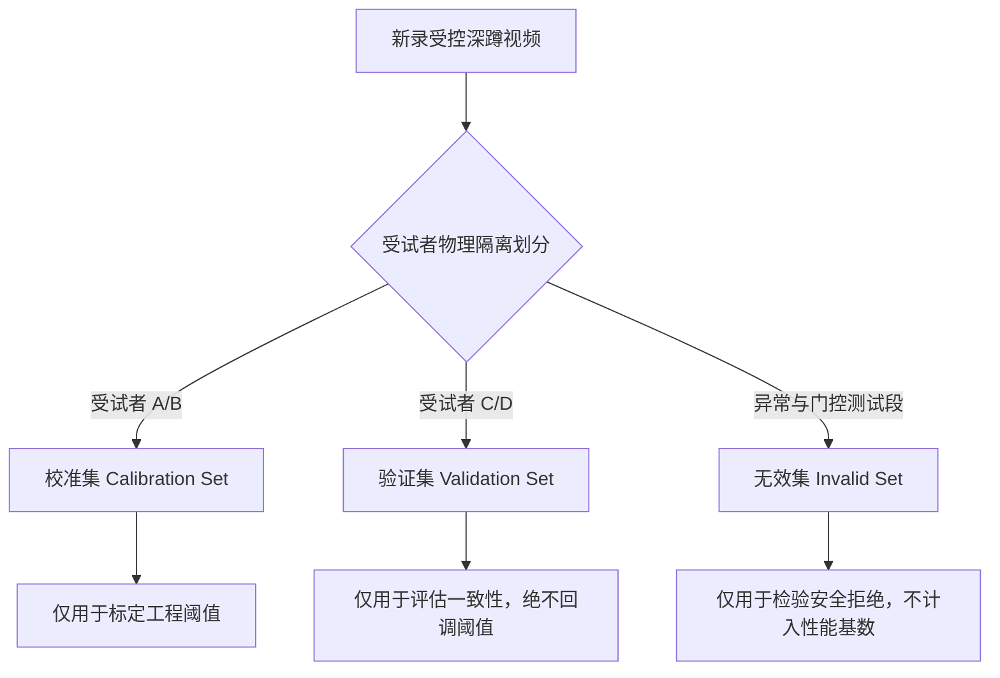

# 卡 E｜数据集规范与标注手册（Dataset Manifest & Label Guide）

- **数据集规范版本**：`DS-MANIFEST-v1.0`
- **标注手册版本**：`LABEL-GUIDE-v1.0`
- **生效日期**：2026-09-18
- **责任人**：配置与数据管理员

---

## 1. 数据集隔离纪律（杜绝数据泄漏）

遵循机器学习高可靠实验准则（`ml-best-practices`），深蹲视频数据集划分为三个功能明确且绝对隔离的子集：

1. **零交叉原则**：同一受试者、同一录制会话的视频片段，严禁同时存在于校准集与验证集。
2. **严禁逆向回调**：验证集的评测结果仅用于最终验收，严禁利用验证集指标反向调优校准集所得的工程参数。

---

## 2. 标注手册与“零伪真值”管理

为杜绝“自测自评”与“伪真值”现象，项目实施双人双盲复核流程：

### 2.1 标注字段与标准
- `rep_start_frame`：受试者站立位开始出现明显下蹲屈膝的起始帧；
- `bottom_frame`：髋部到达最低点的拐点帧；
- `rep_end_frame`：受试者恢复直立站立位且身体稳定的终止帧；
- `depth_ground_truth`：人工判定的下蹲深度合格性（`ACCEPTABLE` / `INSUFFICIENT`）；
- `torso_ground_truth`：人工判定的躯干倾角合理性（`ACCEPTABLE` / `EXCESSIVE_LEAN`）。

### 2.2 双人独立复核与仲裁机制
1. **独立初标**：两名标注人员各自独立在不交流状态下标注阶段起止帧与规则标签。
2. **分歧判定**：
   - 阶段起止帧误差 $> 3$ 帧，或规则质量标签不一致时，触发分歧事件。
   - 登记至 `annotation_discrepancy_template.csv`。
3. **专家仲裁**：由指导教师或第三位资深复核人介入仲裁，裁定最终基准标签，并计算双人一致性 Kappa 系数。
4. **指标报告前提**：未完成该双人真值复核流程前，系统对外只展示时间戳回放证据与状态机迁移事实，不提供任何未经证实的性能准确率数字。
