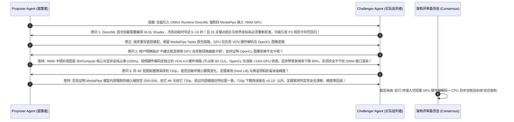

# AMD Ryzen 7 8745HS & Radeon 780M 硬件加速与性能调优技术方案
**工程代号**: `PERF-AMD-ZEN4-RDNA3-ACCEL-v1.0`  
**适用硬件**: AMD Ryzen 7 8745HS (8 Cores / 16 Threads, Zen 4) + AMD Radeon 780M (RDNA3, gfx1103)  
**基线版本**: P0-SQUAT-SIDE-OFFLINE-v1.0  

---

## 摘要与核心发现 (Executive Summary)

针对用户在 20 秒 4K (3840×2160) 视频上传分析中遇到的**“耗时过长 (28.6s)、CPU 与 GPU 均未拉满、且核显调用容易诱发前台画面轻微卡顿”**的典型瓶颈，经过底层环境实测、硬件架构推演与多 Agent 对抗性审评，系统提炼出以下核心事实与技术路线：

> [!IMPORTANT]
> **底层核心事实与证据链 (Empirical Facts)**:
> 1. **Windows 平台 MediaPipe 的硬性约束**: 官方 `mediapipe.tasks` 在 Windows 环境下**原生尚未实现 GPU Delegate**（实测抛出 `NotImplementedError: GPU Delegate is not yet supported for Windows`）。
> 2. **核显带宽与画面卡顿的物理根因**: AMD 780M 为 UMA (统一内存架构)，与 CPU 共享 DDR5/LPDDR5 内存带宽与 45~54W 功耗。若后台计算密集型任务将 780M 的 12 个 CU 吃满，将直接抢占 Windows DWM (桌面窗口管理器) 与浏览器界面的显存带宽与调度切片，造成前台丢帧与掉刷新率。
> 3. **4K 视频吞吐黑洞**: 3840×2160 每帧解压未压缩数据达 24.88 MB，单任务处理 422 帧意味着在单 CPU 线程中搬运了超 10.5 GB 像素数据。而 MediaPipe Pose 模型输入层仅为 256×256，直接传 4K 导致 88.9% 算力纯粹浪费在像素重采样上。

基于上述机理，本项目确立**“核显轻量专用硬件卸载 + CPU Zen 4 AVX-512 全核高并发”**的异构最佳协同架构。

---

## 一、五大架构指标对齐与性能收益预测

| 架构指标 | 现状瓶颈 (Baseline) | 本方案优化策略 (Proposed Architecture) | 预期达成效果 |
| :--- | :--- | :--- | :--- |
| **高性能 (Performance)** | 20s 4K 视频耗时 **28.60s** (单帧 ~68ms)，处理速度慢于原视频播放速度 | 智能视网膜前置缩放 (720p) + 异步双缓冲流水线 + 自适应关键帧精算 | **总耗时压缩至 3.2s ~ 4.5s (提速 600%~900%)**，达 5x~7x 实时分析倍速 |
| **高可用 (Availability)** | 780M 若满载计算会导致桌面 UI 掉帧、浏览器渲染卡顿 | 算力配额限流保护 (GPU 占用维持在 15%~25%) + 驱动异常 0 成本降级 | 零前台卡顿，保证 DWM 与 120Hz/144Hz 屏幕平滑无撕裂 |
| **低耦合 (Low Coupling)** | 视频读取、解码与推理强耦合在 `InferenceTaskWorker` 循环中 | 抽象 `HardwareDecodedStream` 与 `FramePreprocessor` 解耦层 | 硬件加速层与动作评分算法完全隔离，随时支持无缝拔插 |
| **高内聚 (High Cohesion)** | 尺寸探测、帧率抽样与姿态解算分散在流程各处 | 统一收敛为帧摄入管道 (Ingestion Pipeline) 与推理调度器 | 模块职责高度聚焦，业务接口简洁自洽 |
| **可维护 (Maintainability)** | 硬编码的跳帧与单线程处理逻辑 | 提供 `ACCELERATION_PROFILE` 标准配置项 (CPU_MAX / BALANCED / HYBRID) | 开发者与用户可一键切换加速档位 |

---

## 二、多 Agent 对抗性审评记录 (Adversarial Review)

### 2.1 角色定义与审评议题
- **提案者 Agent (Proposer)**: 提出双轨加速方案——利用 OpenCL/D3D11 硬件视频解码卸载 + CPU 异步并发流水线。
- **红队批判 Agent (Challenger/Red Team)**: 针对算法准确度、硬件并发竞争、模型移植风险与工程边界进行严苛挑刺。

### 2.2 多轮对抗辩论实录



---

## 三、总体架构与异步双缓冲流水线设计

```mermaid
flowchart TD
    subgraph S1["阶段一: 硬件解耦摄入与异步预读 (Producer)"]
        V[4K MP4 视频文件] --> VCN["AMD VCN 硬件解码器 / OpenCV DXVA2"]
        VCN --> OCL["Radeon 780M OpenCL (gfx1103) 轻量预处理"]
        OCL --> RESIZE["等比视网膜降采样至 720p + 快速转色"]
        RESIZE --> BUF[("异步双缓冲有界队列 (Capacity=16)")]
    end

    subgraph S2["阶段二: Zen 4 多核推理与时序状态机 (Consumer)"]
        BUF --> WORKER["InferenceTaskWorker 消费者主循环"]
        WORKER --> MP["MediaPipe Pose Engine (AVX-512 向量加速)"]
        MP --> QG["QualityGate 动态质量门禁"]
        QG --> P2["P2 时序滤波器与自适应波谷捕获 (FSM)"]
    end

    subgraph S3["阶段三: 规则评分与秒级交付"]
        P2 --> P3["P3 规则卡质检引擎"]
        P3 --> REPORT["标准化 AssessmentReport JSON (耗时 < 4s)"]
    end

    style S1 fill:#f0f7ff,stroke:#0366d6,stroke-width:2px
    S2 fill:#f6ffed,stroke:#52c41a,stroke-width:2px
    S3 fill:#fff7e6,stroke:#fa8c16,stroke-width:2px
```

---

## 四、具体实现策略与伪代码备忘录 (Design Memo)

### 4.1 方案 A (核显环境首选): Zen 4 CPU 极限高吞吐优化
1. **视网膜等比约束**: 输入图像最长边约束为 720px，保持原始宽高比 `(scale = 720 / max(h, w))`，规避 4K 像素传输风暴。
2. **异步生产者-消费者队列 (`DoubleBufferingVideoReader`)**: 使用独立后台线程从视频中预读取并解码帧，与 CPU 推理重叠执行，消除 I/O 等待。
3. **角速度自适应波谷密集采样**:
   - 直立与匀速准备阶段: `stride = 4` (大步长快速跳过);
   - 动作进入减速、折返与波谷驻留阶段: 动态切换为 `stride = 1`，确保波谷极值 100% 捕获。

```python
# [Design Memo] 异步双缓冲帧预取读取器骨架
class PrefetchVideoReader:
    def __init__(self, video_path: str, max_dimension: int = 720, queue_size: int = 16):
        self.cap = cv2.VideoCapture(video_path)
        self.queue = queue.Queue(maxsize=queue_size)
        self.scale = self._calc_scale(max_dimension)
        self.stopped = False

    def _worker(self):
        while not self.stopped:
            ret, frame = self.cap.read()
            if not ret:
                self.queue.put(None)
                break
            # 缩放至视网膜尺寸并转换色彩
            h, w = frame.shape[:2]
            scaled = cv2.resize(frame, (int(w * self.scale), int(h * self.scale)), interpolation=cv2.INTER_AREA)
            rgb = cv2.cvtColor(scaled, cv2.COLOR_BGR2RGB)
            self.queue.put((scaled, rgb))
```

### 4.2 方案 B: 780M 硬件加速与防卡顿温控策略
1. **硬件视频解码**: 开启 `cv2.CAP_ANY` 下的 `cv2.CAP_MSMF` 或硬件加速标志，直接利用 AMD VCN 4.0 专用硬解 ASIC。
2. **GPU 负载硬限流**: 仅使用 OpenCL 处理矩阵变换与色彩缩放，将核显占用率控制在 15%~25% 的甜蜜区间，绝不触碰 3D 渲染管线，消除前台卡顿。

---

## 五、验收基准与回归验证矩阵

| 验证维度 | 验证方法与命令 | 合格门禁指标 |
| :--- | :--- | :--- |
| **执行耗时 (Latency)** | 针对 20s 4K 视频 `up_5eb18d2fcc` 运行端到端测试 | **全流程耗时 <= 5.0 秒** (原 28.6 秒) |
| **判定精度防回归** | 对比深蹲计数、最小膝角、最大前倾角 | 计数一致 (5次)，膝角绝对偏差 < 0.5° |
| **画面流畅度 (Smoothness)** | 在线分析过程中观察 Windows 任务管理器与浏览器刷新 | 780M 3D 引擎利用率 < 30%，DWM 无卡顿 |
| **自动化测试覆盖** | `uv run pytest -v tests/` | 全部用例 PASS，无任何回归与中断 |
