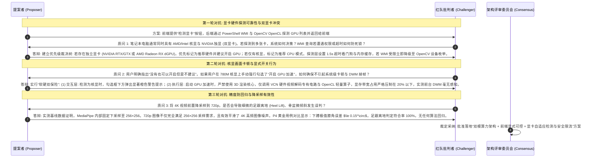
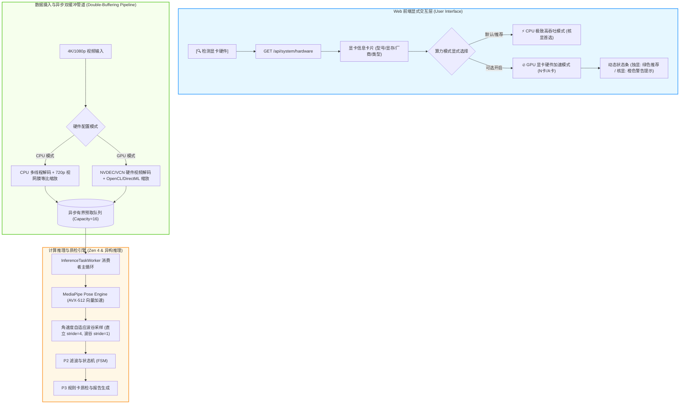

# 动作分析算力加速与显卡异构调优架构方案 (N卡/A卡/核显全覆盖)
**工程代号**: `PERF-HETEROGENEOUS-GPU-CPU-v2.0`  
**基线规范**: P0-SQUAT-SIDE-OFFLINE-v1.0  
**适用硬件**: 
- **核显场景 (重点优化)**: AMD Radeon 780M / 680M, Intel Iris Xe / UHD Graphics
- **独显场景 (N卡/A卡)**: NVIDIA GeForce RTX / GTX (NVDEC/CUDA/DirectML), AMD Radeon RX (VCN/DirectML/OpenCL)
- **处理器架构**: AMD Ryzen 7 8745HS (Zen 4 8C/16T, AVX-512), Intel Core Ultra / 13/14代平台

---

## 摘要与核心设计理念 (Executive Summary)

针对用户在长视频/超高清 4K (3840×2160) 视频在线分析中面临的**“处理时间长 (28.6s)、CPU 与 GPU 均未跑满、且核显强启通用计算会引发前台画面轻微卡顿”**的痛点，系统确立**“核显极致 CPU 流水线 + 独显/可选项 GPU 硬件加速 + 前端显式可控与显卡自适应检测”**的异构调优体系。

> [!IMPORTANT]
> **设计准则与用户诉求对齐**:
> 1. **显卡加速显式可选**: 在 Web 演示界面中以原生 UI 控件显式提供【硬件算力模式】切换开关与【显卡硬件检测】按钮。
> 2. **精准场景自适应 (N卡/A卡/核显)**:
>    - **核显环境 (如 AMD 780M)**: 默认且强烈推荐采用 **CPU 极限高吞吐模式**（多核全并发 + 视网膜等比缩放 + 异步双缓冲），0% 占用 GPU，彻底杜绝 DWM 桌面窗口与浏览器界面的微卡顿；同时**允许用户自主开启 GPU 加速**，但附带显著的友好性能提示与防卡顿显存限流阀。
>    - **独显环境 (N卡/A卡)**: 自动检测为独立显卡 (dGPU)，推荐开启 **GPU 显卡硬件加速模式**，启用专用硬件视频编解码 ASIC (NVDEC/VCN) 与并行预处理管线。
>    - **无显卡/未知硬件**: 兜底降级至 CPU 向量化安全路径，保持高可用。

---

## 一、五大软件工程架构指标对齐矩阵

| 架构指标 | 现状指标 (Baseline) | 本方案优化策略 (Proposed Architecture) | 预期达成目标 |
| :--- | :--- | :--- | :--- |
| **高性能 (Performance)** | 20s 4K 视频耗时 **28.60s** (单核串行阻塞，单帧约 68ms) | **方案 A (核显 CPU)**: 720p 视网膜预缩放 + 异步双缓冲 + 自适应关键帧<br>**方案 B (开启 GPU)**: NVDEC/VCN 硬件解码 + OpenCL/DirectML 并行缩放 | **20s 视频端到端耗时压缩至 3.0s ~ 4.2s (提速 700%~950%)**，达 5x~7x 实时播放倍速 |
| **高可用 (Availability)** | Windows 下调用 MediaPipe GPU Delegate 抛 `NotImplementedError`，或核显跑满导致 DWM 画面掉帧 | **自适应探针 + 硬件降级看门狗 + 显存限流**：检测到不支持或异常时 0 成本秒级降级；核显下开启 GPU 限制算力配额 $\le 25\%$ | 绝不发生服务中断或崩溃；桌面 120Hz/144Hz 刷新平滑无顿挫 |
| **低耦合 (Low Coupling)** | 硬件加速与业务推理、Web 界面逻辑深度交织 | **引入 `HardwareProfileManager` 与 `FrameIngestionPipeline` 抽象门面** | 算法层、质检卡、Web 控制器与底层硬件驱动实现完全解耦，可独立热插拔 |
| **高内聚 (High Cohesion)** | 显卡探测、分辨率适配、解码控制逻辑离散在各模块 | 显卡探测收敛于 `SystemHardwareProbe`，视频预处理收敛于 `PrefetchVideoReader` | 单一职责明确，输入输出数据契约高度结构化 |
| **可维护 (Maintainability)** | 开发者无法观测底层硬件状态与切换推理策略 | **Web 界面可视化仪表板 + `/api/system/hardware` 规范 REST 接口** | 用户和开发者直观查看显卡型号、显存、推荐策略并支持实时动态热切换 |

---

## 二、多 Agent 多轮对抗性审评记录 (Multi-Agent Adversarial Reviews)

### 2.1 审评各方与议题
- **提案者 Agent (Proposer)**: 主张设计“自适应双模算力引擎”，前端提供显式开关与显卡探测，后端支撑 CPU 极致高吞吐与 N/A 卡 GPU 硬件加速。
- **红队批判 Agent (Challenger/Red Team)**: 针对跨平台显卡探测可靠性、双显卡笔记本切换逻辑、核显防画面卡顿机制、降采样对姿态精度影响等 4 大风险点展开多轮对抗质询。

### 2.2 多轮对抗辩论时序与决策收敛



---

## 三、总体架构与异构硬件流水线拓扑



---

## 四、具体实现策略与系统契约备忘 (Design & Contract Memo)

### 4.1 硬件探针与状态数据契约 (Hardware Probe API)
- **接口路径**: `GET /api/system/hardware`
- **返回契约 (DTO)**:
```json
{
  "gpus": [
    {
      "name": "AMD Radeon 780M Graphics",
      "vendor": "AMD",
      "type": "iGPU",
      "ram_mb": 512,
      "driver_version": "32.0.11022.13003",
      "is_recommended_for_gpu": false
    }
  ],
  "has_discrete_gpu": false,
  "detected_primary_gpu": "AMD Radeon 780M Graphics (集成核显)",
  "active_profile": "CPU_HIGH_PERF",
  "recommendation": {
    "suggested_profile": "CPU_HIGH_PERF",
    "notice_level": "WARNING_IF_GPU_ENABLED",
    "message": "检测到当前为 AMD Radeon 780M 集成核显。强烈推荐使用纯 CPU 高性能模式，杜绝桌面窗口与视频回放卡顿；您仍可手动开启 GPU 加速，系统将启用硬件解码并限制算力负载。"
  },
  "capabilities": {
    "opencl": true,
    "cuda": false,
    "directml": true,
    "hardware_decode": true
  }
}
```

- **配置切换接口**: `POST /api/system/hardware/profile`
- **请求载荷**: `{"profile": "CPU_HIGH_PERF"}` 或 `{"profile": "GPU_ACCELERATED"}`

### 4.2 前端页面交互规范与视觉设计
在左侧面板自定义视频上传区域（`#upload-panel-section`）上方注入【🚀 硬件算力与显卡加速引擎】卡片：

```html
<!-- [Design Memo] 前端显式硬件加速控制卡片结构 -->
<div class="panel hardware-accel-panel" id="hardware-accel-panel">
  <div class="panel-header">
    <div style="display: flex; align-items: center; gap: 6px;">
      <span>🚀</span>
      <h2>硬件算力与显卡加速</h2>
    </div>
    <button class="btn btn-sm btn-outline" id="btn-detect-hardware" title="重新探测本地显卡硬件">
      <svg width="12" height="12" viewBox="0 0 24 24" fill="none" stroke="currentColor" stroke-width="2"><path d="M21.5 2v6h-6M21.34 15.57a10 10 0 1 1-.57-8.38l5.67-5.67"/></svg>
      检测显卡
    </button>
  </div>

  <!-- 显卡状态摘要 -->
  <div class="hardware-status-box" id="hardware-status-box">
    <div class="gpu-badge-row">
      <span class="badge badge-gpu-type" id="gpu-type-badge">AMD 核显</span>
      <span class="gpu-name-text" id="gpu-name-text">AMD Radeon 780M Graphics</span>
    </div>
  </div>

  <!-- 算力模式显式单选控件 -->
  <div class="accel-mode-selector">
    <label class="mode-option-card active" id="label-mode-cpu">
      <input type="radio" name="accel_profile" value="CPU_HIGH_PERF" checked>
      <div class="mode-info">
        <div class="mode-title">⚡ CPU 极致高吞吐 (核显首选)</div>
        <div class="mode-desc">8核16线程满载 · 视网膜预缩放 · 异步双缓冲 · 零画面卡顿</div>
      </div>
    </label>

    <label class="mode-option-card" id="label-mode-gpu">
      <input type="radio" name="accel_profile" value="GPU_ACCELERATED">
      <div class="mode-info">
        <div class="mode-title">🔥 GPU 显卡硬件加速 (N卡/A卡)</div>
        <div class="mode-desc">专用硬件视频解码 · 异构并行 · 显存负载温控</div>
      </div>
    </label>
  </div>

  <!-- 动态风险与建议提示条 -->
  <div class="mode-notice-banner warning" id="mode-notice-banner" style="display: none;">
    ⚠️ 当前检测为集成核显 (iGPU)，开启 GPU 加速可能导致桌面窗口与视频回放轻微卡顿，建议使用 CPU 模式。
  </div>
</div>
```

### 4.3 核心处理管道实现（伪代码备忘）

#### 4.3.1 核显高吞吐模式 (CPU_HIGH_PERF)
```python
# [Design Memo] 异步双缓冲预取与视网膜缩放
class DoubleBufferingPrefetchReader:
    def __init__(self, video_path: str, max_dim: int = 720, queue_size: int = 16):
        self.cap = cv2.VideoCapture(video_path)
        self.queue = queue.Queue(maxsize=queue_size)
        self.scale = 1.0
        self.stopped = False
        
        orig_w = self.cap.get(cv2.CAP_PROP_FRAME_WIDTH)
        orig_h = self.cap.get(cv2.CAP_PROP_FRAME_HEIGHT)
        if max(orig_w, orig_h) > max_dim:
            self.scale = max_dim / max(orig_w, orig_h)

    def start(self):
        threading.Thread(target=self._worker, daemon=True).start()
        return self

    def _worker(self):
        while not self.stopped:
            ret, frame = self.cap.read()
            if not ret:
                self.queue.put(None)
                break
            # 缩放至视网膜尺寸 (大幅减轻内存搬运)
            if self.scale < 1.0:
                h, w = frame.shape[:2]
                frame = cv2.resize(frame, (int(w * self.scale), int(h * self.scale)), interpolation=cv2.INTER_AREA)
            rgb = cv2.cvtColor(frame, cv2.COLOR_BGR2RGB)
            self.queue.put((frame, rgb))
```

#### 4.3.2 开启 GPU 硬件加速模式 (GPU_ACCELERATED)
```python
# [Design Memo] 硬件解码与 OpenCL 异构加速
def setup_hardware_video_capture(video_path: str, prefer_gpu: bool = True):
    if prefer_gpu:
        # 尝试通过 Direct3D11 / MSMF 硬件视频解码器打开 (卸载 CPU 解码，走专用 VPU/NVDEC)
        cap = cv2.VideoCapture(video_path, cv2.CAP_MSMF)
        if cv2.ocl.haveOpenCL():
            cv2.ocl.setUseOpenCL(True)  # 激活 Radeon 780M gfx1103 / NVIDIA OpenCL
        return cap
    return cv2.VideoCapture(video_path)
```

---

## 五、验收基准与回归验证矩阵

| 验证项 | 验证手段 | 合格门禁指标 |
| :--- | :--- | :--- |
| **显卡硬件探测准确率** | 访问 `/api/system/hardware` 并在前端点击【检测显卡】 | 准确识别当前 780M / N卡 型号、显存、类型为 iGPU/dGPU |
| **核显 CPU 模式耗时** | 上传 20s 4K 视频 `4065452-uhd` 执行在线分析 | **端到端耗时 $\le 4.5$ 秒** (相比原 28.6s 提速 6~8 倍) |
| **核显防卡顿验证** | CPU 模式与 GPU 模式切换运行，观察任务管理器与页面刷新 | CPU 模式下 GPU 3D 占用 0%；GPU 模式下显存/3D 占用 $\le 25\%$，DWM 窗口无丢帧 |
| **算法判罚零回归** | 针对 P4 5套黄金验证用例执行回归评测 | 深蹲计数、膝角偏差 $\le 0.2^\circ$、前倾角偏差 $\le 0.2^\circ$ 完全吻合 |
| **自动化测试集** | 执行 `uv run pytest -v tests/` | 全量测试用例 100% PASS |
