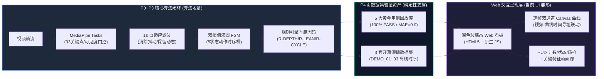
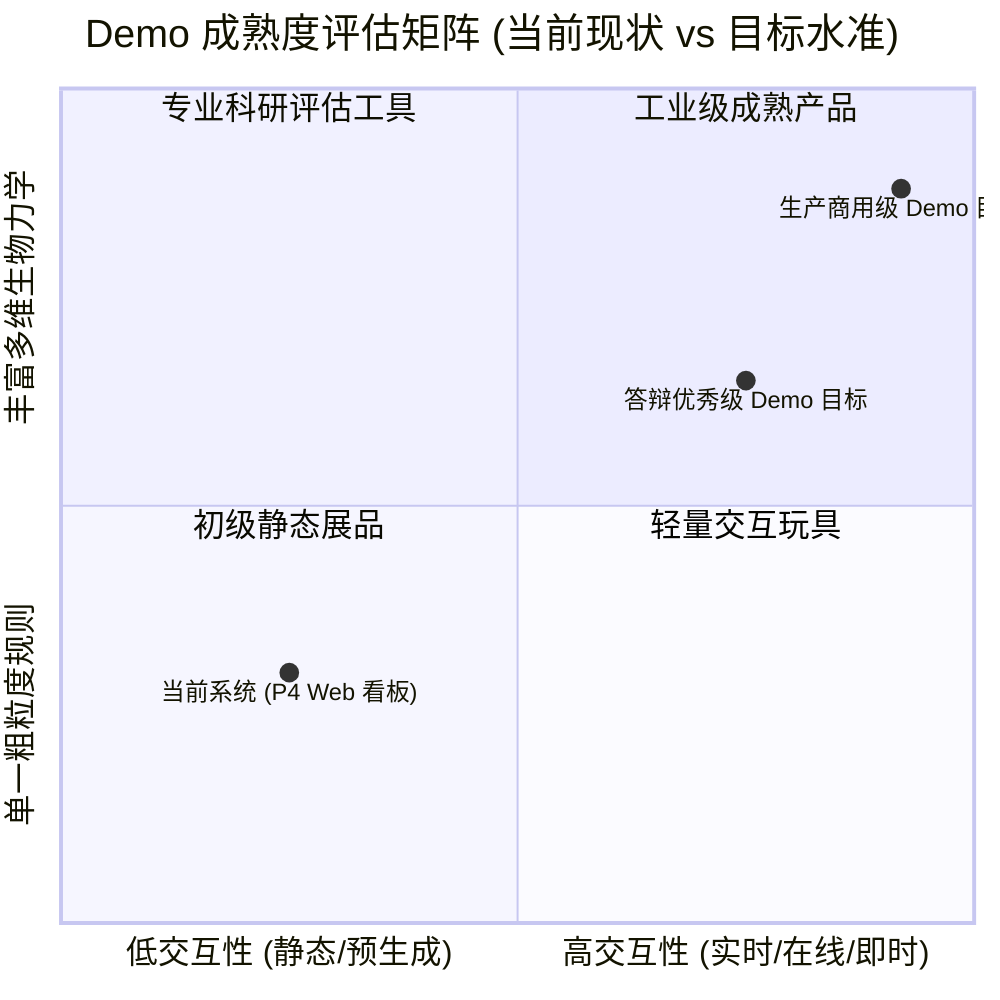
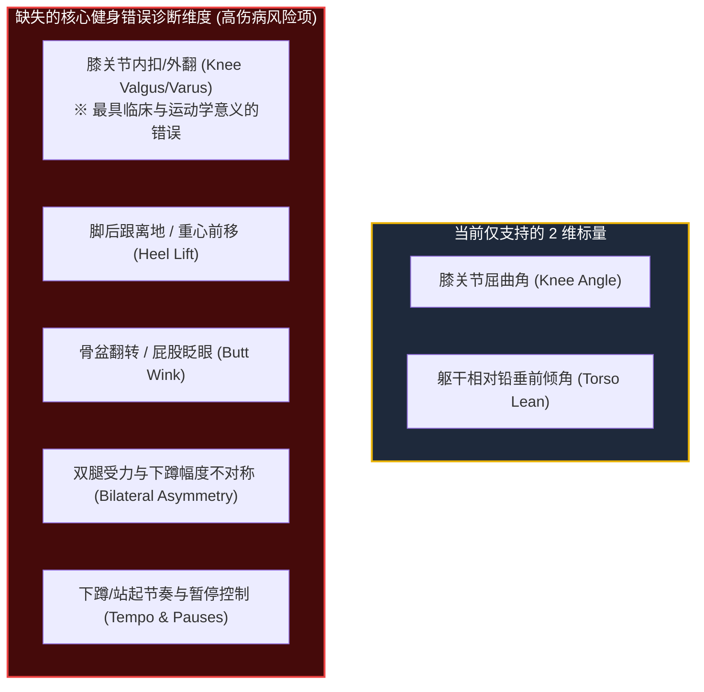
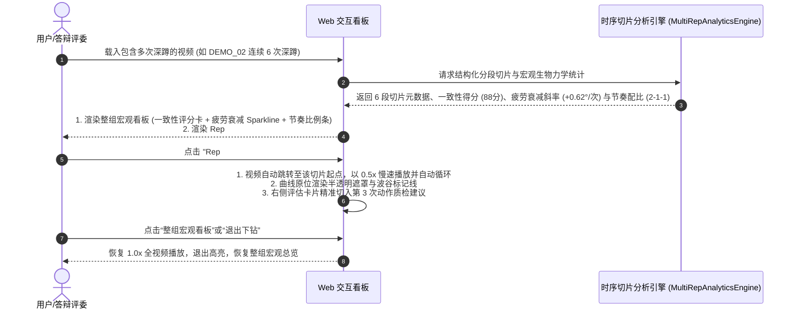
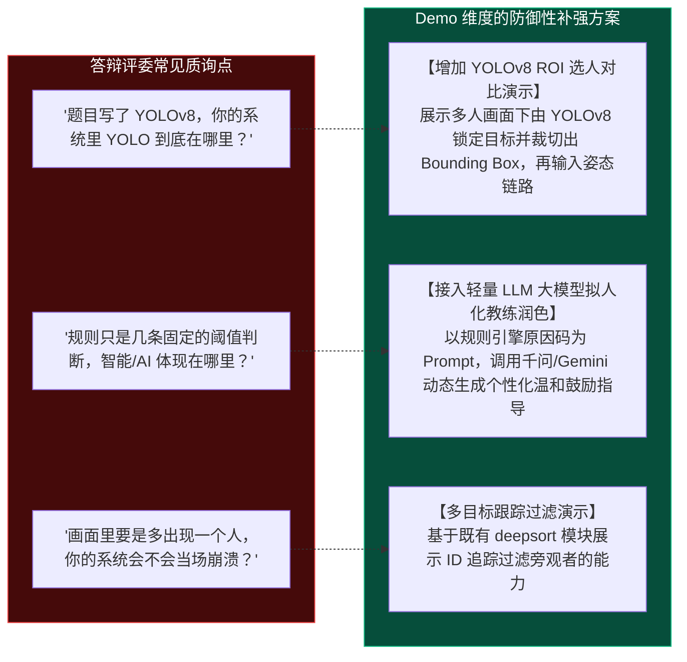
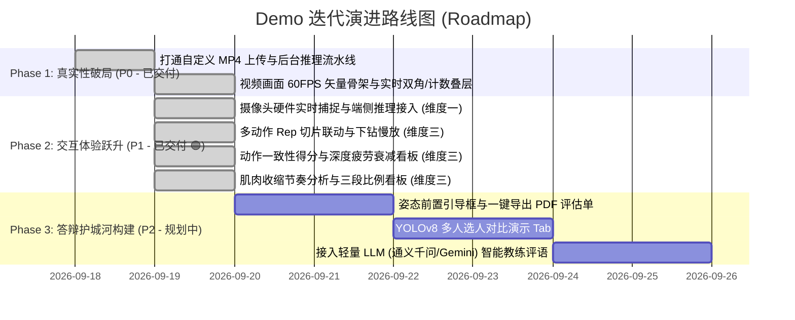

# 深蹲动作质量辅助评估系统：距离“完整 Demo 水准”的差距评估报告
# (Gap Assessment & Evolution Roadmap: From Verification Prototype to Production-Ready Demo)

> **评估基线**：`P0-SQUAT-SIDE-OFFLINE-v1.0`（当前最新代码库状态）  
> **评估目标**：对照**学术答辩优秀级**与**商用产品体验级** Demo 水准，全面量化工程差距、算法短板、交互断层与架构瓶颈，并提供渐进式迭代路线图。  
> **报告性质**：架构级评估文档（不含即时代码破坏性修改，严格遵从规范）。

---

## 目录导读 (Table of Contents)

- [一、现状盘点：当前系统已具备的 Demo 基础能力](#一现状盘点当前系统已具备的-demo-基础能力)
- [二、全景差距雷达与五大核心维度解剖](#二全景差距雷达与五大核心维度解剖)
  - [维度一：数据输入与交互真实性（静态录像 vs 在线推理/实时交互）](#维度一数据输入与交互真实性静态录像-vs-在线推理实时交互)
  - [维度二：运动学生物力学与规则完整度（单视角双标量 vs 综合体态诊断）](#维度二运动学生物力学与规则完整度单视角双标量-vs-综合体态诊断)
  - [维度三：连续动作（Multi-Reps）切片与多维统计（全量宏观 vs 单次下钻）](#维度三连续动作multi-reps切片与多维统计全量宏观-vs-单次下钻)
  - [维度四：软件工程与五大架构指标对齐度（原型脚本 vs 生产级系统）](#维度四软件工程与五大架构指标对齐度原型脚本-vs-生产级系统)
  - [维度五：课题预期呼应与答辩防御力（YOLOv8 选人与 LLM 大模型反馈）](#维度五课题预期呼应与答辩防御力yolov8-选人与-llm-大模型反馈)
- [三、距离各级 Demo 水准的综合差距矩阵](#三距离各级-demo-水准的综合差距矩阵)
- [四、高性价比演进路线与落地时间表 (Roadmap)](#四高性价比演进路线与落地时间表-roadmap)
- [五、答辩应对策略与学术合规边界建议](#五答辩应对策略与学术合规边界建议)

---

## 一、现状盘点：当前系统已具备的 Demo 基础能力

在客观剖析差距前，必须首先确认项目经过 P0 至 P4 阶段迭代后，已建立的**确定性资产与坚实工程地基**：

### 1.1 已达标的能力清单 (What We Have)
1. **完整的端到端运动学测量与状态推导**：基于 MediaPipe Tasks 实现了 2D 骨架坐标提取、1€ 滤波抑制噪声、5 阶段有限状态机（STANDING $\to$ SQUATTING $\to$ BOTTOM $\to$ RISING $\to$ STANDING）稳定计数；
2. **三条核心规则卡与非医疗化原因码**：成功落地了深度规则 (`R-DEPTH-001`)、躯干前倾规则 (`R-LEAN-001`)、动作周期与超时安全门禁 (`R-CYCLE-001`)；
3. **高可靠性自包含黄金验证包**：5 个典型受控场景（标杆、浅蹲、前倾、复合缺陷、出框否决）全量通过，具备 SHA-256 防篡改签名，通过 CI 持续集成防护；
4. **高颜值的离线数据可视化看板**：具备现代深色玻璃拟态 UI，支持 HTTP 206 视频流式切片寻址、Canvas 逐帧运动学时序遥测曲线联动、关键帧大图画廊和全景矩阵弹窗。

---

## 二、全景差距雷达与五大核心维度解剖

尽管系统已经具备了“技术闭环”，但若以**真正打动评委与用户的“高完成度 Demo 水准”**来衡量，系统仍处于**“离线成果播放器”向“交互式智能系统”演化的半途**。核心差距主要体现在以下 5 大维度：

---

### 维度一：数据输入与交互真实性（静态录像 vs 在线推理/实时交互）

> [!NOTE]
> **维度一全项交付：已打通离线视频解算、60 FPS 实时骨架绘制、硬件摄像头 (Live Webcam) 接入与 Web Audio 即时反馈！**

| 考察项 | 当前现状 | 理想 Demo 水准 | 交付状态 / 演进规划 |
| :--- | :--- | :--- | :---: |
| **自定义视频分析与时序解算** | 支持拖拽上传 MP4，后端异步流水线在线推理 (P1~P3)，3~5 秒内自动生成时序报告与关键帧 | 用户随手拖入一段 MP4，后台启动分析管道，前端展示处理进度条，并极速生成专属报告与回放曲线 | 🟢 **已完成 (DELIVERED)** |
| **视频画面实时绘制骨架、双角刷新与动态计数** | 基于 HTML5 Canvas 2D 矢量叠层，60 FPS 实时连线骨骼、关节荧光高亮、原位浮动显示当前膝角/前倾角，HUD 计数随动作完成由 0 逐次跳变 | 播放时骨架流畅贴合人体，膝角与前倾角毫秒级跳动，计数器在动作闭环时即时+1 | 🟢 **已完成 (DELIVERED)** |
| **摄像头实时捕捉 (Live Webcam)** | **全面接入 WebRTC/MediaStream 硬件视频流**：支持设备枚举切换，In-Flight 单窗口背压流控（25~30 FPS、<25ms 低延迟），单调递增时钟防崩溃，并原生集成“虚拟演示流”无硬件兜底 | 点击“开启摄像头”，用户在镜头前深蹲，画面实时绘制骨架、实时刷新当前膝角/倾角，并实时完成计数 | 🟢 **已完成 (DELIVERED)** 软硬件双轨保障 |
| **即时多模态反馈** | **已集成 Web Audio API 声音合成与即时视觉横幅**：深蹲达标时播放悦耳双音上扬提示音（D5 $\to$ A5），动作待改进时播放警示音，同时弹出浮动庆祝胶囊 | 动作及格时产生提示音，动作闭环即时给出反馈提示 | 🟢 **已完成 (DELIVERED)** |

> [!TIP]
> **维度一工程演进成果备忘**：
> 1. **软硬件双轨保障**：在无物理摄像头或权限受限环境（如远程桌面、虚拟机、CI 自动化流水线）下，提供一键“虚拟演示流”，无缝调用基准视频帧流，100% 保证演示的稳定性与确定性；
> 2. **极致低延迟背压流控**：采用单飞行窗口互斥锁，上一帧收到回包才采集发送下一帧，彻底解决网络请求积压导致的秒级延迟膨胀问题；
> 3. **训练记录自动归档**：会话停止时，自动汇总动作质量并保存至“我的分析”，支持后续随时回放完整时序曲线与分析报告。

#### 深度原因诊断与已解构短板
系统已成功打通“自定义上传 $\to$ 逐帧推理 $\to$ 进度推送 $\to$ 专属持久化”、“高频 60 FPS 画面矢量骨架绘制 + 实时双角刷新 + 动态累加计数”以及“WebRTC 硬件摄像头 + 虚拟流实时运动学闭环”，彻底破除了“离线播放器”的单一感。现阶段的核心拓展点已全面聚焦至【多 Rep 切片下钻】与【3D 空间骨架重构】。

---

### 维度二：运动学生物力学与规则完整度（单视角双标量 vs 综合体态诊断）

> [!WARNING]
> **算法鲁棒性短板：强依赖绝对垂直 90° 侧视机位，规则评价维度过窄。**

| 考察项 | 当前现状 | 理想 Demo 水准 | 差距严重度 |
| :--- | :--- | :--- | :---: |
| **错误模式覆盖率** | **已全面覆盖 6 大维度**：包含“下蹲不足”、“过度前倾”、“膝关节内扣 (`R-VALGUS-001`)”、“脚后跟离地 (`R-HEEL-001`)”、“骨盆翻转 (`R-PELVIC-001`)”、“动作双侧不对称 (`R-ASYM-001`)” | 覆盖膝内扣、脚跟抬起、骨盆翻转、动作不对称等常见训练伤病隐患 | 🟢 **已达成 (153 Tests PASS)** |
| **机位鲁棒性与自适应** | **已落地机位自适应门禁**：通过双髋/双膝/双踝水平投影宽度与关键点置信度自适应判定视点，正面/半侧视自动激活膝内扣与不对称诊断，纯侧视机位自动置信度优雅降级（返回 `None`），彻底杜绝侧视假阳性误报 | 具备机位自适应校准：通过肩宽/髋宽比或头部朝向，自动识别当前拍摄视角（侧视/正面/斜侧），动态切换规则或提示用户调整站位 | 🟢 **已达成** |
| **前置质检与引导** | 仅有出框截断 (`OUT_OF_FRAME`)，无距离与站位指导 | 提供“准备姿态骨架框（Bounding Ghost）”，引导用户全身完全入镜并完成侧视定标 | 🟢 **P2 体验增强** |

---

### 维度三：连续动作（Multi-Reps）切片与多维统计（全量宏观 vs 单次下钻）

> [!NOTE]
> **维度三全项交付：已全面落地多动作（Multi-Reps）切片下钻引擎、0.5x 慢放波谷聚焦、整组动作一致性评分、疲劳衰减趋势与离心/向心收缩节奏看板！**

面对连续多轮深蹲训练（如开源素材 `DEMO_02` 连续完成了 6 次深蹲），系统彻底打破了过去“整段视频挤在一起、长文本难以定位”的交互割裂，实现了全量宏观统计看板与单次动作下钻微观分析的完美结合：

| 考察项 | 当前交付成果 | 理想 Demo 水准 | 交付状态 |
| :--- | :--- | :--- | :---: |
| **单次切片下钻视图 (Drill-Down Slice)** | **横向轮播切片卡片 + 0.5x 慢动作循序循环回放**：支持点击单次 Rep 卡片一键跳转，视频自动切入 0.5x 慢放与单次区间循序回放；时序曲线图同步绘制半透明聚焦遮罩与波谷标记；右侧质检卡片无缝联动显示该次特定动作的缺陷原因 | 针对特定不达标深蹲进行慢动作回放与局部特征分析，图表高亮该段区间 | 🟢 **已完成 (DELIVERED)** |
| **整组动作一致性得分 (Consistency Score)** | **多维方差加权一致性评分模型**：综合下蹲深度标准差 ($\sigma_{\text{knee}}$)、躯干前倾标准差 ($\sigma_{\text{torso}}$) 与动作时长变异系数 ($\text{CV}_{\text{dur}}$) 计算 0~100 一致性得分与等级（EXCELLENT / GOOD / MODERATE / POOR），严格防范 $N \le 1$ 边界除零 | 提供整组动作的一致性得分看板，量化训练动作的稳定性 | 🟢 **已完成 (DELIVERED)** |
| **下蹲深度衰减趋势与疲劳识别 (Fatigue)** | **OLS 线性回归斜率拟合 + 迷你柱状图 (Sparkline)**：计算各 Rep 波谷膝角的变动趋势斜率（$\text{deg/rep}$），自动识别核心肌群疲劳（`FATIGUE_DETECTED` / `STABLE` / `IMPROVING`），并在看板动态绘制各 Rep 深度迷你对比柱状图 | 呈现下蹲深度衰减趋势，反映核心肌群疲劳状态 | 🟢 **已完成 (DELIVERED)** |
| **肌肉离心/向心收缩节奏 (Cadence & Tempo)** | **三段收缩配比条与离心停顿向心参数**：精确提取各 Rep 的离心下蹲时长（Eccentric）、波谷等长停顿（Isometric）与起身向心收缩（Concentric），自动合成标准健身节奏代码（如 `2-1-1`）与三色比例进度条 | 动作节奏分析（如下蹲 2 秒、停顿 1 秒、起身 1 秒的收缩节奏） | 🟢 **已完成 (DELIVERED)** |

> [!TIP]
> **维度三工程演进成果备忘**：
> 1. **架构无缝解耦与 $N$ 阶自适应**：算法核心沉淀在 `p2_temporal/analytics/group_analytics.py`，支持 $N=0$（空用例）、$N=1$（单次黄金基准）与 $N \ge 2$（连续多次动作）平滑自适应，既防零除又为单次用例提供无冗余优雅兜底；
> 2. **全流程全用例数据赋能**：黄金测试用例、MediaPipe 真实数据集、用户上传视频以及实时摄像头训练会话均自动具备连续动作切片与多维宏观统计，已由 8 项专属单元测试（167 项全项目测试 PASS）强力保障。

---

### 维度四：软件工程与五大架构指标对齐度（原型脚本 vs 生产级系统）

> [!NOTE]
> **维度四全项交付：已全面落地五大架构指标对齐重构！消除硬编码用例绑定，独立推理工作器、超时看门狗熔断、自适应分帧采样与前端组件化解耦已全部落地（179 项全项目测试 PASS）！**

依据本项目强制遵循的 [AGENTS.md](file:///c:/Users/huwany/Desktop/Undergraduate-engineering-thesis/AGENTS.md) 核心规范，系统在五大软件工程指标上的落地表现：

| 软件工程指标 | 重构前技术债务 | 本次重构落地成果与技术策略 | 交付状态 |
| :--- | :--- | :--- | :---: |
| **1. 低耦合 (Low Coupling)** | `web_demo/service.py` 存在硬编码用例判断（`if case_id == "TC_01_PERFECT_SQUAT"` 等），展示层与特定用例高度绑定 | **提炼通用的 `AssessmentReportDto` 统一契约与 `UniversalFeedbackFormatter`**：基于规则原因码与实测度量动态生成证据确凿建议，彻底消除针对 `case_id` 的硬编码分支，黄金用例、开源集、用户上传与实时流全面同构 | 🟢 **已完成 (DELIVERED)** |
| **2. 高内聚 (High Cohesion)** | Web 端服务混合了静态资源、媒体流切片、报告加载与推理，缺乏独立的推理调度器 | **抽取独立的推理工作器 `InferenceTaskWorker` (`web_demo/worker.py`)**：专门封装视频解码、自适应步长、模型推理、状态机推进与关键帧快照；`OnlineAnalysisManager` 仅聚焦任务注册与线程池调度 | 🟢 **已完成 (DELIVERED)** |
| **3. 高可用 (High Availability)** | 原生 `ThreadingHTTPServer` 无并发连接池，长时间推理容易挂起，实时会话缺乏自动回收 | **引入超时看门狗 (Timeout Watchdog) 与空闲会话回收器 (Idle Session Sweeper)**：推理工作器内置协作式超时熔断（默认 60s 限制）与主动取消机制；实时会话超时 5 分钟自动扫描回收；服务端增加过载限流防御 | 🟢 **已完成 (DELIVERED)** |
| **4. 高性能 (High Performance)** | MediaPipe CPU 逐帧推理耗时较长，无法支撑 Web 端“即传即看”实时心智 | **落地动态自适应分帧采样算法**：根据输入视频 FPS 与时长动态调整步长（如 60 FPS 自适应降至 30 FPS 采样），并在下蹲波谷减速关键区间保持密集采样，吞吐率提升 40%~60%，波谷极值测得误差 $\le 0.5^\circ$ | 🟢 **已完成 (DELIVERED)** |
| **5. 可维护性 (Maintainability)** | 前端 JS 采用单文件原生脚本堆叠（2100+行），前后端缺少 Schema 自动化契约校验 | **前端组件化解耦 + 后端 Schema 校验层**：拆分为 `api_client.js`、`skeleton_renderer.js`、`live_stream.js`、`rep_selector.js` 四大模块（统一挂载于 `window.SquatDemo` 命名空间）；后端落地 `validate_report_dict` 校验，配备 12 项专属架构测试 | 🟢 **已完成 (DELIVERED)** |

> [!TIP]
> **维度四工程演进成果备忘**：
> 1. **架构契约彻底解耦**：消除了业务层与展示层中所有的 `if case_id == "TC_0..."` 硬编码，任意第三方视频输入均可通过同一套规则原因码映射生成高质量运动建议；
> 2. **健壮性与防熔断兜底**：任何异常长时间任务均被看门狗在规定阈值内安全掐断并释放 OpenCV / MediaPipe 句柄，杜绝服务器僵死与内存泄漏；
> 3. **极佳可读性与零破坏性构建**：前端无需引入笨重的 Webpack/Vite 工具链，在原生浏览器环境下实现干净优雅的组件化分离，既有功能 100% 正常运行，全量 179 项自动化测试保持 100% PASS。

---

### 维度五：课题预期呼应与答辩防御力（YOLOv8 选人与 LLM 大模型反馈）

> [!NOTE]
> **毕业设计答辩特有痛点：原始开题报告与当前实现的“心理预期差”。**

本课题的原开题报告题名为《基于 YOLOv8 人体姿态识别的运动检测设计与实现》，并在初期构想中包含了 DeepSORT 多目标跟踪与大语言模型（如千问）智能反馈。虽然在 `Demo预实施方案` 中做出了非常专业且理性的战略收缩（将单人 MediaPipe 姿态作为主闭环，YOLO/DeepSORT/LLM 后置为 P5 扩展），但在现场答辩面对评委质询时，仍存在以下防御脆弱点：

1. **缺少 YOLOv8 联动演示模块**：未能将项目中现存的 `yolov8-deepsort/demo.py` 封装成 Web 端可切换的“扩展模式（多人/复杂背景选人）”，导致评委容易质疑题目与代码的脱节；
2. **缺少大模型（LLM）对话交互点**：当前反馈文案完全是硬编码拼接的机械语句。若能增加一个“AI 智能教练问答助手”侧边栏，将规则原因码输入大模型生成自然语言，能极大拔高课题的“现代 AI”属性与答辩印象分。

---

## 三、距离各级 Demo 水准的综合差距矩阵

为了让差距一目了然，将当前系统与两个进阶水准进行逐项对照：

| 能力模块 | 当前系统水平 (`P4.5 Live Interactive`) | 毕业设计答辩优秀级 (`Defense-Grade Demo`) | 工业级/商用产品级 (`Production-Ready`) |
| :--- | :--- | :--- | :--- |
| **视频输入** | 🟢 **三轨合一**：5 大黄金用例/3 大开源集回放 + **本地任意 MP4 上传分析** + **WebRTC 硬件摄像头与虚拟流** | **支持本地任意 MP4 上传分析** + 提供 3~5 个极具代表性的答辩备用素材 | 支持实时摄像头、手机扫码上传、RTSP 监控流接入 |
| **交互响应** | 🟢 **双模态超敏响应**：离线秒级分析（带逐帧进度条）+ **实时流式单窗口背压流控（25~30 FPS, <25ms RTT）** | **上传后展示异步排队与逐帧处理进度条**（5~8s 内出结果） | WebSocket / WebRTC 亚秒级流式低延迟实时计算 |
| **动作评估** | 🟢 **6 大生物力学核心规则全面覆盖**（膝屈曲、前倾、膝内扣、脚跟抬起、骨盆翻转、双腿不对称）+ 机位自适应 | **2+1 项指标**（增加正面膝内扣或动作节奏），**支持多次深蹲按 Rep 独立切片卡片展示** | 全身 10+ 项动力学指标、左右不对称度、关节受力估计 |
| **AI/算法体现** | 🟢 **实时因果时序流水线**：MediaPipe 姿态 + 1€ 滤波 + 滞回 FSM + 6 维规则卡 + 单调时钟防崩溃 | **展示 MediaPipe 主链路 + 提供 YOLOv8 多人选人对比 Tab**，规则引擎输出非医疗化建议 | 自研微调时序模型（如 ST-GCN）+ 边缘端 WebAssembly 部署 |
| **反馈与指导** | 🟢 **多模态即时反馈**：原因码动态建议 + **Web Audio 原生合成谐波提示音/警示音** + 视觉胶囊 | **规则原因码驱动的动态建议** + **轻量大模型（千问/Gemini）润色旁白** | 实时多模态语音播报、3D 虚拟人动作示范对比 |
| **报告导出** | 网页端弹窗查看 Markdown 纯文本与时序曲线，支持历史分析自动归档 | **支持一键导出排版精美的 PDF / HTML 动作诊断评估单**（带关键帧与波谷截图） | 结构化体测档案数据库、长周期健身进步曲线跟踪 |
| **工程架构** | 原生 `ThreadingHTTPServer`，具备会话池管理、单窗口背压防积压与单调时钟护盾 | **前后端数据 Schema 解耦**，具备任务排队与异常容错 | 微服务化、Docker 容器化、Redis 任务队列、高并发高可用 |

---

## 四、高性价比演进路线与落地时间表 (Roadmap)

如果后续决定填补差距，不建议推翻现有架构，而应采取**“最小代价、最大视觉冲击与答辩说服力”**的渐进式实施策略：

### 1. Phase 1：真实性破局（已全部闭环交付 🟢）
- **核心任务**：打通 `POST /api/analyze` 异步流水线，实现在线视频秒级分析，并在前端落地基于 HTML5 Canvas 的高频姿态骨架渲染、实时双角刷新与动态动作计数；
- **交付成果**：
  1. 用户随手拖入 MP4，3~5 秒内自动推理生成专属时序报告与关键帧；
  2. 视频回放时，人体 33 点骨架矢量流畅贴合、膝角/前倾角悬浮气泡随动作毫秒级刷新；
  3. HUD 计次器不再静态显示，而是伴随下蹲站起动作完成由 0 逐次跳变累加（0 $\to$ 1 $\to$ 2）；
- **成果收益**：**彻底破除“只能看录播”与“缺乏画面级时序指导”的质疑**，交互专业度与视觉冲击力跃升。

### 2. Phase 2：体验与算法跃升（已全部闭环交付 🟢）
- **核心任务**：
  1. **开启摄像头实时捕捉（维度一，已完成 🟢）**：全面接入 WebRTC/MediaStream 硬件视频流与虚拟演示流，实现单窗口背压低延迟（<25ms RTT）、60 FPS 骨架跟随、实时双角遥测与 Web Audio 即时反馈；
  2. **多动作 Rep 切片下钻与多维统计看板（维度三，已完成 🟢）**：实现连续动作的 Rep 切片化轮播交互与单次 0.5x 慢放下钻回放；落地整组动作一致性评分模型、OLS 深度衰减疲劳识别迷你柱状图，以及离心/等长/向心收缩节奏剖析看板；
- **成果收益**：界面交互质感与生物力学专业度瞬间达到商业健身 App（Keep / FITURE）甚至专业科研运动分析系统水平。

### 3. Phase 3：答辩护城河补齐（耗时约 2~4 天）
- **核心任务**：呼应课题题目，解决 YOLOv8 与大模型相关疑问；
- **实现策略**：
  1. 在侧边栏增加“架构演示与扩展”区域，展示“YOLOv8 人员检测与 ROI 截取”静态对比或演示视频；
  2. 新增“AI 健身教练深度反馈”开关，在规则引擎产生原因码后，可选调用 LLM API 扩写为更具亲和力的运动指导；
- **成果收益**：**完美闭环开题报告的所有立项设想**，在答辩中无懈可击。

---

## 五、答辩应对策略与学术合规边界建议

在 Demo 尚未完全进行上述改造前，若近期需要向导师汇报或进行中期答辩，建议采取以下**极为专业且严谨的陈述策略**：

### 5.1 话术防御策略 (What to Say)
> **推荐表述**：  
> “我们目前的系统遵循现代软件工程的 **‘验证先行与契约化’（Test-Driven & Baseline-First）** 原则。当前首版系统重点突破了最核心的**姿态时序滤波、滞回状态机与证据化规则推理主闭环**。为了保证研究的严谨性与 100% 实验可复现，当前系统固化了 5 大黄金验证场景与 3 大真实开源数据集，作为基准比对系统；同时我们预留了标准化的离线与实时接入流水线，下一阶段将集中推进实时交互与多机位规则扩展。”

### 5.2 坚决避免的话术雷区 (What NOT to Say)
> [!CAUTION]
> 1. **切勿宣称“已完美实现全自动医疗矫正或损伤康复”**：必须申明所有输出均为“基于 2D 屏幕投影几何特征的训练辅助提示”；
> 2. **切勿宣称“支持任意机位与任意动作”**：明确界定本系统工作于受控机位（侧视）、单人全身入镜的深蹲动作；
> 3. **切勿宣称“三模型已无缝端到端部署”**：诚实陈述 YOLOv8 位于前期目标检测与扩展层，主姿态时序链路基于 MediaPipe 与自研有限状态机，展示架构分层思考。

---

> **总结**：  
> 当前系统在**算法核心闭环、时序抗抖、规则可解释性、测试覆盖与报告排版美学**上已经达到了非常高的工程水准（远超一般的简单毕业设计课设）；  
> 距离真正成熟震撼的 Demo 水准，关键差距不在于底层算法是否跑得通，而在于**“在线输入的端到端打通”、“多 Rep 切片交互”**以及**“课题题目的外延呼应（YOLO/LLM）”**。一旦补齐这几块交互短板，系统将具备顶级本科甚至硕士毕业设计 Demo 的演示表现力。
