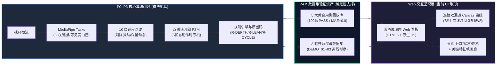
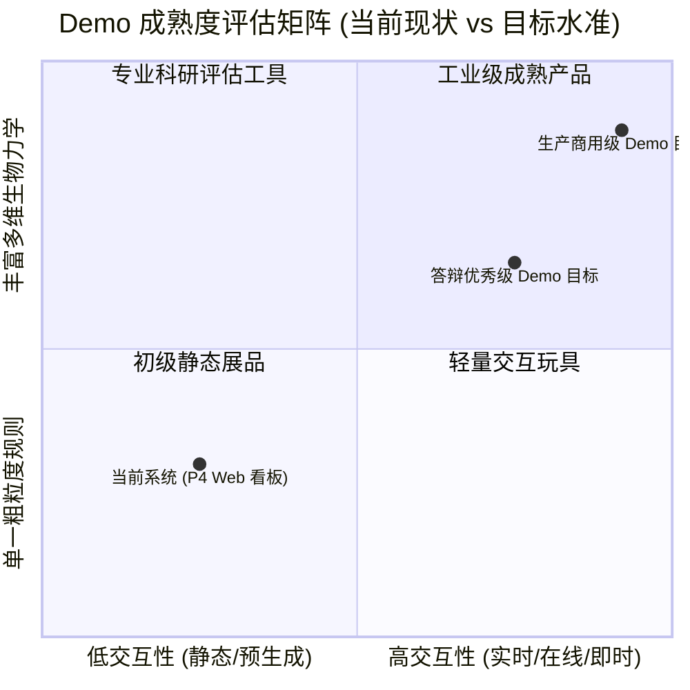
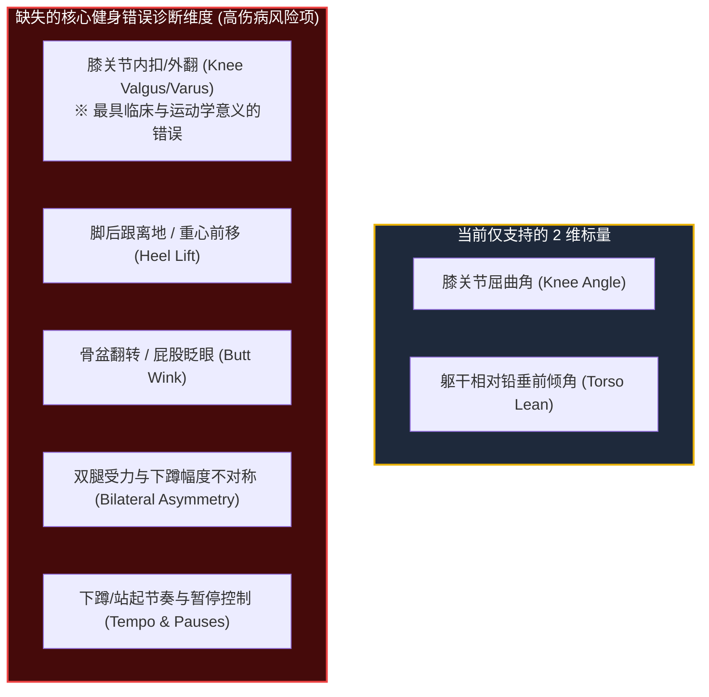
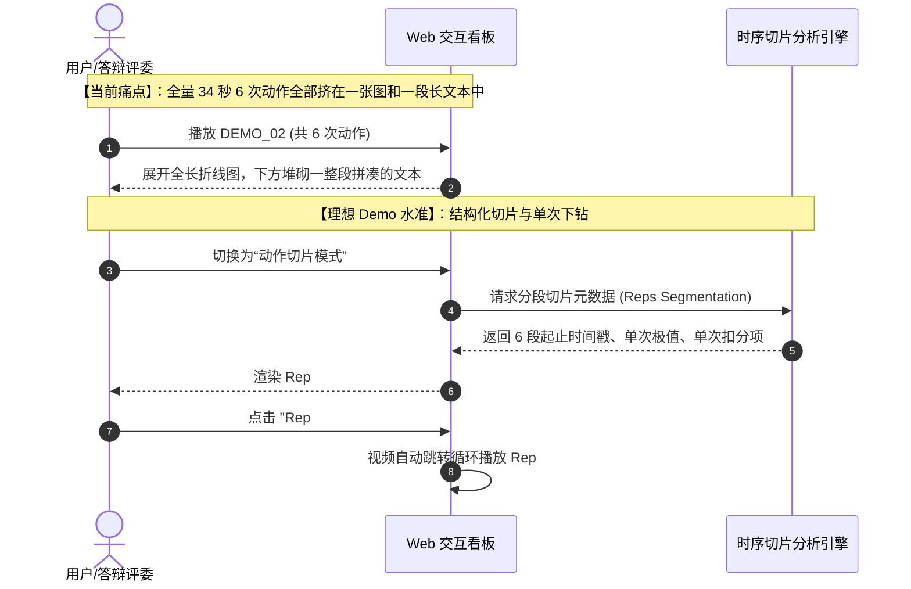
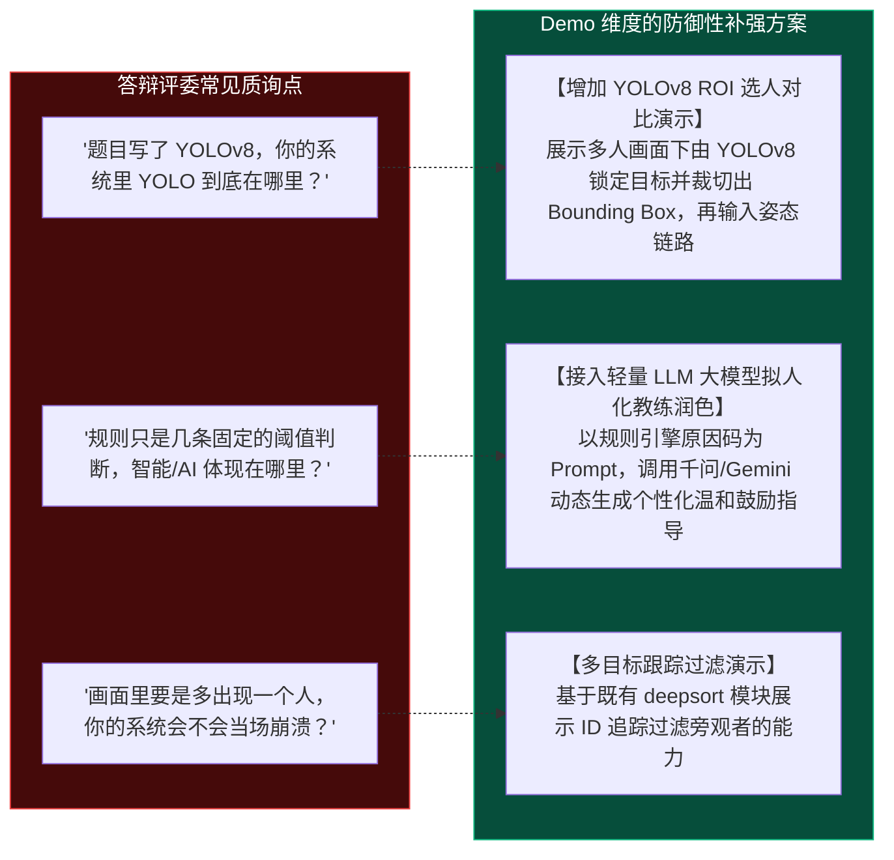
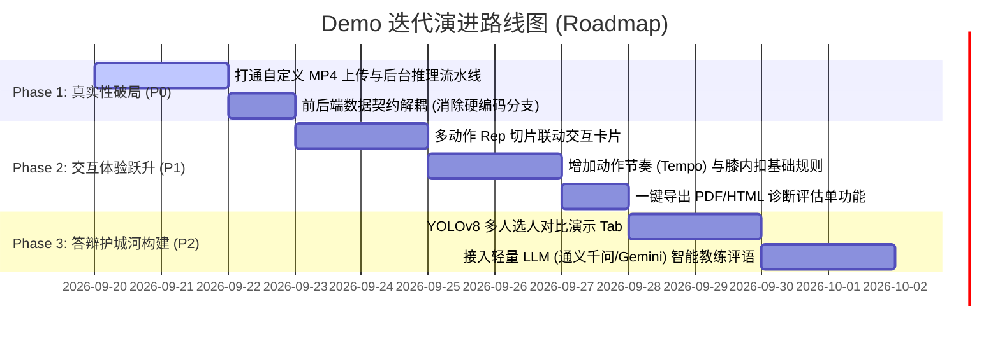

# 深蹲动作质量辅助评估系统：距离“完整 Demo 水准”的差距评估报告
# (Gap Assessment & Evolution Roadmap: From Verification Prototype to Production-Ready Demo)

> **评估基线**：`P0-SQUAT-SIDE-OFFLINE-v1.0`（当前最新代码库状态）  
> **评估目标**：对照**学术答辩优秀级**与**商用产品体验级** Demo 水准，全面量化工程差距、算法短板、交互断层与架构瓶颈，并提供渐进式迭代路线图。  
> **报告性质**：架构级评估文档（不含即时代码破坏性修改，严格遵从规范）。

---

## 目录导读 (Table of Contents)

- [一、现状盘点：当前系统已具备的 Demo 基础能力](#一现状盘点当前系统已具备的-demo-基础能力)
- [二、全景差距雷达与五大核心维度解剖](#二全景差距雷达与五大核心维度解剖)
  - [维度一：数据输入与交互真实性（静态录像 vs 在线推理/实时交互）](#维度一数据输入与交互真实性静态录像-vs-在线推理实时交互)
  - [维度二：运动学生物力学与规则完整度（单视角双标量 vs 综合体态诊断）](#维度二运动学生物力学与规则完整度单视角双标量-vs-综合体态诊断)
  - [维度三：连续动作（Multi-Reps）切片与多维统计（全量宏观 vs 单次下钻）](#维度三连续动作multi-reps切片与多维统计全量宏观-vs-单次下钻)
  - [维度四：软件工程与五大架构指标对齐度（原型脚本 vs 生产级系统）](#维度四软件工程与五大架构指标对齐度原型脚本-vs-生产级系统)
  - [维度五：课题预期呼应与答辩防御力（YOLOv8 选人与 LLM 大模型反馈）](#维度五课题预期呼应与答辩防御力yolov8-选人与-llm-大模型反馈)
- [三、距离各级 Demo 水准的综合差距矩阵](#三距离各级-demo-水准的综合差距矩阵)
- [四、高性价比演进路线与落地时间表 (Roadmap)](#四高性价比演进路线与落地时间表-roadmap)
- [五、答辩应对策略与学术合规边界建议](#五答辩应对策略与学术合规边界建议)

---

## 一、现状盘点：当前系统已具备的 Demo 基础能力

在客观剖析差距前，必须首先确认项目经过 P0 至 P4 阶段迭代后，已建立的**确定性资产与坚实工程地基**：

### 1.1 已达标的能力清单 (What We Have)
1. **完整的端到端运动学测量与状态推导**：基于 MediaPipe Tasks 实现了 2D 骨架坐标提取、1€ 滤波抑制噪声、5 阶段有限状态机（STANDING $\to$ SQUATTING $\to$ BOTTOM $\to$ RISING $\to$ STANDING）稳定计数；
2. **三条核心规则卡与非医疗化原因码**：成功落地了深度规则 (`R-DEPTH-001`)、躯干前倾规则 (`R-LEAN-001`)、动作周期与超时安全门禁 (`R-CYCLE-001`)；
3. **高可靠性自包含黄金验证包**：5 个典型受控场景（标杆、浅蹲、前倾、复合缺陷、出框否决）全量通过，具备 SHA-256 防篡改签名，通过 CI 持续集成防护；
4. **高颜值的离线数据可视化看板**：具备现代深色玻璃拟态 UI，支持 HTTP 206 视频流式切片寻址、Canvas 逐帧运动学时序遥测曲线联动、关键帧大图画廊和全景矩阵弹窗。

---

## 二、全景差距雷达与五大核心维度解剖

尽管系统已经具备了“技术闭环”，但若以**真正打动评委与用户的“高完成度 Demo 水准”**来衡量，系统仍处于**“离线成果播放器”向“交互式智能系统”演化的半途**。核心差距主要体现在以下 5 大维度：

---

### 维度一：数据输入与交互真实性（静态录像 vs 在线推理/实时交互）

> [!CAUTION]
> **最大体验硬伤：当前 Web 界面的“自定义视频上传”仅是静态占位符！**

| 考察项 | 当前现状 | 理想 Demo 水准 | 差距严重度 |
| :--- | :--- | :--- | :---: |
| **自定义视频分析** | 前端点击上传后仅弹出 `alert()` 弹窗，后端 `server.py` **未实现 POST 接口**，无法在线分析新视频 | 用户随手拖入一段 MP4，后台启动分析管道，前端展示处理进度条，并在 3~5 秒内生成专属报告与回放曲线 | 🔴 **P0 致命** (现场演示极易穿帮) |
| **摄像头实时捕捉 (Live Webcam)** | 完全不支持，无 WebRTC/MediaStream 接入，无实时推理模式 | 点击“开启摄像头”，用户在镜头前深蹲，画面实时绘制骨架、实时刷新当前膝角/倾角，并实时完成计数 | 🟡 **P1 核心亮点** (答辩现场杀手锏) |
| **即时多模态反馈** | 仅能在视频播放结束后静态查看文字卡片 | 动作下蹲到及格深度时产生微震动或音效（Web Audio API 提示音），起身判定完成时即时语音提示（如“第 1 次，深度达标”） | 🟢 **P2 体验增强** |

#### 深度原因诊断
当前 Web Demo 架构本质上是一个**“静态报告与预渲染素材分发器”**，后端服务主要负责读取硬盘中已预先算好的 JSONL 和 MP4 文件。一旦脱离预先生成好的用例目录，系统无法实时调用 `p1_pipeline`、`p2_temporal` 和 `p3_rules` 处理未知流，缺乏“处理中排队 $\to$ 逐帧推理 $\to$ 进度推送 $\to$ 结果持久化”的在线工作流。

---

### 维度二：运动学生物力学与规则完整度（单视角双标量 vs 综合体态诊断）

> [!WARNING]
> **算法鲁棒性短板：强依赖绝对垂直 90° 侧视机位，规则评价维度过窄。**

| 考察项 | 当前现状 | 理想 Demo 水准 | 差距严重度 |
| :--- | :--- | :--- | :---: |
| **错误模式覆盖率** | 仅覆盖“下蹲不足”与“过度前倾”2 项 | 覆盖膝内扣、脚跟抬起、骨盆翻转、动作不对称等常见训练伤病隐患 | 🟡 **P1 重要** |
| **机位鲁棒性与自适应** | 仅支持绝对侧视。若机位偏转 30° 或正视（如 DEMO_03），2D 角度产生几何透视畸变且无自适应校正 | 具备机位自适应校准：通过肩宽/髋宽比或头部朝向，自动识别当前拍摄视角（侧视/正面/斜侧），动态切换规则或提示用户调整站位 | 🟡 **P1 重要** |
| **前置质检与引导** | 仅有出框截断 (`OUT_OF_FRAME`)，无距离与站位指导 | 提供“准备姿态骨架框（Bounding Ghost）”，引导用户全身完全入镜并完成侧视定标 | 🟢 **P2 体验增强** |

---

### 维度三：连续动作（Multi-Reps）切片与多维统计（全量宏观 vs 单次下钻）

> [!IMPORTANT]
> **交互颗粒度缺陷：面对连续多轮动作，缺乏“单次 Rep”的切片下钻分析能力。**

真实训练场景中，用户通常会连续完成 5~12 次深蹲（如开源素材 `DEMO_02` 连续完成了 6 次深蹲）。然而当前系统的交互方式存在严重割裂：

1. **缺乏单次切片视图**：无法针对某一次特定的不达标深蹲进行慢动作回放与局部特征分析；
2. **缺乏整组训练统计看板**：
   - 缺少整组动作的**一致性得分 (Consistency Score)**；
   - 缺少**下蹲深度衰减趋势**（反映核心肌群疲劳）；
   - 缺少**动作节奏分析**（如下蹲 2 秒、停顿 1 秒、起身 1 秒的肌肉离心/向心收缩节奏）。

---

### 维度四：软件工程与五大架构指标对齐度（原型脚本 vs 生产级系统）

依据本项目强制遵循的 [AGENTS.md](file:///c:/Users/huwany/Desktop/Undergraduate-engineering-thesis/AGENTS.md) 核心规范，评估系统在五大软件工程指标上的表现：

| 软件工程指标 | 当前达成情况 | 现存技术债务与差距 | 优化与整改方向 |
| :--- | :--- | :--- | :--- |
| **1. 低耦合 (Low Coupling)** | P1/P2/P3 核心库设计了契约接口 (`contracts.py`)，各层输入输出明确 | `web_demo/service.py` 存在硬编码用例判断（`if case_id == "TC_01_PERFECT_SQUAT"` 等），展示层与特定用例高度绑定，无法通用化服务任意输入 | 提炼通用的 `AssessmentReport` 数据契约，所有用例（测试用例、公开数据集、用户上传）均由同一组渲染器解析 |
| **2. 高内聚 (High Cohesion)** | 滤波、状态机、规则卡职责划分清晰，边界严明 | Web 端服务混合了“静态资源服务”、“媒体流切片”、“报告加载”与“用例文案合成”，缺乏独立的推理任务调度器 (`InferenceTaskWorker`) | 将推理任务从 HTTP 线程中抽离，拆分为独立的分析服务进程或后台任务线程 |
| **3. 高可用 (High Availability)** | 具备针对视频缺失与媒体超界的容错，支持 HTTP 206 断点续传 | 使用 Python 原生 `ThreadingHTTPServer`，无并发连接池，无大文件上传限制与异常超时熔断；视频分析若耗时过长容易导致请求挂起 | 引入轻量异步服务（如 FastAPI / Starlette），增加任务超时隔离与状态机保活机制 |
| **4. 高性能 (High Performance)** | 采用轻量几何运算，单帧时序计算耗时 $\le 1\text{ms}$ | MediaPipe 运行于单线程 CPU 模式，处理一段 30 秒高帧率视频耗时达 15~20 秒，无法支撑 Web 端“即传即看”的实时心智 | 增加分帧采样策略（例如按 15 FPS 或 2 帧步长提取）、优化关键点检测 ROI 区域 |
| **5. 可维护性 (Maintainability)** | 核心算法单元测试完善，覆盖率高，P4 验证包自包含性强 | 前端 JS 采用单文件原生脚本堆叠，缺少组件化拆分；前后端数据缺少 OpenAPI / Schema 自动化契约校验 | 拆分前端模块（`player.js`, `chart.js`, `rep_selector.js`），补充前端自动化或端到端验证测试 |

---

### 维度五：课题预期呼应与答辩防御力（YOLOv8 选人与 LLM 大模型反馈）

> [!NOTE]
> **毕业设计答辩特有痛点：原始开题报告与当前实现的“心理预期差”。**

本课题的原开题报告题名为《基于 YOLOv8 人体姿态识别的运动检测设计与实现》，并在初期构想中包含了 DeepSORT 多目标跟踪与大语言模型（如千问）智能反馈。虽然在 `Demo预实施方案` 中做出了非常专业且理性的战略收缩（将单人 MediaPipe 姿态作为主闭环，YOLO/DeepSORT/LLM 后置为 P5 扩展），但在现场答辩面对评委质询时，仍存在以下防御脆弱点：

1. **缺少 YOLOv8 联动演示模块**：未能将项目中现存的 `yolov8-deepsort/demo.py` 封装成 Web 端可切换的“扩展模式（多人/复杂背景选人）”，导致评委容易质疑题目与代码的脱节；
2. **缺少大模型（LLM）对话交互点**：当前反馈文案完全是硬编码拼接的机械语句。若能增加一个“AI 智能教练问答助手”侧边栏，将规则原因码输入大模型生成自然语言，能极大拔高课题的“现代 AI”属性与答辩印象分。

---

## 三、距离各级 Demo 水准的综合差距矩阵

为了让差距一目了然，将当前系统与两个进阶水准进行逐项对照：

| 能力模块 | 当前系统水平 (`P4 Prototype`) | 毕业设计答辩优秀级 (`Defense-Grade Demo`) | 工业级/商用产品级 (`Production-Ready`) |
| :--- | :--- | :--- | :--- |
| **视频输入** | 仅支持固定 5 个黄金用例与 3 个公开数据集回放 | **支持本地任意 MP4 上传分析** + 提供 3~5 个极具代表性的答辩备用素材 | 支持实时摄像头、手机扫码上传、RTSP 监控流接入 |
| **交互响应** | 静态加载预计算数据（无进度、无在线状态） | **上传后展示异步排队与逐帧处理进度条**（5~8s 内出结果） | WebSocket / WebRTC 亚秒级流式低延迟实时计算 |
| **动作评估** | 2 项指标（膝角、前倾角）、单次汇总文案 | **2+1 项指标**（增加正面膝内扣或动作节奏），**支持多次深蹲按 Rep 独立切片卡片展示** | 全身 10+ 项动力学指标、左右不对称度、关节受力估计 |
| **AI/算法体现** | MediaPipe 姿态 + 滞回 FSM + 阈值规则引擎 | **展示 MediaPipe 主链路 + 提供 YOLOv8 多人选人对比 Tab**，规则引擎输出非医疗化建议 | 自研微调时序模型（如 ST-GCN）+ 边缘端 WebAssembly 部署 |
| **反馈与指导** | 预置模板字符串替换，部分用例硬编码 | **规则原因码驱动的动态建议** + **轻量大模型（千问/Gemini）润色旁白** | 实时多模态语音播报、3D 虚拟人动作示范对比 |
| **报告导出** | 网页端弹窗查看 Markdown 纯文本 | **支持一键导出排版精美的 PDF / HTML 动作诊断评估单**（带关键帧与波谷截图） | 结构化体测档案数据库、长周期健身进步曲线跟踪 |
| **工程架构** | 原生 `ThreadingHTTPServer`，部分代码存在耦合 | **前后端数据 Schema 解耦**，具备任务排队与异常容错 | 微服务化、Docker 容器化、Redis 任务队列、高并发高可用 |

---

## 四、高性价比演进路线与落地时间表 (Roadmap)

如果后续决定填补差距，不建议推翻现有架构，而应采取**“最小代价、最大视觉冲击与答辩说服力”**的渐进式实施策略：

### 1. Phase 1：真实性破局（耗时约 2~3 天，ROI 最高）
- **核心任务**：打通 `POST /api/analyze` 接口，解决前端上传视频只是弹出 `alert` 的假功能；
- **实现策略**：前端上传视频 $\to$ 后端存入临时目录 $\to$ 启动线程调用 `PipelineRunner` 处理 $\to$ 生成 `sidecars` 和标注视频 $\to$ 前端平滑切换到新用例；
- **成果收益**：**彻底破除“只能看录播”的质疑**，答辩现场评委当场传一段视频就能立刻出图表和分析。

### 2. Phase 2：体验与算法跃升（耗时约 3~5 天）
- **核心任务**：实现连续动作的 Rep 切片化交互与单次下钻；
- **实现策略**：在前端增加 Rep 切换器（Rep #1, Rep #2, ...），点击单次深蹲时，视频进度自动裁剪循环，时序图高亮对应区间，并在右侧展示该次动作的独立得分与极值；
- **成果收益**：界面交互质感瞬间达到商业健身 App（Keep / FITURE）水平。

### 3. Phase 3：答辩护城河补齐（耗时约 2~4 天）
- **核心任务**：呼应课题题目，解决 YOLOv8 与大模型相关疑问；
- **实现策略**：
  1. 在侧边栏增加“架构演示与扩展”区域，展示“YOLOv8 人员检测与 ROI 截取”静态对比或演示视频；
  2. 新增“AI 健身教练深度反馈”开关，在规则引擎产生原因码后，可选调用 LLM API 扩写为更具亲和力的运动指导；
- **成果收益**：**完美闭环开题报告的所有立项设想**，在答辩中无懈可击。

---

## 五、答辩应对策略与学术合规边界建议

在 Demo 尚未完全进行上述改造前，若近期需要向导师汇报或进行中期答辩，建议采取以下**极为专业且严谨的陈述策略**：

### 5.1 话术防御策略 (What to Say)
> **推荐表述**：  
> “我们目前的系统遵循现代软件工程的 **‘验证先行与契约化’（Test-Driven & Baseline-First）** 原则。当前首版系统重点突破了最核心的**姿态时序滤波、滞回状态机与证据化规则推理主闭环**。为了保证研究的严谨性与 100% 实验可复现，当前系统固化了 5 大黄金验证场景与 3 大真实开源数据集，作为基准比对系统；同时我们预留了标准化的离线与实时接入流水线，下一阶段将集中推进实时交互与多机位规则扩展。”

### 5.2 坚决避免的话术雷区 (What NOT to Say)
> [!CAUTION]
> 1. **切勿宣称“已完美实现全自动医疗矫正或损伤康复”**：必须申明所有输出均为“基于 2D 屏幕投影几何特征的训练辅助提示”；
> 2. **切勿宣称“支持任意机位与任意动作”**：明确界定本系统工作于受控机位（侧视）、单人全身入镜的深蹲动作；
> 3. **切勿宣称“三模型已无缝端到端部署”**：诚实陈述 YOLOv8 位于前期目标检测与扩展层，主姿态时序链路基于 MediaPipe 与自研有限状态机，展示架构分层思考。

---

> **总结**：  
> 当前系统在**算法核心闭环、时序抗抖、规则可解释性、测试覆盖与报告排版美学**上已经达到了非常高的工程水准（远超一般的简单毕业设计课设）；  
> 距离真正成熟震撼的 Demo 水准，关键差距不在于底层算法是否跑得通，而在于**“在线输入的端到端打通”、“多 Rep 切片交互”**以及**“课题题目的外延呼应（YOLO/LLM）”**。一旦补齐这几块交互短板，系统将具备顶级本科甚至硕士毕业设计 Demo 的演示表现力。
