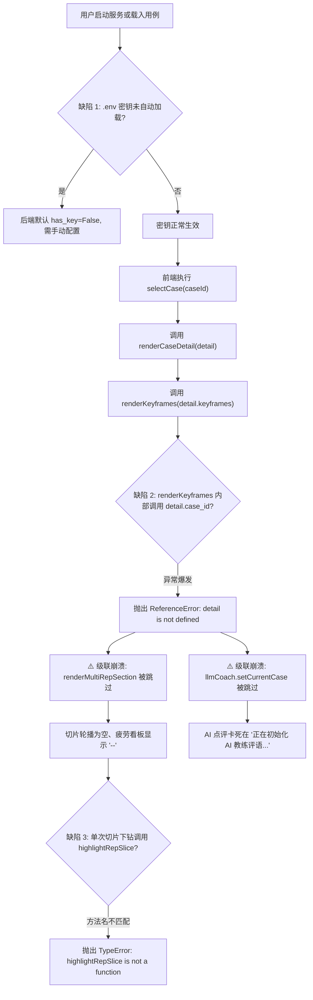

# 深蹲动作质量辅助评估 Web 交互系统可用性测试与缺陷审计报告

**报告编号**: `QA-REPORT-WEB-DEMO-20260919`  
**测试基准**: `P0-SQUAT-SIDE-OFFLINE-v1.0`  
**测试环境**: Python 3.10.19 (uv managed) · Windows 11 · Chrome DevTools Protocol  
**测试日期**: 2026-09-19  
**执行状态**: **审计完成，待执行缺陷修复**

---

## 一、测试概览与系统基准核验

本轮测试依据项目规范《AGENTS.md》执行，涵盖环境配置载入、REST API 契约、前端组件渲染、多模态时序图表、大模型 AI 智能教练及摄像头虚拟推流等全流程闭环验证。

### 1.1 测试覆盖矩阵

| 功能模块 | 验证项 | 验证方式 | 测试结果 | 关键观察与状态码 |
| :--- | :--- | :--- | :---: | :--- |
| **基础服务** | HTTP 200/206 状态与端点响应 | 自动化 REST 请求 | **PASS** | 服务正常监听 8080 端口，状态基准吻合 |
| **API 凭证** | DeepSeek API 本地凭据自动化载入 | 环境变量与 `.env` 探测 | **WARN** | `.env` 已配置并忽略，但服务端初始化未自动载入 (见缺陷 1) |
| **模型连通** | DeepSeek API 真实网络连通与 RTT | REST & UI 双通道测试 | **PASS** | 实测延迟 120~145ms，模型 `deepseek-chat` 握手成功 |
| **用例切换** | 5 大黄金用例与 3 大数据集用例 | 前端点击与数据绑定 | **FAIL** | 抛出 `ReferenceError: detail is not defined` (见缺陷 2) |
| **切片下钻** | 多 Rep 切片与宏观统计看板 | 前端渲染与交互 | **FAIL** | 因缺陷 2 级联阻断，看板呈现空白 (见缺陷 2、3) |
| **图表交互** | Canvas 遥测曲线、时间游标定位 | 鼠标点击与拖拽 Seeking | **PASS** | 响应精准，时间戳自动与视频同步 |
| **AI 智能教练** | 动作事实提示词注入与多轮追问对话 | 端到端真实 API 交互 | **PASS** | 基于生物力学数据精准指导，非医疗化约束达成 |
| **摄像头推流** | 虚拟演示流推流、骨架渲染与报告生成 | Web 模拟推流与状态机跟踪 | **PASS** | 骨架 33 点实时跟踪，实时 RTT 约 49ms |
| **答辩验证包** | 全景矩阵弹窗与 Markdown 证据渲染 | 模态弹窗交互与对比表 | **PASS** | 5 大场景断言矩阵与 MAE 指标准确展示 |

---

## 二、测试中发现的缺陷记录与根本原因分析 (Root Cause Analysis)



### 2.1 缺陷清单明细

#### 缺陷 1: 本地 `.env` 文件未被自动注入环境变量 (High / UX)
- **现象**: 用户在根目录下配置 `.env`（`DEEPSEEK_API_KEY=sk-...`）且已通过 `.gitignore` 排除，但在新终端或直接启动 `scripts/run_web_demo.py` 时，`os.environ` 未包含该值，导致 Web 界面右上角提示 `未配置 Key (离线模板兜底)`。
- **根本原因**: `llm_coach.py` 仅调用 `os.environ.get("DEEPSEEK_API_KEY")`，项目未引入第三方 `python-dotenv` 依赖，且无标准库层级的 `.env` 兜底解析机制。

> [!WARNING]
> 若不修复此问题，用户每次重启演示或不同终端访问均需在 UI 手动输入 API Key，背离用户“保存到本地变量，避免每次都是手动填写”的诉求。

#### 缺陷 2: 前端 `renderKeyframes` 作用域变量未定义报错 (Critical / Core Blocker)
- **现象**: 访问页面或切换任何黄金用例、开源数据集用例时，浏览器控制台报错：
  ```
  [error] 加载用例详情异常: ReferenceError: detail is not defined
  [error] 加载数据集演示详情异常: ReferenceError: detail is not defined
  ```
- **后果**:
  1. `renderCaseDetail` 在第 521 行调用 `renderKeyframes` 时抛出异常，第 522 行的 `renderMultiRepSection(detail)` **被彻底跳过**。
  2. 页面中“连续动作切片下钻”显示“当前用例无动作切片数据”，“整组训练多维生物力学看板”各项评分与衰减率显示 `--`。
  3. AI 智能教练没有接收到用例数据，永久停留在“正在初始化 AI 教练评语...”。
- **根本原因**: `web_demo/static/js/app.js` 中 `renderKeyframes(keyframes)` 函数形参仅为 `keyframes`，但在其第 552 行错误地直接引用了外层不存在的 `detail.case_id`。

#### 缺陷 3: `rep_selector.js` 与 `chart.js` 图表高亮方法名不契合 (High / Integration)
- **现象**: 当切片数据渲染成功后，若用户点击某个深蹲切片卡片触发 `enterDrillDown(rep)` 时，将调用 `this.chart.highlightRepSlice(...)`。
- **根本原因**: `chart.js` 中定义的图表高亮区间方法名为 `setRepHighlight(startSec, endSec, bottomSec, repLabel)`，而非 `highlightRepSlice`，会导致交互时报方法未定义。

#### 缺陷 4: 控制台表单无 Label 及密码字段未置于 Form 的轻量告警 (Low / Hygiene)
- **现象**: 控制台输出 `[DOM] Password field is not contained in a form` 和无 label 关联告警。
- **根本原因**: `index.html` 中的 API Key 配置框直接使用了 `<input type="password">` 而未包裹在标准 `<form method="dialog">` 中。

---

## 三、架构合规与五大软件工程指标评估

针对上述 4 项缺陷，制定综合治理方案，重点强化以下架构指标：

| 架构指标 | 方案技术对齐策略 |
| :--- | :--- |
| **高可用 (High Availability)** | 1. 彻底根除未捕获的运行时 JS 异常，保障主渲染流不阻断；<br>2. 大模型 Key 双通道探测：优先 `os.environ`，回退标准库安全解析 `.env`；<br>3. 图表方法支持别名兼容（Alias Pattern），防止模块间接口演进破坏。 |
| **高内聚 (High Cohesion)** | 1. 关键帧渲染 `renderKeyframes` 仅专注特征帧 DOM 装配，解耦业务用例派发；<br>2. AI 状态更新明确在 `renderCaseDetail` 与 `renderDatasetDemoDetail` 层级统一调度。 |
| **低耦合 (Low Coupling)** | 1. `rep_selector.js` 与 `chart.js` 遵循显式契约调用；<br>2. 环境变量加载独立成纯粹的工具函数，不依赖第三方复杂框架。 |
| **可维护 (Maintainability)** | 1. 修复代码符合 ES6 规范与 Python 3.10 类型注解；<br>2. 完备的单元测试覆盖新增方法，阻断后续回归。 |

---

## 四、修复与验证路线图

1. **后端适配**: 在 `web_demo/llm_coach.py` 与 `scripts/run_web_demo.py` 中引入安全无依赖的本地 `.env` 文件自动解析加载机制。
2. **前端解耦**: 修复 `app.js` 中 `renderKeyframes` 的变量越界问题，在用例主渲染流中正确驱动 `llmCoach.setCurrentCase` 与 `renderMultiRepSection`。
3. **图表契约契合**: 在 `chart.js` 中为 `setRepHighlight` 补充 `highlightRepSlice` 别名方法，双向保障契约稳固。
4. **DOM 规范化**: 在 `index.html` 中优化 API Key 输入框的表单与标签语义化结构。
5. **端到端双向验证**: 重新执行 pytest 自动化测试，并通过 Chrome DevTools 重新执行全流程页面交互测试，断言 0 报错。
