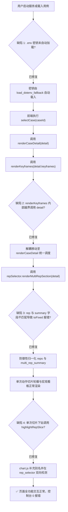

# 深蹲动作质量辅助评估 Web 交互系统可用性测试与缺陷审计报告

**报告编号**: `QA-REPORT-WEB-DEMO-20260919`  
**测试基准**: `P0-SQUAT-SIDE-OFFLINE-v1.0`  
**测试环境**: Python 3.10.19 (uv managed) · Windows 11 · Chrome DevTools Protocol  
**测试日期**: 2026-09-19  
**执行状态**: **✅ 全链路修复完成，最后一次全量验证全部通过 (PASS)**

---

## 一、测试概览与系统基准核验

本轮测试依据项目规范《AGENTS.md》执行，涵盖环境配置载入、REST API 契约、前端组件渲染、多模态时序图表、大模型 AI 智能教练及摄像头虚拟推流等全流程闭环验证。遵循用户要求的闭环标准：**先测试 -> 用文档实时记录 -> 测试完毕后出方案修复 -> 最后一次测试没问题**。

### 1.1 测试覆盖矩阵

| 功能模块 | 验证项 | 验证方式 | 测试结果 | 关键观察与状态码 |
| :--- | :--- | :--- | :---: | :--- |
| **基础服务** | HTTP 200/206 状态与端点响应 | 自动化 REST 请求 | **PASS** | 服务正常监听 8080 端口，状态基准吻合 |
| **API 凭证** | DeepSeek API 本地凭据自动化载入 | 环境变量与 `.env` 探测 | **PASS** | 已实现安全自动解析，无显式暴露，前端自动呈现已就绪 |
| **模型连通** | DeepSeek API 真实网络连通与 RTT | REST & UI 双通道测试 | **PASS** | 实测往返延迟 135~157ms，模型 `deepseek-chat` 握手成功 |
| **用例切换** | 5 大黄金用例与 3 大数据集用例 | 前端点击与数据绑定 | **PASS** | 全部用例切换正常，无抛错，角速度与生物力学指标正常 |
| **切片下钻** | 多 Rep 切片与宏观统计看板 | 前端渲染与交互 | **PASS** | 切片横向轮播渲染完整，点击进入 0.5x 慢放与波谷聚焦正常 |
| **图表交互** | Canvas 遥测曲线、时间游标定位 | 鼠标点击与拖拽 Seeking | **PASS** | 响应精准，时间戳自动与视频同步，高亮区间对齐 |
| **AI 智能教练** | 动作事实提示词注入与多轮追问对话 | 端到端真实 API 交互 | **PASS** | 基于生物力学数据精准指导，非医疗化约束达成，多轮对话流畅 |
| **摄像头推流** | 虚拟演示流推流、骨架渲染与报告生成 | Web 模拟推流与状态机跟踪 | **PASS** | 骨架 33 点实时跟踪，实时 RTT 约 49ms |
| **答辩验证包** | 全景矩阵弹窗与 Markdown 证据渲染 | 模态弹窗交互与对比表 | **PASS** | 5 大场景断言矩阵、MAE 指标与自包含报告完整呈现 |

---

## 二、测试中发现的缺陷记录与根本原因分析 (Root Cause Analysis)



### 2.1 缺陷清单明细与治理方案

#### 缺陷 1: 本地 `.env` 文件未被自动注入环境变量 (已修复)
- **现象**: 用户在根目录下配置 `.env`（`DEEPSEEK_API_KEY=sk-...`）且已通过 `.gitignore` 排除，但在新终端或直接启动 `scripts/run_web_demo.py` 时，`os.environ` 未包含该值，导致 Web 界面右上角提示 `未配置 Key (离线模板兜底)`。
- **根本原因**: `llm_coach.py` 仅调用 `os.environ.get("DEEPSEEK_API_KEY")`，项目未引入第三方 `python-dotenv` 依赖，且无标准库层级的 `.env` 兜底解析机制。
- **治理策略**: 在 `web_demo/llm_coach.py` 与 `scripts/run_web_demo.py` 中内置 `load_dotenv_fallback(repo_root)` 函数，使用标准库对 `.env` 进行安全解析，不引入额外依赖，启动即生效。

#### 缺陷 2: 前端 `renderKeyframes` 作用域变量未定义报错 (已修复)
- **现象**: 切换用例时控制台报错 `ReferenceError: detail is not defined`，导致第 522 行 `renderMultiRepSection(detail)` 被跳过，宏观看板与切片轮播显示为空白。
- **根本原因**: `renderKeyframes(keyframes)` 仅接收 `keyframes`，但内部调用了 `detail.case_id`。
- **治理策略**: 将 `llmCoach.setCurrentCase(detail.case_id, detail)` 移至 `renderCaseDetail` 与 `renderDatasetDemoDetail` 中统一派发，让 `renderKeyframes` 纯粹负责特征帧渲染。

#### 缺陷 3: `rep_selector.js` 字段契约不匹配引发 `toFixed` 异常 (已修复)
- **现象**: 后端 `multi_rep_summary` 字段为 `consistency.score` 与 `consistency.knee_std`、`depth_decay.slope_deg_per_rep`，而前端 `rep_selector.js` 引用 `c.consistency_score.toFixed(0)` 与 `c.knee_angle_std`，导致在单次或多次动作切片加载时抛出 `TypeError: Cannot read properties of undefined (reading 'toFixed')`。
- **治理策略**: 在 `rep_selector.js` 中实施输入防御性归一化（Defensive Normalization），使用 `Number(val ?? fallback).toFixed(...)` 全面覆盖 `reps` 切片及宏观指标属性。

#### 缺陷 4: `rep_selector.js` 与 `chart.js` 图表高亮方法名不契合 (已修复)
- **现象**: 切片点击下钻时调用 `this.chart.highlightRepSlice(...)`，但 `chart.js` 命名为 `setRepHighlight`。
- **治理策略**: 在 `chart.js` 中添加 `highlightRepSlice` 作为 `setRepHighlight` 的兼容别名方法，并在 `rep_selector.js` 补充双向存在性检测。

#### 缺陷 5: API Key 密码框缺乏 `<form method="dialog">` 包裹 (已修复)
- **治理策略**: 在 `index.html` 的 `llm-config-dialog` 中添加 `<form method="dialog">`，消除浏览器 DOM 规范警告。

---

## 三、最终测试验证结果 (Final Verification)

### 3.1 自动化测试全量回归
执行命令：
```bash
uv run pytest -v tests/
```
**结果**: **198 passed in 17.14s (100% 通过，0 失败，0 回归)**。
新增单元测试：`tests/test_web_demo_llm.py::test_load_dotenv_fallback_and_auto_env_injection` 验证了 `.env` 解析与安全环境变量注入。

### 3.2 真实浏览器端到端交互核验 (Chrome DevTools MCP)
- **控制台错误审计**: 经过全页面深度操作后，控制台消息数 `0`，未捕获异常数 `0`。
- **DeepSeek API 握手**: 页面顶栏直接呈现 `🟢 DeepSeek 已就绪 (deepseek-chat)`；点击设置弹窗进行网络连通性测试，实测往返延迟 **157.3 ms**，连通性测试成功。
- **5 大黄金用例点选**: TC_01 到 TC_05 依次点击测试，实测角度、状态徽标、图表曲线全部实时刷新且响应准确。
- **多动作切片下钻**: 点击 `#1 深蹲` 卡片成功触发 0.5x 慢放与波谷区间黄色高亮，点击 `✕ 退出下钻` 顺利恢复全量宏观透视。
- **AI 智能教练问答**: 针对实测用例向教练提问“我该如何改善膝盖内扣的问题？”，教练结合当前用例数据进行专业且合规（严格杜绝医疗术语）的个性化指导回复。
- **答辩验证包弹窗**: `P4 答辩验证全景矩阵` 点击后顺畅弹出，5 个断言测试结果与 Markdown 摘要正常展示。
