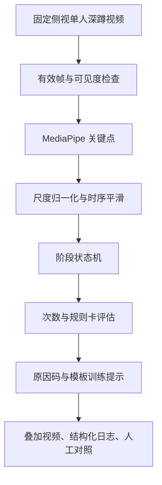

# 开题报告修改方案：健身动作规范性评估与反馈

> **目标**：在不背离“健身动作矫正、体育动作分析”原始应用方向的前提下，把原报告从宽泛的安防式“运动检测”调整为可落地、可验证、可答辩的“指定动作姿态时序分析与训练辅助反馈”。本文是修改蓝图，不把拟实现功能写成既有成果。

## 1. 建议定题

> **《基于人体姿态时序分析的健身动作规范性评估与反馈系统设计与实现》**

题名不写“YOLOv8 人体姿态识别”：现有 YOLOv8 代码实际承担的是目标检测，不是姿态估计；姿态关键点来自 MediaPipe，且尚未接入检测跟踪主链路。题名也不写“千问大模型”，因为大模型不是动作判定的证据来源。

若学院更偏好保守措辞，可将正文研究目标中的“规范性评估”统一表述为“动作质量辅助评估”。其定义为：**依据预先公开、可复核的关节角度与时序规则，对指定机位、指定健身动作进行的训练辅助判断**，不替代教练或医学专业意见。

---

## 2. 修改总览

| 原报告主线 | 问题 | 修改后的主线 |
|---|---|---|
| 安防、交通、区域入侵、跨线计数与姿态识别并列 | 应用跨度过大，无法体现健身方向 | 居家/训练场景下的单人深蹲动作评估与反馈 |
| “YOLOv8 人体姿态识别” | 概念不准确 | MediaPipe 提取关键点；YOLOv8/DeepSORT 作为可选选人/多人扩展基础 |
| “三模块端到端已集成” | 与当前仓库不符 | 分清已有检测跟踪原型、独立姿态示例和待完成的集成任务 |
| PCK、MPJPE、MOTA、IDF1 | 现有数据没有姿态/跟踪真值 | 次数 MAE、阶段一致率、规则结论一致率、有效帧比例与端到端耗时 |
| 41 帧、9 条轨迹作评估基础 | 现有标注为检测框，且口径不一致 | 仅作为检测/跟踪调试资源；另建受控深蹲小样本数据集 |
| “动作矫正/损伤风险/康复” | 容易被要求医学或临床证据 | 训练辅助提示；不作医学诊断或运动风险结论 |

---

## 3. 各章节可直接替换的写作方向

### 一、课题来源及意义

将“智能安防、交通、入侵告警”删出主叙事，改写为：视频化居家训练和基础体育训练中，使用者缺少即时、可回看的动作要点提示；基于视觉的人体关键点可在不佩戴传感器的条件下提供低成本、可视化的辅助分析。课题旨在设计一个限定机位、限定动作的原型，通过姿态时序特征、动作阶段和可解释规则输出训练提示。

意义应分三层但避免夸大：

- **方法层面**：探索关键点时序特征、平滑与有限状态机如何支撑可复核的动作阶段判断；
- **工程层面**：建立视频输入、姿态提取、规则引擎、可视化和日志留痕的模块化闭环；
- **应用层面**：为训练者提供“可观测动作要点”的辅助反馈，不声称替代专业教练或医疗评估。

### 二、国内外发展状况

改为四条线并在末尾落到研究空位：

1. 轻量化/视频人体姿态估计；
2. 基于骨架时序的人体动作识别与阶段建模；
3. 健身、太极、跳远等动作质量评估和反馈；
4. 可解释规则与受控自然语言反馈。

不要保留“YOLOv8—DeepSORT—MediaPipe 三者首次融合”的断言。可写“已有研究证明姿态估计与动作分析具有应用基础；本课题聚焦其在限定深蹲场景中的工程化、可解释集成与功能验证”。

### 三、研究目标、内容、方法与技术路线

#### 3.1 总体目标（建议替换稿）

设计并实现一个面向固定侧视、单人深蹲视频的动作质量辅助评估原型。系统提取人体关键点及其时序特征，判定深蹲阶段和完成次数，依据预先定义的深度与躯干前倾等规则生成可解释的训练提示，并输出可回放的视频和结构化日志。

#### 3.2 研究内容（建议六项）

| 编号 | 研究内容 | 预期可验证成果 |
|---|---|---|
| R1 | 受控拍摄条件、数据授权和深蹲规则卡设计 | 机位/全身入镜/单人要求及标签定义 |
| R2 | MediaPipe 视频关键点提取与有效性门控 | 骨架叠加、可见度和无效状态 |
| R3 | 关键点归一化、平滑和屏幕空间特征计算 | 关键角度、髋部下降代理量的逐帧记录 |
| R4 | 基于滞回状态机的下蹲—最低点—起身阶段判定 | 稳定的次数和阶段序列 |
| R5 | 基于规则卡的深蹲要点评估和原因码反馈 | 正常、下蹲不足、躯干前倾、低置信度等可解释结果 |
| R6 | 可视化、日志、测试集与功能性实验 | 标注视频、JSON/CSV、测试记录和回放核验 |

YOLOv8 检测、DeepSORT 跟踪、多人选择、第二类动作以及千问文本改写放在“扩展设计”或“后续工作”，不应成为首版完成承诺。若以后确实接入 YOLO，应在人员筛选后先严格过滤 `person`，并解决 ROI 与原图关键点坐标映射；在此之前不能将其列为已集成模块。

#### 3.3 技术路线

方法说明必须强调：以 2D 屏幕几何角度和相对特征为主；采用最小持续帧数、双阈值滞回和有限状态机降低关键点抖动；低可见度、无人、出框时不作质量结论。

### 四、可行性、已有条件和实验设计

#### 4.1 已有条件：使用三种状态而非“全部已实现”

| 状态 | 内容 | 报告中可用表述 |
|---|---|---|
| 已有原型 | YOLOv8 检测、DeepSORT 关联、轨迹显示、区域/越线功能 | “已具备人员定位与视频处理基础” |
| 已有示例 | 独立 MediaPipe 姿态可视化 | “已验证姿态框架调用条件，待接入视频时序链路” |
| 待完成核心 | 关键点时序、深蹲状态机、规则评估、反馈、日志和测试 | “为本课题的主要实现与验证工作” |

现有 `humandetection` 标注应更正为“41 帧、45 条 person 轨迹、仅含框标注”（具体统计以最终复核结果为准）。它不能用于关键点精度、动作质量或动作分类评价。

#### 4.2 实验设计（建议替换）

新建小规模、经同意的受控深蹲视频集，先写清标注手册：固定侧视、单人、全身可见、普通光照；样例分为正常深蹲、下蹲不足、躯干前倾和无效输入。每段记录人工次数、阶段/问题标签、机位与剔除原因。可由两名人员独立复核部分样本，并保留分歧处理记录。

| 验证目标 | 可报告指标 | 必要前提 |
|---|---|---|
| 次数统计 | MAE | 人工次数记录 |
| 阶段判定 | 准确率/一致率 | 人工阶段标签 |
| 规则反馈 | 一致率，或 Precision、Recall、F1 | 规则卡与人工问题标签 |
| 安全降级 | 无效状态触发率、错误结论抑制情况 | 无人/低可见度/出框样例 |
| 工程实现 | 输出可播放率、日志—视频时间戳核验 | 固定输入与回放记录 |

只有在明确硬件、分辨率、视频时长和计时方法后，才可补充端到端耗时或 FPS；不得沿用或臆造 PCK、MPJPE、MOTA、IDF1 等无真值支撑的指标。

### 五、进度安排（16 周建议）

| 阶段 | 周次 | 工作与里程碑 |
|---|---:|---|
| 需求与调研 | 1–2 | 文献整理、规则卡、数据授权、机位与标注手册 |
| 数据与姿态链路 | 3–4 | 录制受控视频；完成关键点、可见度与骨架叠加 |
| 时序与计数 | 5–6 | 完成平滑、状态机、次数日志与异常状态 |
| 规则反馈 | 7–8 | 实现深度/躯干规则、原因码和模板提示 |
| 系统验证 | 9–10 | 形成离线 Demo、标注 MP4、JSON/CSV 和测试表 |
| 实验与改进 | 11–12 | 基于标注数据实测指标，分析失败案例和消融式对比 |
| 论文与答辩材料 | 13–15 | 撰写、修订、整理证据包和演示录像 |
| 答辩准备 | 16 | 离线演示、常见问题演练和边界说明 |

### 六、创新点与风险（建议写法）

创新点应定位为工程性、可检验的组合，而非宣称提出新基础模型：

1. 面向受控深蹲场景，把关键点时序、状态机和规则卡结合为可回放的动作辅助评估流程；
2. 使用“特征—规则—原因码—提示”的证据链，而非黑箱式正确/错误标签；
3. 在低可见度、出框等场景显式拒绝评价，保留结果日志以提升工程可信度。

风险与应对：关键点抖动采用平滑、滞回和最小持续帧；机位歧义以固定侧视和屏幕空间特征约束；数据不足以小规模受控数据和功能验证为主；现场不稳定时，以可复现的离线输入、输出视频、日志和截图作为正式演示。

---

## 4. 参考文献替换清单（24 篇，中文/英文各 12 篇）

> 选择规则：全部为 2021–2023 年发表，优先保留与人体姿态、骨架时序、健身/体育动作评估直接相关的论文。每项给出 DOI 或官方出版/会议页面；提交前仍应按学校 GB/T 7714 模板统一著录格式并逐条打开链接复核。YOLOv8 官方文档可在正文作为软件资料引用，但不应伪装成正式学术论文、也不w计入这 24 篇。

### 中文文献（12 篇）

1. 吕淑平, 黄毅, 王莹莹. 基于 C3D 卷积神经网络人体动作识别方法改进[J]. 实验技术与管理, 2021, 38(10): 168-171+176. [DOI](https://doi.org/10.16791/j.cnki.sjg.2021.10.031)
2. 蒋韦晔, 刘成明. 基于深度图的人体动作分类自适应算法[J]. 郑州大学学报(理学版), 2021, 53(1): 16-21. [DOI](https://doi.org/10.13705/j.issn.1671-6841.2019584)
3. 李扬志, 袁家政, 刘宏哲. 基于时空注意力图卷积网络模型的人体骨架动作识别算法[J]. 计算机应用, 2021, 41(7): 1959-1965. [期刊页面](https://www.joca.cn/CN/10.11772/j.issn.1001-9081.2020101799)
4. 张宇, 温光照, 米思娅, 等. 基于深度学习的二维人体姿态估计综述[J]. 软件学报, 2022, 33(11): 4173-4191. [DOI](https://doi.org/10.13328/j.cnki.jos.006390)
5. 孙琪翔, 何宁, 张敬尊, 宏晨. 基于非局部高分辨率网络的轻量化人体姿态估计方法[J]. 计算机应用, 2022, 42(5): 1398-1406. [DOI](https://doi.org/10.11772/j.issn.1001-9081.2021030512)
6. 杨飞宇, 宋展, 肖振中, 等. 对人体姿态估计热图误差的再思考[J]. 计算机应用, 2022, 42(8): 2548-2555. [DOI](https://doi.org/10.11772/j.issn.1001-9081.2021050805)
7. 蔡敏敏, 黄继风, 林晓, 周小平. 基于人体姿态估计与聚类的特定运动帧获取方法[J]. 图学学报, 2022, 43(1). [DOI](https://doi.org/10.11996/JG.j.2095-302X.2022010044)
8. 蔡兴泉, 霍宇晴, 李发建, 孙海燕. 面向太极拳学习的人体姿态估计及相似度计算[J]. 图学学报, 2022, 43(4): 695-706. [DOI](https://doi.org/10.11996/JG.j.2095-302X.2022040695)
9. 李晟, 宋可儿, 欧阳柏强, 等. 基于人体姿态识别的立定跳远动作智能评估系统[J]. 人工智能, 2022(2): 75-87. [DOI](https://doi.org/10.16453/j.cnki.ISSN2096-5036.2022.02.009)
10. 王名赫, 徐望明, 蒋昊坤. 一种改进的轻量级人体姿态估计算法[J]. 液晶与显示, 2023, 38(7): 955-963. [DOI](https://doi.org/10.37188/CJLCD.2022-0323)
11. 毋宁, 王鹏, 李晓艳, 等. 基于自适应特征感知的轻量化人体姿态估计[J]. 液晶与显示, 2023, 38(8): 1107-1117. [DOI](https://doi.org/10.37188/CJLCD.2022-0351)
12. 李豆豆, 李汪根, 夏义春, 等. 基于特征交互与自适应融合的骨骼动作识别[J]. 计算机应用, 2023, 43(8): 2581-2587. [DOI](https://doi.org/10.11772/j.issn.1001-9081.2022071105)

### 英文文献（12 篇）

13. Song L, Yu G, Yuan J, Liu Z. Human pose estimation and its application to action recognition: A survey[J]. *Journal of Visual Communication and Image Representation*, 2021, 76: 103055. [DOI](https://doi.org/10.1016/j.jvcir.2021.103055)
14. Chen Y, Zhang Z, Yuan C, et al. Channel-wise topology refinement graph convolution for skeleton-based action recognition[C]//*ICCV*, 2021: 13359-13368. [DOI](https://doi.org/10.1109/ICCV48922.2021.01312)
15. Zheng C, Zhu S, Mendieta M, et al. 3D human pose estimation with spatial and temporal transformers[C]//*ICCV*, 2021: 11656-11665. [DOI](https://doi.org/10.1109/ICCV48922.2021.01147)
16. Duan H, Zhao Y, Chen K, et al. Revisiting skeleton-based action recognition[C]//*CVPR*, 2022: 2969-2978. [DOI](https://doi.org/10.1109/CVPR52688.2022.00299)
17. Xu Y, Zhang J, Zhang Q, Tao D. ViTPose: Simple vision transformer baselines for human pose estimation[C]//*NeurIPS*, 2022, 35: 38571-38584. [Proceedings](https://proceedings.neurips.cc/paper_files/paper/2022/hash/fbb15eb925c9d7adba45a378c1f1d5d9-Abstract-Conference.html)
18. Wang J, Yan S, Xiong Y, Lin D. MotionBERT: A unified perspective on learning human motion representations[C]//*ICCV*, 2023: 15085-15099. [DOI](https://doi.org/10.1109/ICCV51070.2023.01391)
19. Thilakarathne H, Nibali A, He Z, et al. Pose is all you need: POGARS[J]. *Machine Vision and Applications*, 2022, 33: 95. [DOI](https://doi.org/10.1007/s00138-022-01346-2)
20. Singh A, Le B T, Le Nguyen T, et al. Interpretable classification of human exercise videos through pose estimation and multivariate time series analysis[C]//*W3PHIAI@AAAI*, 2021. [Proceedings/project](https://github.com/mlgig/BodyMTS_2021)
21. Deyzel M, Theart R P. One-shot skeleton-based action recognition on strength and conditioning exercises[C]//*CVPR Workshops*, 2023: 5169-5178. [CVF Open Access](https://openaccess.thecvf.com/content/CVPR2023W/CV4MET/html/Deyzel_One-Shot_Skeleton-Based_Action_Recognition_on_Strength_and_Conditioning_Exercises_CVPRW_2023_paper.html)
22. Fu H, Gao J, Liu H. Human pose estimation and action recognition for fitness movements[J]. *Computers & Graphics*, 2023, 116: 418-426. [DOI](https://doi.org/10.1016/j.cag.2023.09.008)
23. Paoletti G, Beyan C, Del Bue A. SKELTER: unsupervised skeleton action denoising and recognition using transformers[J]. *Frontiers in Computer Science*, 2023, 5: 1203901. [DOI](https://doi.org/10.3389/fcomp.2023.1203901)
24. Liu M, Meng F, Chen C, Wu S. Novel motion patterns matter for practical skeleton-based action recognition[C]//*AAAI*, 2023, 37(2): 1701-1709. [DOI](https://doi.org/10.1609/aaai.v37i2.25258)

---

## 5. 提交前的最终核对

- [ ] 封面、目录、正文、PPT 使用同一最终题名。
- [ ] 全文把“已实现”与“拟实现/待集成”按三种状态逐一校正。
- [ ] 删除安防、交通、入侵告警作为研究主目标的段落；可在已有基础中简述，但不抢占篇幅。
- [ ] 删除没有真值条件支撑的 PCK、MPJPE、MOTA、IDF1 和任何未经测量的 FPS/精度数字。
- [ ] 更正检测标注集统计口径，并写清它不用于姿态/质量评测。
- [ ] 为每条深蹲规则补上适用机位、依据、阈值、无效条件和输出话术。
- [ ] 逐条打开 24 个文献链接，按学院要求转换为 GB/T 7714；第 20 篇为 workshop/proceedings 项，若学院不接受则用同年正式期刊/会议论文替换。
- [ ] 答辩演示准备“输入视频—结果 MP4—结构化日志—测试表/截图”四层证据包。

## 6. 多轮审查结论

独立的选题审查、仓库差距审查和文献审查均指向同一结论：原报告的最大问题不是方向改变，而是把“检测/跟踪原型、独立姿态示例、拟完成的动作评估”混写为一个已集成系统。两轮对抗性复核后，采用“单人固定侧视深蹲 + 姿态时序 + 状态机 + 可解释训练提示 + 日志验证”的最小闭环；YOLO/DeepSORT、多人和千问只保留为验收后扩展，从而把工作量集中在可展示、可评估、可答辩的核心研究内容上。
